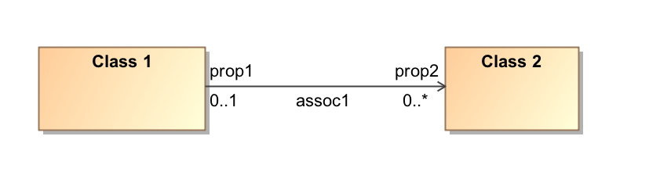
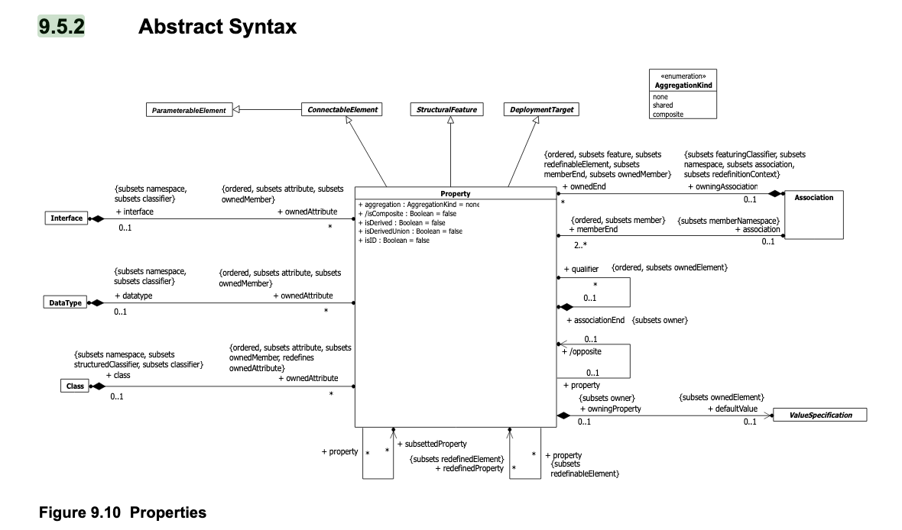
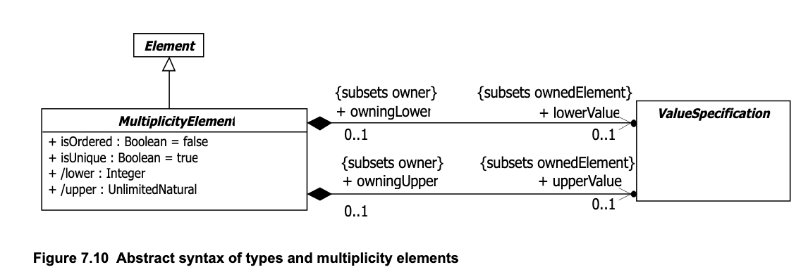
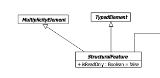
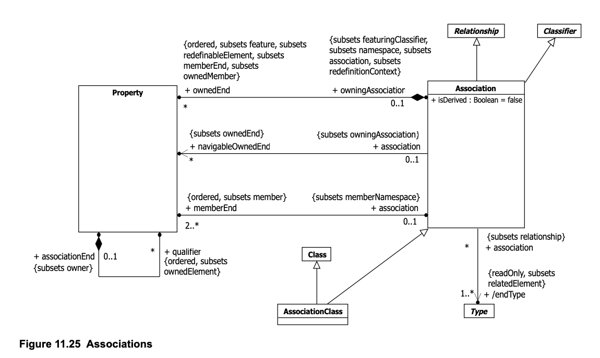
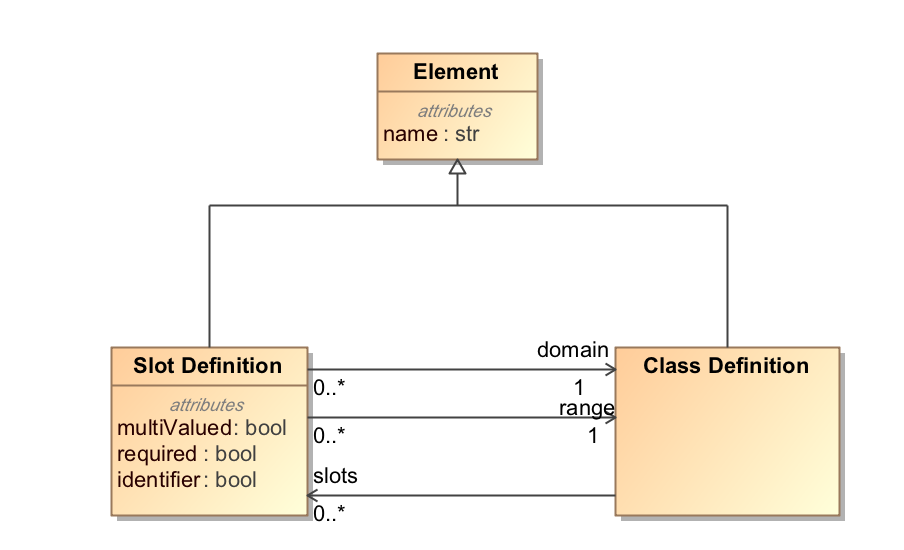
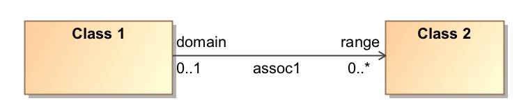
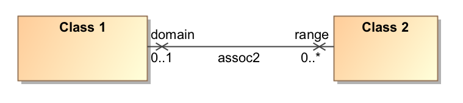

# Notes on how the *linkml* slot model aligns with UML 2.5.1.

This document describes how the following UML model:


Is represent using 1) the UML metamodel and 2) the linkml modeling language.

## UML Metamodel representation

Referring to the [UML 2.5.1 Specification](https://www.omg.org/spec/UML/2.5.1/PDF):

Using the model below as a reference point:



Ignoring some irrelevant generalities form the UML model (e.g. data types and interfaces can also have Properties), a 
**Property** represents an attribute of a **Class**.  Every **Property** is owned by exactly one **Class**. 
Every **Property** can (but doesn't have to) have a name.  Every **Property** has an optional **MultiplicityElement**,
inherited through ***Structuralfeature*** (below), which defines the lower and upper cardinality of the **Property**. 




The above model allows us to make the following assertions about our example:

* **:prop1** name "prop1"
* **:prop1** lower **0**
* **:prop1** upper **1**
* **:prop2** name "prop2"
* **:prop2** lower **0**
* **:prop2** upper **UnlimitedNatural**
* **:Class 1** ownedAttribute **:prop1**

Note, however, that there *isn't* an ownedAttribute between **:Class 2** and **:prop2**. This is because of  
navigability -- the arrow goes between **:Class 1** and **:Class 2**, but not the reverse, meaning that instances of
**:Class 1** "know about" their **:prop 1** links to **:Class 2**, but **:Class 2** instances have no knowledge of
the reverse.

UML adds a second component to make the model complete:


An **Association** has 2 memberEnds.  In addition, an **Association** owns (ownsEnd) any **Property** that 
is not owned by a class.  To complete our model above we add:
* **:assoc1** name "assoc1"
* **:assoc1** memberEnd **:prop1*
* **:prop1** association **:assoc1**
* **:assoc1** memberEnd **:prop2**
* **:prop2** association **:prop2**
* **:assoc1** ownedEnd **:prop2**
* **:assoc2** navigableOwnedEnd **:prop2**

We can now get from **:Class 1** to *ownedAttribute* **:prop 1** to *association* **:assoc1** 
to *navigableOwnedEnd* **:prop2**.  **:Class 2**, however, is not "aware" of any attributes at all.

## LinkML Model Equivalent
The following diagram shows how slots (attributes) are represented in the LinkML model:


N.B. This is a *metamodel*, akin to the UML metamodels above.

For our purposes, the linkml `Class Definition` is analogous to the UML **Class**, with the following simplifications:
1) All **Property** instances must be named either "domain" or "range"
2) All **Association** instances must have one `memberEnd` named "domain" and a second "range"
3) There are two possibility navigability choices:
    1) The "range" **Property** is navigable
    2) Neither the "domain" or the "range" **Property** is navigable
4) The cardinality of the "domain" property is always `0..*`
5) The *lower* cardinality of the "range" property is `0` if `required` is false else `1`
6) The *upper* cardinality of the "range" property is `1` if `multiValued` is false else `*`


Given the following linkml definition
```yaml
slots:
    assoc1:
      domain: Class 1
      range: Class 2
      multivalued: true
      required: false

classes:
    Class 1:
      slots:
        - assoc1
```
*Note*: the `domain` and `required` elements are not necessary in this example. The default for `required` is already `false`,
and, when a slot is named in the `class.slots` entry, the domain is checked for matching the slot `domain` and, if not
present, it is added)

The equivalent UML model for this definition would be:



This model would result in the following UML instances:
* **:prop1** name "domain"
* **:prop1** lower **0**
* **:prop1** upper **1**
* **:prop1** association **:assoc1**
* **:prop2** name "range"
* **:prop2** lower **0**
* **:prop2** upper **UnlimitedNatural**
* **:prop2** association **:assoc1**
* **:Class 1** ownedAttribute **:prop1**
* **:assoc1** name "assoc1"
* **:assoc1** memberEnd **:prop1**
* **:assoc1** memberEnd **:prop2**
* **:assoc1** ownedEnd **:prop2**
* **:assoc2** navigableOwnedEnd **:prop2**

An interesting case is:

```yaml
slots:
    assoc2:
      domain: Class 1
      range: Class 2
      multivalued: true
      required: false

classes:
    Class 1:
```

Where the UML equivalent is:



(The "X" exists to differentiate this model from one where navigability is not specified)

This model would result in the following UML instances:
* **:prop1** name "domain"
* **:prop1** lower **0**
* **:prop1** upper **1**
* **:prop1** association **:assoc2**
* **:prop2** name "range"
* **:prop2** lower **0**
* **:prop2** upper **UnlimitedNatural**
* **:prop2** association **:assoc2**
* **:assoc2** name "assoc2"
* **:assoc2** memberEnd **:prop1**
* **:assoc1** memberEnd **:prop2**
* **:assoc1** ownedEnd **:prop2**
* **:assoc2** ownedEnd **:prop1**
* **:assoc2** navigableOwnedEnd **:prop1**
* **:assoc2** navigableOwnedEnd **:prop2**

This is a rather uncommon situation in the UML world -- it means that *neither* clase is "aware" of the fact that it
participates in an association, and, as such, validation cannot occur on the class level.  Validation *can*, however, 
occur when presented with an instance of **assoc2** with the following tests being possible:

1) Verify that the ownedEnd named "domain" is an instance of **Class 1**
2) Verify that all instances of the ownedEnd named "range" are instances of **Class 2**
3) If `multivalued` is false, verify that there is at most one instance of **assoc2** whose domain is **Class 1**
3) If `required` is true, *and a closed world assumption*(**!**) verify that there is at least one instance of **assoc2** 
whose domain is **Class 1**


