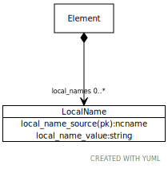

# Class: LocalName

an attributed label

URI: [meta:LocalName](https://w3id.org/linkml/meta/LocalName)

## Referenced by class

 *  **[Element](Element.md)** *[local_names](local_names.md)*  0..*  **[LocalName](LocalName.md)**

## Attributes

### Own

 * [local_name_source](local_name_source.md)  REQ
     * Description: the ncname of the source of the name
     * range: [Ncname](types/Ncname.md)
 * [local_name_value](local_name_value.md)  REQ
     * Description: a name assigned to an element in a given ontology
     * range: [String](types/String.md)
