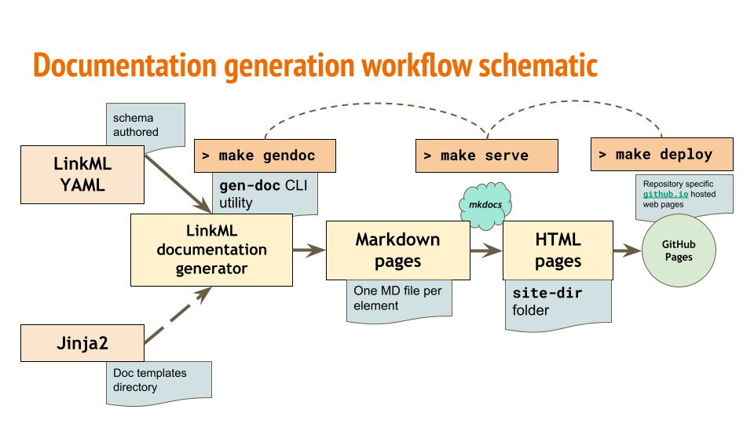

Markdown
========

Overview
--------

Markdown is a lightweight markup language with simple, readable syntax
that can be used to author technical documentation pages.

Some static site/documentation generator frameworks (such as `mkdocs <https://www.mkdocs.org/>`_)
use markdown to simplify the creation of websites.

The LinkML framework has a utility called ``gen-doc`` which can be
used to automatically create documentation pages from your hand authored schema.

Above is a schematic diagram explaining the working mechanism of the ``gen-doc`` module.
The documentation generation module takes in the path to your schema directory as an argument.
It also ships with some base jinja2 templates for each schema element which controls the content
rendered on documentation pages for that schema elements.
For example, there is a jinja2 template for classes, one for slots, etc. Optionally linkml also
allows you to exercise more granular control on the content rendered on pages, by allowing you to
customize the jinja2 templates based on your requirement.
``gen-doc`` turns your YAML schemas into Markdown documentation pages.
It also has utilities that allow you to further convert those Markdown pages into HTML pages (using mkdocs)
that can be hosted on website hosting services like `GitHub Pages <https://pages.github.com/>`_.

Examples of sites that have been auto generated by linkml ``gen-doc`` and hosted on ``gh-pages``:

* `LinkML (Meta)Model <https://linkml.io/linkml-model/docs/>`_
* `NMDC Schema <https://microbiomedata.github.io/nmdc-schema/>`_
* `CMDR Schema <https://linkml.io/cmdr/>`_
* `GA4GH-VA Schema <https://sujaypatil96.github.io/ga4gh-va-schema/>`_

To generate documentation pages for your schema, run:

.. code:: bash

   gen-doc ~/path/to/schema.yaml

The documentation generator will generate one Markdown file per element, along with an index document.
Some other important options that can be configured while running the generator:

* ``--template-directory``: path to the directory with custom jinja2 templates

* ``--directory``: path to directory where you want the markdown files to be written to

* ``--hierarchical-class-view / --no-hierarchical-class-view``: control style of rendering
classes on index page

``gen-doc`` renders Mermaid UML `class diagrams <https://mermaid.js.org/syntax/classDiagram.html>`_
by default on individual class documentation pages to summarize it's relationship with other
classes and slots.

Note:
We have two Markdown documentation generators within the linkml framework - ``gen-doc`` and ``gen-markdown``.
It is important to note that while ``gen-markdown`` still works, it has been deprecated (no active development)
in favour of the de facto ``gen-doc`` generator.

Docs
----

Command Line
^^^^^^^^^^^^

.. currentmodule:: linkml.generators.markdowngen

.. click:: linkml.generators.markdowngen:cli
    :prog: gen-markdown
    :nested: short

Code
^^^^

.. autoclass:: MarkdownGenerator
    :members: serialize
