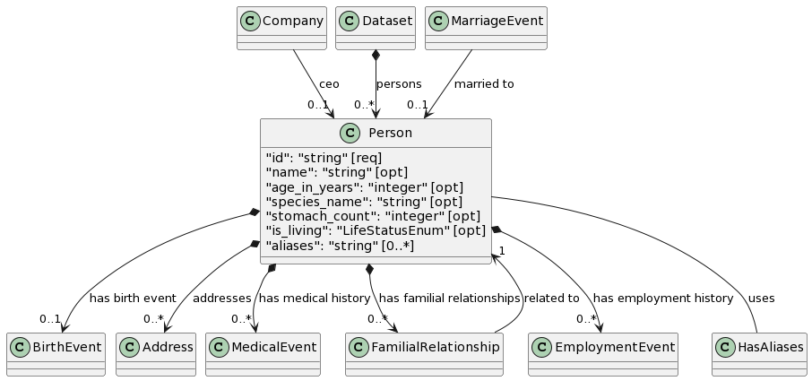

PlantUML Diagram Generator
==========================

Similar to `Mermaid <https://mermaid.js.org/>`_, PlantUML is yet another diagramming tool that
can be used to create UML diagrams from simple textual descriptions.

Usage:

.. code:: bash

    gen-plantuml ~/path/to/linkml_schema.yaml --classes <class-one> --classes <class-two> --directory ~/path/to/output-directory

.. note ::
    The ``--classes`` optional argument can take multiple values. To generate PlantUML diagrams
    for multiple classes pass values to ``gen-plantuml`` like above. The above example illustrates
    running the generator with only two classes but you can follow the same pattern and run the
    generator with as many classes as you want. If you want to generate the diagram for one class
    only then do not specify ``--classes`` multiple times.

In the context of ``gen-doc``:

PlantUML has the capability to create a number of UML diagrams (sequence, use case, class,
activity, etc.) much like it's Mermaid counterpart. *Mermaid* is the default diagramming tool with
which UML class diagrams are rendered on schema (class) documentation pages. However, while
generating documentation pages you have the option to choose which of the two UML diagramming
tools you want to use to create your UML class diagrams — *Mermaid*, or *PlantUML*.

To generate your documentation pages with PlantUML diagrams, use ``gen-doc`` like this:

.. code:: bash

    gen-doc ~/path/to/linkml_schema.yaml --diagram-type plantuml_class_diagram --directory ~/path/to/output-directory

Example output:

This is what the PlantUML class diagram looks like for the ``Person`` class.

