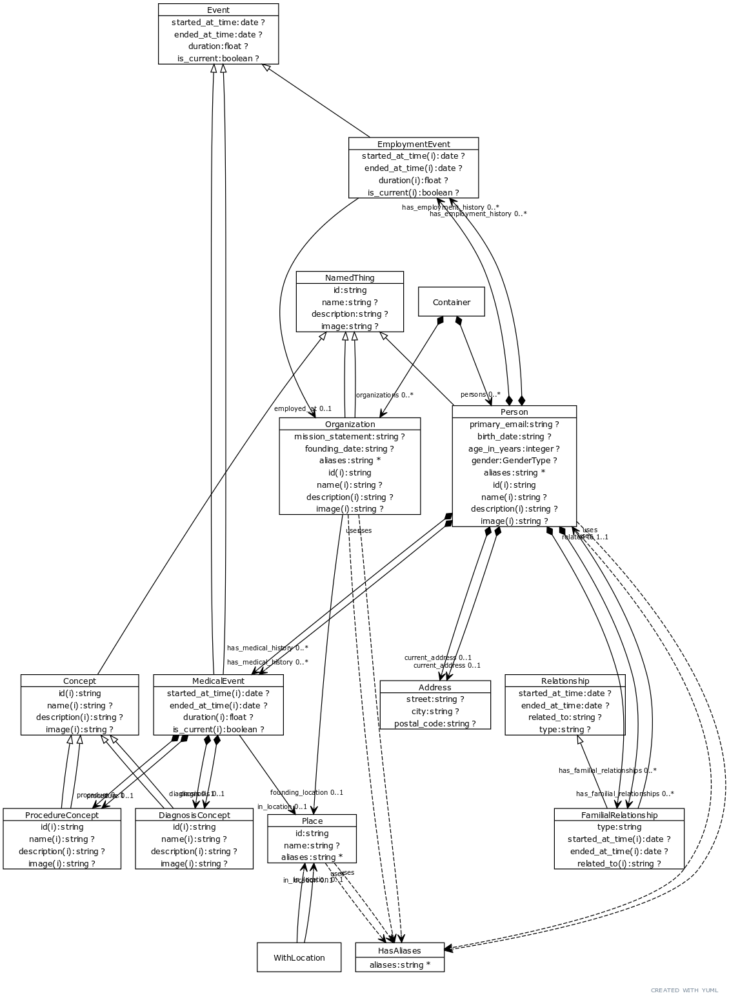

# Person Schema

This folder is located here: https://github.com/linkml/linkml/tree/main/examples/PersonSchema

An example schema/model to demonstrate use of LinkML. For more examples, see the [linkml-registry](https://linkml.io/linkml-registry/registry/)

 * [personinfo.yaml](personinfo.yaml) -- schema source
 * [personinfo/](personinfo) -- derived files, created with `gen-project`
     * json-schema
     * python
     * owl
     * shex
     * sql
     * ...
 * [data/](data) -- example data files
 * [build/](build) -- derived data files

## Schema diagram

generated via `gen-yuml`:

 
