# PERSONINFO


**metamodel version:** 1.7.0

**version:** None


Information about people, based on [schema.org](http://schema.org)


## Class Diagram

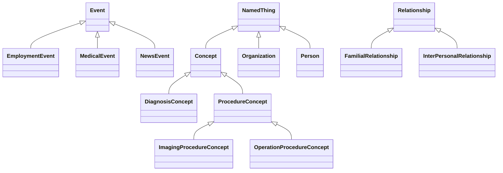

## ERD Diagram

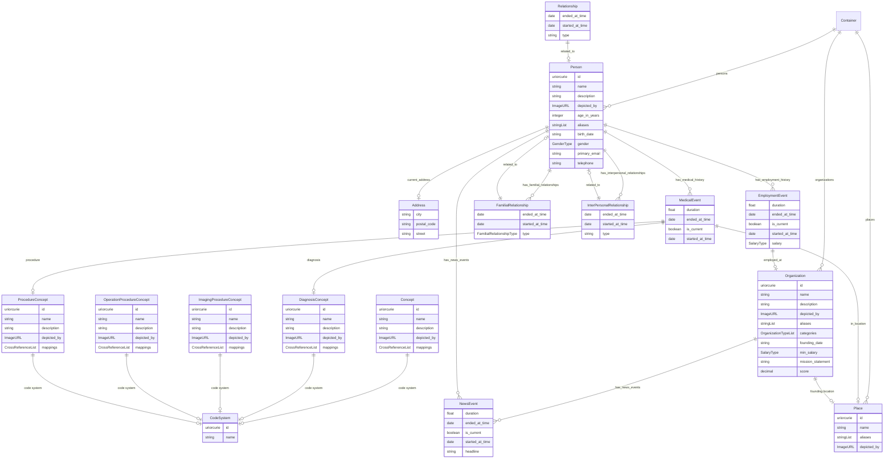

## Base Classes


Foundational classes in the hierarchy (root classes and direct children of Thing):

| Class | Description |
| --- | --- |
| [Event](#Event) |  |
| [NamedThing](#NamedThing) | A generic grouping for any identifiable entity |
| [Relationship](#Relationship) |  |

## Standalone Classes


These classes are completely isolated with no relationships and are not used as base classes:

| Class | Description |
| --- | --- |
| [IntegerPrimaryKeyObject](#IntegerPrimaryKeyObject) |  |

## Classes


### Address


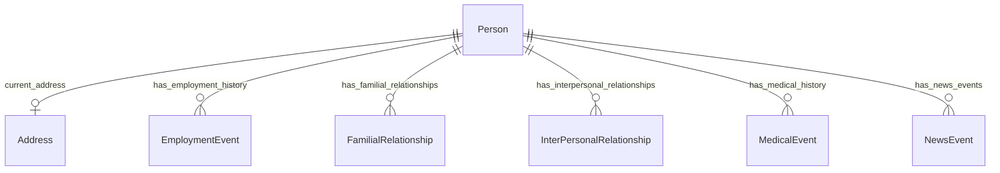

#### Attributes

| Name | Cardinality: | Type | Description |
| --- | --- | --- | --- |
| **[city](#City)** | <sub>0..1</sub> | string |  |
| **[postal_code](#PostalCode)** | <sub>0..1</sub> | string |  |
| **[street](#Street)** | <sub>0..1</sub> | string |  |

#### Referenced by:

 *  **[Person](#Person)** : current_address  <sub>0..1</sub> 


### Concept


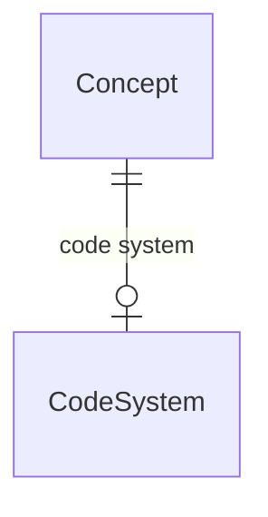

#### Attributes

| Name | Cardinality: | Type | Description |
| --- | --- | --- | --- |
| **[id](#Id)** | <sub>0..1</sub> | uriorcurie |  |
| **[name](#Name)** | <sub>1..1</sub> | string |  |
| **[description](#Description)** | <sub>0..1</sub> | string |  |
| **[depicted_by](#DepictedBy)** | <sub>0..1</sub> | ImageURL |  |
| **[code system](#CodeSystem)** | <sub>0..1</sub> | [CodeSystem](#CodeSystem) |  |
| **[mappings](#Mappings)** | <sub>0..\*</sub> | CrossReference |  |

#### Parents

 * [NamedThing](#NamedThing) - A generic grouping for any identifiable entity

#### Children

 * [DiagnosisConcept](#DiagnosisConcept)
 * [ProcedureConcept](#ProcedureConcept)


### Container


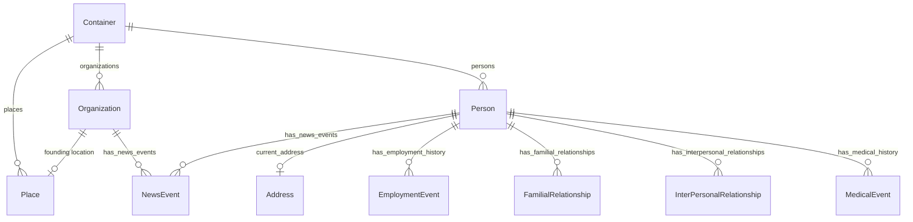

#### Attributes

| Name | Cardinality: | Type | Description |
| --- | --- | --- | --- |
| **[organizations](#Organizations)** | <sub>0..\*</sub> | [Organization](#Organization) |  |
| **[persons](#Persons)** | <sub>0..\*</sub> | [Person](#Person) |  |
| **[places](#Places)** | <sub>0..\*</sub> | [Place](#Place) |  |


### DiagnosisConcept


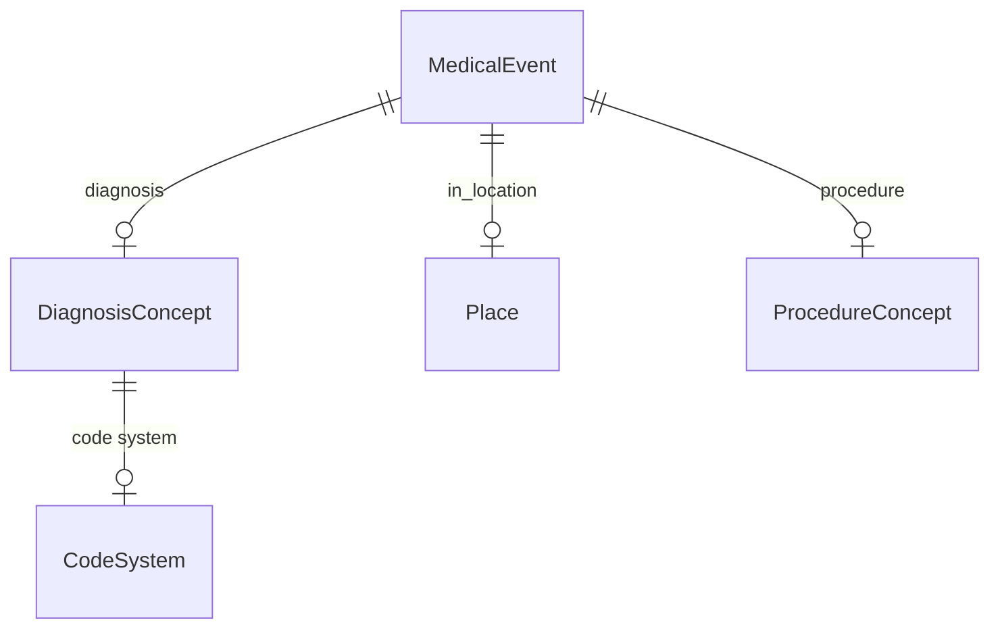

#### Attributes

| Name | Cardinality: | Type | Description |
| --- | --- | --- | --- |
| **[id](#Id)** | <sub>1..1</sub> | uriorcurie |  |
| **[name](#Name)** | <sub>1..1</sub> | string |  |
| **[description](#Description)** | <sub>0..1</sub> | string |  |
| **[code system](#CodeSystem)** | <sub>0..1</sub> | [CodeSystem](#CodeSystem) |  |
| **[depicted_by](#DepictedBy)** | <sub>0..1</sub> | ImageURL |  |
| **[mappings](#Mappings)** | <sub>0..\*</sub> | CrossReference |  |

#### Parents

 * [Concept](#Concept)

#### Referenced by:

 *  **[MedicalEvent](#MedicalEvent)** : diagnosis  <sub>0..1</sub> 


### EmploymentEvent


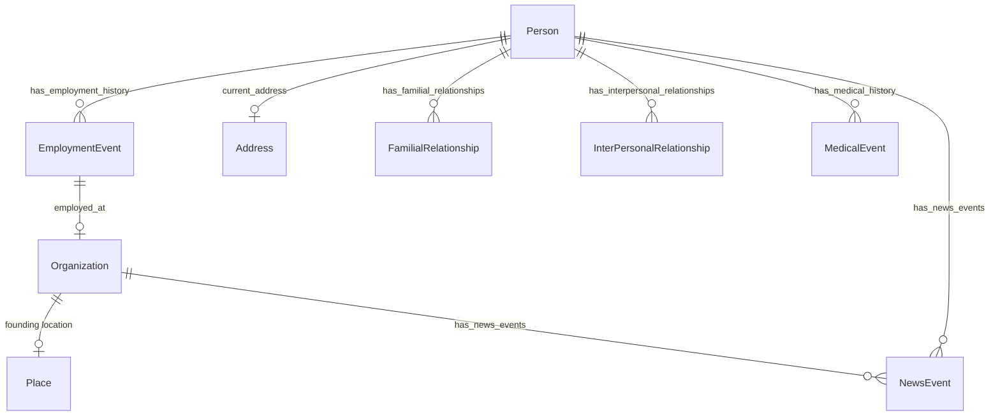

#### Attributes

| Name | Cardinality: | Type | Description |
| --- | --- | --- | --- |
| **[duration](#Duration)** | <sub>0..1</sub> | float |  |
| **[ended_at_time](#EndedAtTime)** | <sub>0..1</sub> | date |  |
| **[is_current](#IsCurrent)** | <sub>0..1</sub> | boolean |  |
| **[started_at_time](#StartedAtTime)** | <sub>0..1</sub> | date |  |
| **[employed_at](#EmployedAt)** | <sub>0..1</sub> | [Organization](#Organization) |  |
| **[salary](#Salary)** | <sub>0..1</sub> | SalaryType |  |

#### Parents

 * [Event](#Event)

#### Referenced by:

 *  **[Person](#Person)** : has_employment_history  <sub>0..\*</sub> 


### Event


#### Local class diagram

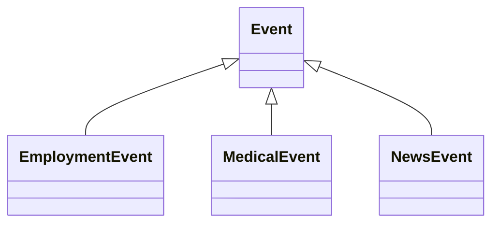

#### Attributes

| Name | Cardinality: | Type | Description |
| --- | --- | --- | --- |
| **[duration](#Duration)** | <sub>0..1</sub> | float |  |
| **[ended_at_time](#EndedAtTime)** | <sub>0..1</sub> | date |  |
| **[is_current](#IsCurrent)** | <sub>0..1</sub> | boolean |  |
| **[started_at_time](#StartedAtTime)** | <sub>0..1</sub> | date |  |

#### Children

 * [EmploymentEvent](#EmploymentEvent)
 * [MedicalEvent](#MedicalEvent)
 * [NewsEvent](#NewsEvent)


### FamilialRelationship


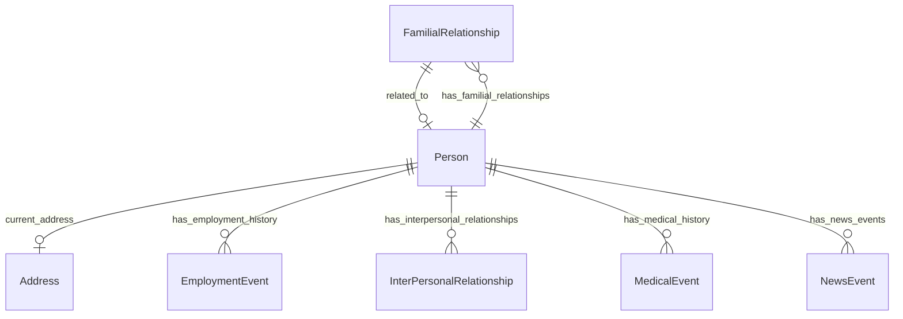

#### Attributes

| Name | Cardinality: | Type | Description |
| --- | --- | --- | --- |
| **[ended_at_time](#EndedAtTime)** | <sub>0..1</sub> | date |  |
| **[related_to](#RelatedTo)** | <sub>0..1</sub> | [Person](#Person) |  |
| **[started_at_time](#StartedAtTime)** | <sub>0..1</sub> | date |  |
| **[type](#Type)** | <sub>1..1</sub> | [FamilialRelationshipType](#FamilialRelationshipType) |  |

#### Parents

 * [Relationship](#Relationship)

#### Referenced by:

 *  **[Person](#Person)** : has_familial_relationships  <sub>0..\*</sub> 


### ImagingProcedureConcept


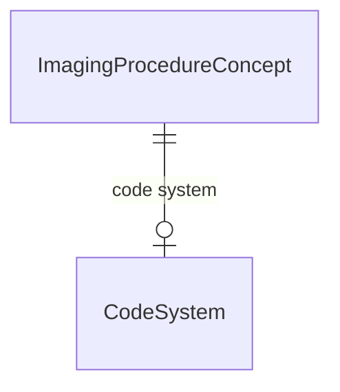

#### Attributes

| Name | Cardinality: | Type | Description |
| --- | --- | --- | --- |
| **[id](#Id)** | <sub>1..1</sub> | uriorcurie |  |
| **[name](#Name)** | <sub>1..1</sub> | string |  |
| **[description](#Description)** | <sub>0..1</sub> | string |  |
| **[code system](#CodeSystem)** | <sub>0..1</sub> | [CodeSystem](#CodeSystem) |  |
| **[depicted_by](#DepictedBy)** | <sub>0..1</sub> | ImageURL |  |
| **[mappings](#Mappings)** | <sub>0..\*</sub> | CrossReference |  |

#### Parents

 * [ProcedureConcept](#ProcedureConcept)


### IntegerPrimaryKeyObject


#### Attributes

| Name | Cardinality: | Type | Description |
| --- | --- | --- | --- |
| **[int_id](#IntId)** | <sub>0..1</sub> | integer |  |


### InterPersonalRelationship


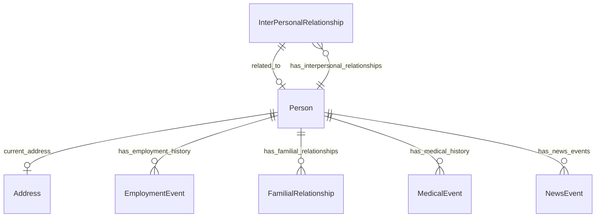

#### Attributes

| Name | Cardinality: | Type | Description |
| --- | --- | --- | --- |
| **[ended_at_time](#EndedAtTime)** | <sub>0..1</sub> | date |  |
| **[related_to](#RelatedTo)** | <sub>0..1</sub> | [Person](#Person) |  |
| **[started_at_time](#StartedAtTime)** | <sub>0..1</sub> | date |  |
| **[type](#Type)** | <sub>1..1</sub> | string |  |

#### Parents

 * [Relationship](#Relationship)

#### Referenced by:

 *  **[Person](#Person)** : has_interpersonal_relationships  <sub>0..\*</sub> 


### MedicalEvent


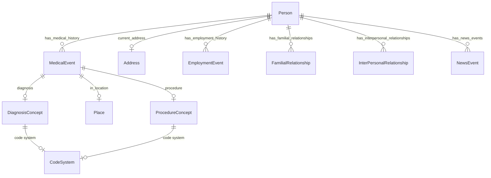

#### Attributes

| Name | Cardinality: | Type | Description |
| --- | --- | --- | --- |
| **[duration](#Duration)** | <sub>0..1</sub> | float |  |
| **[ended_at_time](#EndedAtTime)** | <sub>0..1</sub> | date |  |
| **[is_current](#IsCurrent)** | <sub>0..1</sub> | boolean |  |
| **[started_at_time](#StartedAtTime)** | <sub>0..1</sub> | date |  |
| **[in_location](#InLocation)** | <sub>0..1</sub> | [Place](#Place) |  |
| **[diagnosis](#Diagnosis)** | <sub>0..1</sub> | [DiagnosisConcept](#DiagnosisConcept) |  |
| **[procedure](#Procedure)** | <sub>0..1</sub> | [ProcedureConcept](#ProcedureConcept) |  |

#### Parents

 * [Event](#Event)

#### Uses

 *  mixin: [WithLocation](#WithLocation)

#### Referenced by:

 *  **[Person](#Person)** : has_medical_history  <sub>0..\*</sub> 


### NamedThing

A generic grouping for any identifiable entity


#### Local class diagram

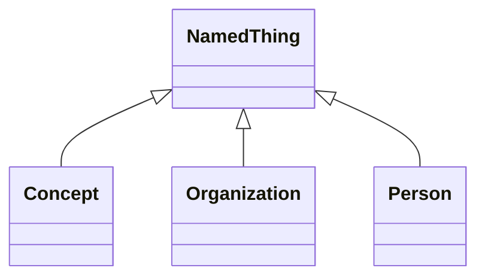

#### Attributes

| Name | Cardinality: | Type | Description |
| --- | --- | --- | --- |
| **[id](#Id)** | <sub>1..1</sub> | uriorcurie |  |
| **[name](#Name)** | <sub>1..1</sub> | string |  |
| **[description](#Description)** | <sub>0..1</sub> | string |  |
| **[depicted_by](#DepictedBy)** | <sub>0..1</sub> | ImageURL |  |

#### Children

 * [Concept](#Concept)
 * [Organization](#Organization) - An organization such as a company or university
 * [Person](#Person) - A person (alive, dead, undead, or fictional).


### NewsEvent


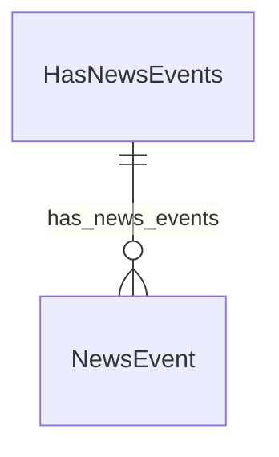

#### Attributes

| Name | Cardinality: | Type | Description |
| --- | --- | --- | --- |
| **[duration](#Duration)** | <sub>0..1</sub> | float |  |
| **[ended_at_time](#EndedAtTime)** | <sub>0..1</sub> | date |  |
| **[is_current](#IsCurrent)** | <sub>0..1</sub> | boolean |  |
| **[started_at_time](#StartedAtTime)** | <sub>0..1</sub> | date |  |
| **[headline](#Headline)** | <sub>0..1</sub> | string |  |

#### Parents

 * [Event](#Event)

#### Referenced by:

 *  **[HasNewsEvents](#HasNewsEvents)** : hasNewsEvents__has_news_events  <sub>0..\*</sub> 


### OperationProcedureConcept


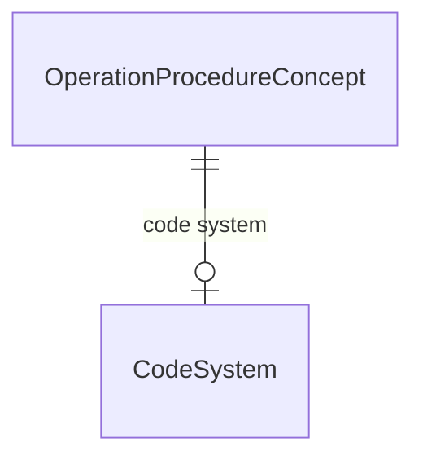

#### Attributes

| Name | Cardinality: | Type | Description |
| --- | --- | --- | --- |
| **[id](#Id)** | <sub>1..1</sub> | uriorcurie |  |
| **[name](#Name)** | <sub>1..1</sub> | string |  |
| **[description](#Description)** | <sub>0..1</sub> | string |  |
| **[code system](#CodeSystem)** | <sub>0..1</sub> | [CodeSystem](#CodeSystem) |  |
| **[depicted_by](#DepictedBy)** | <sub>0..1</sub> | ImageURL |  |
| **[mappings](#Mappings)** | <sub>0..\*</sub> | CrossReference |  |

#### Parents

 * [ProcedureConcept](#ProcedureConcept)


### Organization

An organization such as a company or university

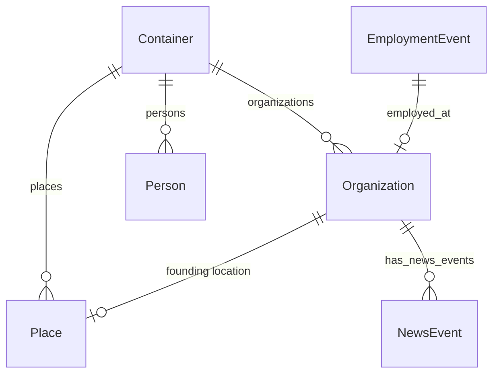

#### Attributes

| Name | Cardinality: | Type | Description |
| --- | --- | --- | --- |
| **[id](#Id)** | <sub>1..1</sub> | uriorcurie |  |
| **[name](#Name)** | <sub>1..1</sub> | string |  |
| **[description](#Description)** | <sub>0..1</sub> | string |  |
| **[depicted_by](#DepictedBy)** | <sub>0..1</sub> | ImageURL |  |
| **[aliases](#Aliases)** | <sub>0..\*</sub> | string |  |
| **[has_news_events](#HasNewsEvents)** | <sub>0..\*</sub> | [NewsEvent](#NewsEvent) |  |
| **[categories](#Categories)** | <sub>0..\*</sub> | [OrganizationType](#OrganizationType) |  |
| **[founding location](#FoundingLocation)** | <sub>0..1</sub> | [Place](#Place) |  |
| **[founding_date](#FoundingDate)** | <sub>0..1</sub> | string |  |
| **[min_salary](#MinSalary)** | <sub>0..1</sub> | SalaryType |  |
| **[mission_statement](#MissionStatement)** | <sub>0..1</sub> | string |  |
| **[score](#Score)** | <sub>0..1</sub> | decimal | A score between 0 and 5, represented as a decimal |

#### Parents

 * [NamedThing](#NamedThing) - A generic grouping for any identifiable entity

#### Uses

 *  mixin: [HasAliases](#HasAliases) - A mixin applied to any class that can have aliases/alternateNames
 *  mixin: [HasNewsEvents](#HasNewsEvents)

#### Referenced by:

 *  **[EmploymentEvent](#EmploymentEvent)** : employed_at  <sub>0..1</sub> 
 *  **[Container](#Container)** : organizations  <sub>0..\*</sub> 


### Person

A person (alive, dead, undead, or fictional).

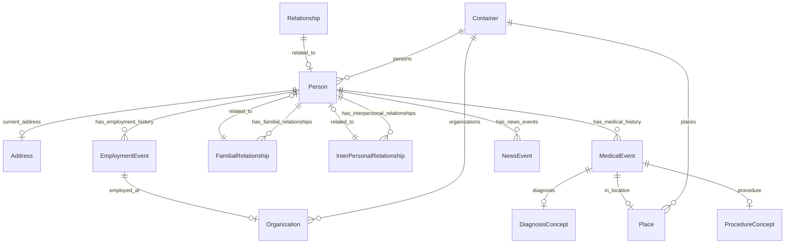

#### Attributes

| Name | Cardinality: | Type | Description |
| --- | --- | --- | --- |
| **[id](#Id)** | <sub>1..1</sub> | uriorcurie |  |
| **[name](#Name)** | <sub>1..1</sub> | string |  |
| **[description](#Description)** | <sub>0..1</sub> | string |  |
| **[depicted_by](#DepictedBy)** | <sub>0..1</sub> | ImageURL |  |
| **[aliases](#Aliases)** | <sub>0..\*</sub> | string |  |
| **[has_news_events](#HasNewsEvents)** | <sub>0..\*</sub> | [NewsEvent](#NewsEvent) |  |
| **[age_in_years](#AgeInYears)** | <sub>0..1</sub> | integer |  |
| **[birth_date](#BirthDate)** | <sub>0..1</sub> | string |  |
| **[current_address](#CurrentAddress)** | <sub>0..1</sub> | [Address](#Address) | The address at which a person currently lives |
| **[gender](#Gender)** | <sub>0..1</sub> | [GenderType](#GenderType) |  |
| **[has_employment_history](#HasEmploymentHistory)** | <sub>0..\*</sub> | [EmploymentEvent](#EmploymentEvent) |  |
| **[has_familial_relationships](#HasFamilialRelationships)** | <sub>0..\*</sub> | [FamilialRelationship](#FamilialRelationship) |  |
| **[has_interpersonal_relationships](#HasInterpersonalRelationships)** | <sub>0..\*</sub> | [InterPersonalRelationship](#InterPersonalRelationship) |  |
| **[has_medical_history](#HasMedicalHistory)** | <sub>0..\*</sub> | [MedicalEvent](#MedicalEvent) |  |
| **[primary_email](#PrimaryEmail)** | <sub>0..1</sub> | string |  |
| **[telephone](#Telephone)** | <sub>0..1</sub> | string |  |

#### Parents

 * [NamedThing](#NamedThing) - A generic grouping for any identifiable entity

#### Uses

 *  mixin: [HasAliases](#HasAliases) - A mixin applied to any class that can have aliases/alternateNames
 *  mixin: [HasNewsEvents](#HasNewsEvents)

#### Referenced by:

 *  **[FamilialRelationship](#FamilialRelationship)** : related to  <sub>1..1</sub> 
 *  **[InterPersonalRelationship](#InterPersonalRelationship)** : related to  <sub>1..1</sub> 
 *  **[Container](#Container)** : persons  <sub>0..\*</sub> 
 *  **[Relationship](#Relationship)** : related_to  <sub>0..1</sub> 


### Place


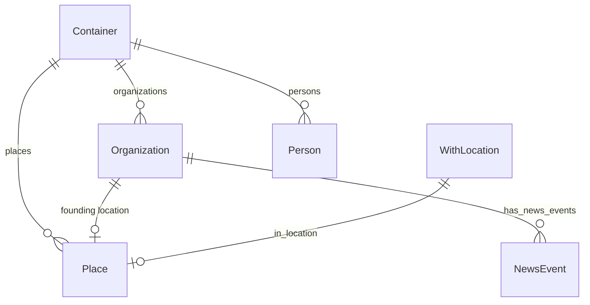

#### Attributes

| Name | Cardinality: | Type | Description |
| --- | --- | --- | --- |
| **[id](#Id)** | <sub>1..1</sub> | uriorcurie |  |
| **[name](#Name)** | <sub>1..1</sub> | string |  |
| **[aliases](#Aliases)** | <sub>0..\*</sub> | string |  |
| **[depicted_by](#DepictedBy)** | <sub>0..1</sub> | ImageURL |  |

#### Uses

 *  mixin: [HasAliases](#HasAliases) - A mixin applied to any class that can have aliases/alternateNames

#### Referenced by:

 *  **[Organization](#Organization)** : founding location  <sub>0..1</sub> 
 *  **[WithLocation](#WithLocation)** : in_location  <sub>0..1</sub> 
 *  **[Container](#Container)** : places  <sub>0..\*</sub> 


### ProcedureConcept


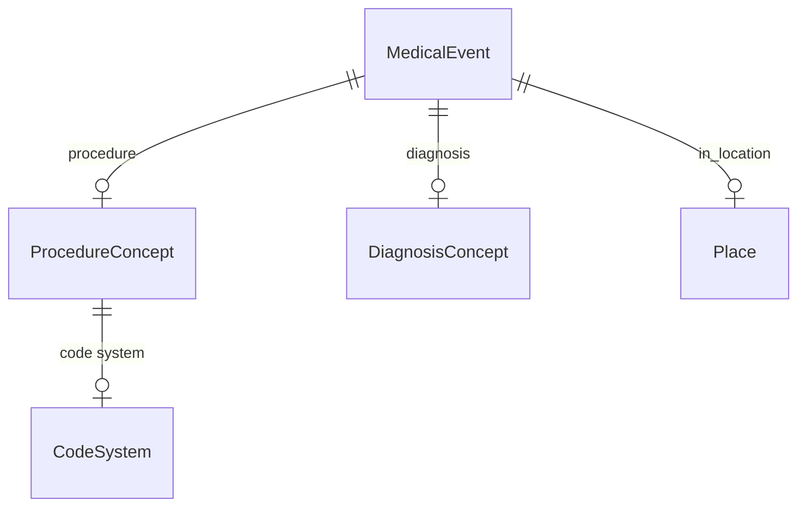

#### Attributes

| Name | Cardinality: | Type | Description |
| --- | --- | --- | --- |
| **[id](#Id)** | <sub>1..1</sub> | uriorcurie |  |
| **[name](#Name)** | <sub>1..1</sub> | string |  |
| **[description](#Description)** | <sub>0..1</sub> | string |  |
| **[code system](#CodeSystem)** | <sub>0..1</sub> | [CodeSystem](#CodeSystem) |  |
| **[depicted_by](#DepictedBy)** | <sub>0..1</sub> | ImageURL |  |
| **[mappings](#Mappings)** | <sub>0..\*</sub> | CrossReference |  |

#### Parents

 * [Concept](#Concept)

#### Children

 * [ImagingProcedureConcept](#ImagingProcedureConcept)
 * [OperationProcedureConcept](#OperationProcedureConcept)

#### Referenced by:

 *  **[MedicalEvent](#MedicalEvent)** : procedure  <sub>0..1</sub> 


### Relationship


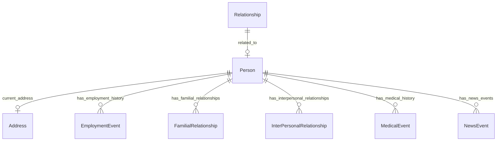

#### Attributes

| Name | Cardinality: | Type | Description |
| --- | --- | --- | --- |
| **[ended_at_time](#EndedAtTime)** | <sub>0..1</sub> | date |  |
| **[related_to](#RelatedTo)** | <sub>0..1</sub> | [Person](#Person) |  |
| **[started_at_time](#StartedAtTime)** | <sub>0..1</sub> | date |  |
| **[type](#Type)** | <sub>0..1</sub> | string |  |

#### Children

 * [FamilialRelationship](#FamilialRelationship)
 * [InterPersonalRelationship](#InterPersonalRelationship)


### CodeSystem


```mermaid
erDiagram
CodeSystem {

}
Concept {

}

Concept ||--|o CodeSystem : "code system"

```

#### Attributes

| Name | Cardinality: | Type | Description |
| --- | --- | --- | --- |
| **[id](#Id)** | <sub>1..1</sub> | uriorcurie |  |
| **[name](#Name)** | <sub>1..1</sub> | string |  |

#### Referenced by:

 *  **[Concept](#Concept)** : concept__code_system  <sub>0..1</sub> 


## Mixins


### HasAliases

A mixin applied to any class that can have aliases/alternateNames


#### Attributes

| Name | Cardinality: | Type | Description |
| --- | --- | --- | --- |
| **[aliases](#Aliases)** | <sub>0..\*</sub> | string |  |

#### Used as mixin by

 * [Organization](#Organization) - An organization such as a company or university
 * [Person](#Person) - A person (alive, dead, undead, or fictional).
 * [Place](#Place)

### HasNewsEvents


```mermaid
erDiagram
HasNewsEvents {

}
NewsEvent {

}

HasNewsEvents ||--}o NewsEvent : "has_news_events"

```

#### Attributes

| Name | Cardinality: | Type | Description |
| --- | --- | --- | --- |
| **[has_news_events](#HasNewsEvents)** | <sub>0..\*</sub> | [NewsEvent](#NewsEvent) |  |

#### Used as mixin by

 * [Organization](#Organization) - An organization such as a company or university
 * [Person](#Person) - A person (alive, dead, undead, or fictional).

### WithLocation


```mermaid
erDiagram
Place {

}
WithLocation {

}

WithLocation ||--|o Place : "in_location"

```

#### Attributes

| Name | Cardinality: | Type | Description |
| --- | --- | --- | --- |
| **[in_location](#InLocation)** | <sub>0..1</sub> | [Place](#Place) |  |

#### Used as mixin by

 * [MedicalEvent](#MedicalEvent)

## Slots

| Name | Cardinality/Range | Used By |
| --- | --- | --- |
| <a id="Id"></a>**id** | <sub>1..1</sub><br/>uriorcurie | [Concept](#Concept), [DiagnosisConcept](#DiagnosisConcept), [ImagingProcedureConcept](#ImagingProcedureConcept), [NamedThing](#NamedThing), [OperationProcedureConcept](#OperationProcedureConcept), [Organization](#Organization), [Person](#Person), [Place](#Place), [ProcedureConcept](#ProcedureConcept), [CodeSystem](#CodeSystem) |
| <a id="Name"></a>**name** | <sub>1..1</sub><br/>string | [Concept](#Concept), [DiagnosisConcept](#DiagnosisConcept), [ImagingProcedureConcept](#ImagingProcedureConcept), [NamedThing](#NamedThing), [OperationProcedureConcept](#OperationProcedureConcept), [Organization](#Organization), [Person](#Person), [Place](#Place), [ProcedureConcept](#ProcedureConcept), [CodeSystem](#CodeSystem) |
| <a id="Description"></a>**description** | <sub>0..1</sub><br/>string | [Concept](#Concept), [DiagnosisConcept](#DiagnosisConcept), [ImagingProcedureConcept](#ImagingProcedureConcept), [NamedThing](#NamedThing), [OperationProcedureConcept](#OperationProcedureConcept), [Organization](#Organization), [Person](#Person), [ProcedureConcept](#ProcedureConcept) |
| <a id="FamilialRelationshipRelatedTo"></a>**FamilialRelationship_related to** | <sub>1..1</sub><br/>[Person](#Person) |  |
| <a id="FamilialRelationshipType"></a>**FamilialRelationship_type** | <sub>1..1</sub><br/>[FamilialRelationshipType](#FamilialRelationshipType) |  |
| <a id="InterPersonalRelationshipRelatedTo"></a>**InterPersonalRelationship_related to** | <sub>1..1</sub><br/>[Person](#Person) |  |
| <a id="InterPersonalRelationshipType"></a>**InterPersonalRelationship_type** | <sub>1..1</sub><br/>string |  |
| <a id="OrganizationCategories"></a>**Organization_categories** | <sub>0..\*</sub><br/>[OrganizationType](#OrganizationType) |  |
| <a id="PersonAgeInYears"></a>**Person_age_in_years** | <sub>0..1</sub><br/>integer |  |
| <a id="PersonPrimaryEmail"></a>**Person_primary_email** | <sub>0..1</sub><br/>string |  |
| <a id="PersonTelephone"></a>**Person_telephone** | <sub>0..1</sub><br/>string |  |
| <a id="AgeInYears"></a>**age_in_years** | <sub>0..1</sub><br/>integer | [Person](#Person) |
| <a id="BirthDate"></a>**birth_date** | <sub>0..1</sub><br/>string | [Person](#Person) |
| <a id="Categories"></a>**categories** | <sub>0..\*</sub><br/>string | [Organization](#Organization) |
| <a id="City"></a>**city** | <sub>0..1</sub><br/>string | [Address](#Address) |
| <a id="ConceptCodeSystem"></a>**concept__code_system** | <sub>0..1</sub><br/>[CodeSystem](#CodeSystem) |  |
| <a id="ConceptMappings"></a>**concept__mappings** | <sub>0..\*</sub><br/>CrossReference |  |
| <a id="CurrentAddress"></a>**current_address**<br/>The address at which a person currently lives | <sub>0..1</sub><br/>[Address](#Address) | [Person](#Person) |
| <a id="DepictedBy"></a>**depicted_by** | <sub>0..1</sub><br/>ImageURL | [Concept](#Concept), [DiagnosisConcept](#DiagnosisConcept), [ImagingProcedureConcept](#ImagingProcedureConcept), [NamedThing](#NamedThing), [OperationProcedureConcept](#OperationProcedureConcept), [Organization](#Organization), [Person](#Person), [Place](#Place), [ProcedureConcept](#ProcedureConcept) |
| <a id="Diagnosis"></a>**diagnosis** | <sub>0..1</sub><br/>[DiagnosisConcept](#DiagnosisConcept) | [MedicalEvent](#MedicalEvent) |
| <a id="Duration"></a>**duration** | <sub>0..1</sub><br/>float | [EmploymentEvent](#EmploymentEvent), [Event](#Event), [MedicalEvent](#MedicalEvent), [NewsEvent](#NewsEvent) |
| <a id="EmployedAt"></a>**employed_at** | <sub>0..1</sub><br/>[Organization](#Organization) | [EmploymentEvent](#EmploymentEvent) |
| <a id="EndedAtTime"></a>**ended_at_time** | <sub>0..1</sub><br/>date | [EmploymentEvent](#EmploymentEvent), [Event](#Event), [FamilialRelationship](#FamilialRelationship), [InterPersonalRelationship](#InterPersonalRelationship), [MedicalEvent](#MedicalEvent), [NewsEvent](#NewsEvent), [Relationship](#Relationship) |
| <a id="FoundingLocation"></a>**founding location** | <sub>0..1</sub><br/>[Place](#Place) | [Organization](#Organization) |
| <a id="FoundingDate"></a>**founding_date** | <sub>0..1</sub><br/>string | [Organization](#Organization) |
| <a id="Gender"></a>**gender** | <sub>0..1</sub><br/>[GenderType](#GenderType) | [Person](#Person) |
| <a id="HasAliasesAliases"></a>**hasAliases__aliases** | <sub>0..\*</sub><br/>string |  |
| <a id="HasNewsEventsHasNewsEvents"></a>**hasNewsEvents__has_news_events** | <sub>0..\*</sub><br/>[NewsEvent](#NewsEvent) |  |
| <a id="HasEmploymentHistory"></a>**has_employment_history** | <sub>0..\*</sub><br/>[EmploymentEvent](#EmploymentEvent) | [Person](#Person) |
| <a id="HasFamilialRelationships"></a>**has_familial_relationships** | <sub>0..\*</sub><br/>[FamilialRelationship](#FamilialRelationship) | [Person](#Person) |
| <a id="HasInterpersonalRelationships"></a>**has_interpersonal_relationships** | <sub>0..\*</sub><br/>[InterPersonalRelationship](#InterPersonalRelationship) | [Person](#Person) |
| <a id="HasMedicalHistory"></a>**has_medical_history** | <sub>0..\*</sub><br/>[MedicalEvent](#MedicalEvent) | [Person](#Person) |
| <a id="Image"></a>**image** | <sub>0..1</sub><br/>string |  |
| <a id="InLocation"></a>**in_location** | <sub>0..1</sub><br/>[Place](#Place) | [MedicalEvent](#MedicalEvent), [WithLocation](#WithLocation) |
| <a id="IntId"></a>**int_id** | <sub>1..1</sub><br/>integer | [IntegerPrimaryKeyObject](#IntegerPrimaryKeyObject) |
| <a id="IsCurrent"></a>**is_current** | <sub>0..1</sub><br/>boolean | [EmploymentEvent](#EmploymentEvent), [Event](#Event), [MedicalEvent](#MedicalEvent), [NewsEvent](#NewsEvent) |
| <a id="MinSalary"></a>**min_salary** | <sub>0..1</sub><br/>SalaryType | [Organization](#Organization) |
| <a id="MissionStatement"></a>**mission_statement** | <sub>0..1</sub><br/>string | [Organization](#Organization) |
| <a id="NewsEventHeadline"></a>**newsEvent__headline** | <sub>0..1</sub><br/>string |  |
| <a id="Organizations"></a>**organizations** | <sub>0..\*</sub><br/>[Organization](#Organization) | [Container](#Container) |
| <a id="Persons"></a>**persons** | <sub>0..\*</sub><br/>[Person](#Person) | [Container](#Container) |
| <a id="Places"></a>**places** | <sub>0..\*</sub><br/>[Place](#Place) | [Container](#Container) |
| <a id="PostalCode"></a>**postal_code** | <sub>0..1</sub><br/>string | [Address](#Address) |
| <a id="PrimaryEmail"></a>**primary_email** | <sub>0..1</sub><br/>string | [Person](#Person) |
| <a id="Procedure"></a>**procedure** | <sub>0..1</sub><br/>[ProcedureConcept](#ProcedureConcept) | [MedicalEvent](#MedicalEvent) |
| <a id="RelatedTo"></a>**related to** | <sub>1..1</sub><br/>[Person](#Person) |  |
| <a id="RelatedTo"></a>**related_to** | <sub>0..1</sub><br/>[Person](#Person) | [FamilialRelationship](#FamilialRelationship), [InterPersonalRelationship](#InterPersonalRelationship), [Relationship](#Relationship) |
| <a id="Salary"></a>**salary** | <sub>0..1</sub><br/>SalaryType | [EmploymentEvent](#EmploymentEvent) |
| <a id="Score"></a>**score**<br/>A score between 0 and 5, represented as a decimal | <sub>0..1</sub><br/>decimal | [Organization](#Organization) |
| <a id="StartedAtTime"></a>**started_at_time** | <sub>0..1</sub><br/>date | [EmploymentEvent](#EmploymentEvent), [Event](#Event), [FamilialRelationship](#FamilialRelationship), [InterPersonalRelationship](#InterPersonalRelationship), [MedicalEvent](#MedicalEvent), [NewsEvent](#NewsEvent), [Relationship](#Relationship) |
| <a id="Street"></a>**street** | <sub>0..1</sub><br/>string | [Address](#Address) |
| <a id="Telephone"></a>**telephone** | <sub>0..1</sub><br/>string | [Person](#Person) |
| <a id="Type"></a>**type** | <sub>0..1</sub><br/>string | [FamilialRelationship](#FamilialRelationship), [InterPersonalRelationship](#InterPersonalRelationship), [Relationship](#Relationship) |

## Enums


### DiagnosisType


| Text | Meaning: | Description |
| --- | --- | --- |
| todo | None |  |

### FamilialRelationshipType


| Text | Meaning: | Description |
| --- | --- | --- |
| CHILD_OF | famrel:03 |  |
| PARENT_OF | famrel:02 |  |
| SIBLING_OF | famrel:01 |  |

#### Used by

 *  **[FamilialRelationship](#FamilialRelationship)** *[FamilialRelationship_type](#FamilialRelationshipType)*  <sub>1..1</sub> 

### GenderType


| Text | Meaning: | Description |
| --- | --- | --- |
| cisgender man | GSSO:000371 |  |
| cisgender woman | GSSO:000385 |  |
| nonbinary man | GSSO:009254 |  |
| nonbinary woman | GSSO:009253 |  |
| transgender man | GSSO:000372 |  |
| transgender woman | GSSO:000384 |  |

#### Used by

 *  **[Person](#Person)** *[gender](#Gender)*  <sub>0..1</sub> 

### NonFamilialRelationshipType


| Text | Meaning: | Description |
| --- | --- | --- |
| BEST_FRIEND_OF | None |  |
| COWORKER_OF | famrel:70 |  |
| MORTAL_ENEMY_OF | None |  |
| ROOMMATE_OF | famrel:71 |  |

### OrganizationType


| Text | Meaning: | Description |
| --- | --- | --- |
| charity | bizcodes:001 |  |
| for profit | None |  |
| loose organization | None |  |
| non profit | None |  |
| offshore | None |  |
| shell company | None |  |

#### Used by

 *  **[Organization](#Organization)** *[Organization_categories](#OrganizationCategories)*  <sub>0..\*</sub>

