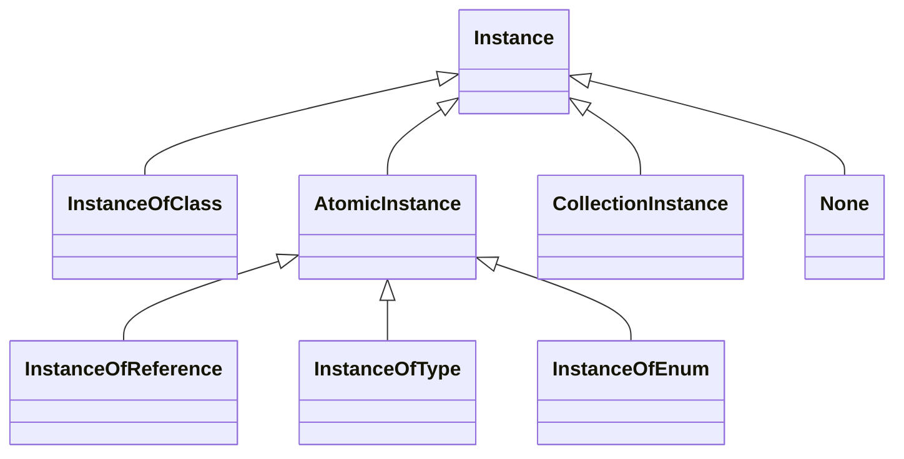
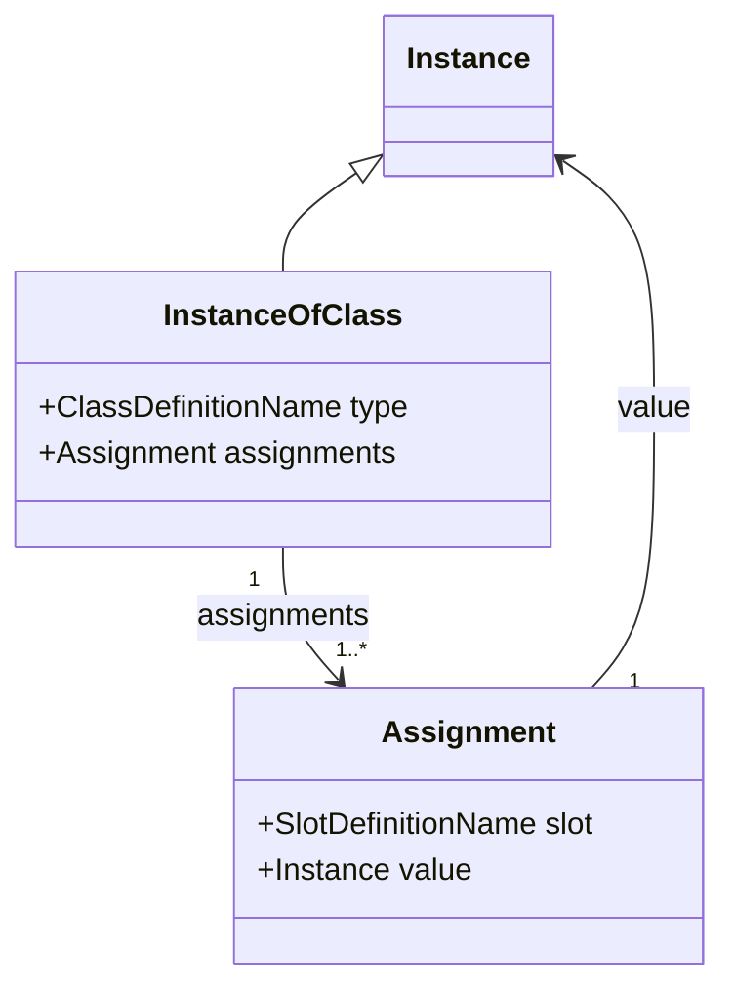
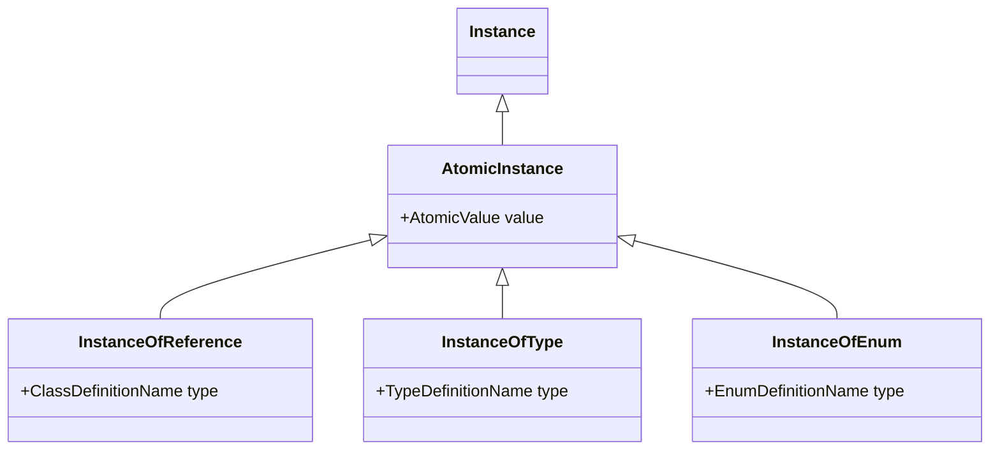
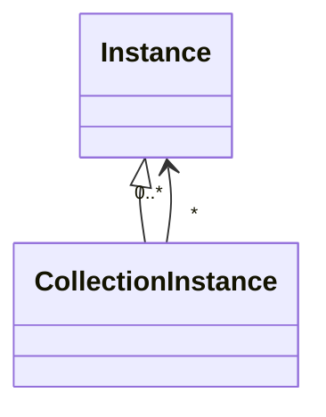

# LinkML Instances

## Abstract Functional Instance Syntax and Structure

This specification provides a grammar for a **functional syntax** for expressing the structure of LinkML instances. A LinkML instance is a tree-like structure conforming to the syntax specified here.

This syntax is not intended for data exchange, but instead for unambiguous describing data in LinkML in a way that is independent of any particular syntax.

[Section 6](../06mapping) specifies how the instance model is serialized as JSON, YAML, and RDF, and guidelines for mapping to object-oriented programming representations.

This section uses BNF to define the structure of the LinkML instance abstract model.
We also include UML-style diagrams for informative purposes.

### Instances

An instance is a tree-like structure conforming to either one of four *definition* types, or a *collection*, or the special token `None`. The four definition types are subdivided into instances of classes (aka objects), or atomic instances:

> **Instance** := **None** | **InstanceOfClass** | **AtomicInstance** | **CollectionInstance**
 
> **AtomicInstance** := **InstanceOfType** | **InstanceOfEnum** | **InstanceOfReference**



### Definition Types and Names

Definition names are used to unambiguously indicate *elements* specified in a **Schema** (described in [Part 3](../03schemas)):

> **ClassDefinitionName** := **ElementName** | **Unspecified**

> **TypeDefinitionName** := **ElementName** | **Unspecified**

> **EnumDefinitionName** := **ElementName** | **Unspecified**

> **SlotDefinitionName** := **ElementName**

> **ElementName** := **LocalName** | **PrefixedName** | **IRI**

> **LocalName** := *a finite sequence of characters matching the PN_LOCAL production of [SPARQL](https://www.w3.org/TR/rdf-sparql-query/) and not matching any of the keyword terminals of the syntax*

> **PrefixedName** := **Prefix** ':' **LocalName**

> **IRI** := '<' *a valid IRI* '>'

> **Unspecified** := '?'

Names SHOULD NOT be shared across definition types.

The **Unspecified** name is used to indicate that the name of the class, type, or enum
is unknown. An instance that uses **Unspecified** as a name anywhere in its tree is
called *uncommitted*. Uncommitted trees may be generated when parsing from tree-serializations
such as JSON or the JSON-equivalent of YAML. They may be replaced with names as
part of an **Inference Procedure** (see [Part 5](../05validation)).

### Instances of Classes (Objects)

An **InstanceOfClass** is a pair consisting of (1) a ClassDefinition *Name* that indicates the *instantiation type* of the instance, and (2) zero to many *Assignments**, where each
assignment is a key-value pair of a **SlotName** and an **Instance** value.

> **InstanceOfClass** := **ClassDefinitionName** '(' <**Assignment**>List ')'

> **Assignment** := **SlotDefinitionName** '=' **Instance**



No SlotDefinitionName can appear twice in any set of Assignments (i.e. SlotDefinitionName is a *key*)

An example instance might be written in functional syntax as:

```python
Person(id=...,
       name=...,
       age=...,
       <other Assignments>)
```

Here the **ClassDefinitionName** is `Person`, and the **SlotDefinitionName**s are `id`, `name`, `age`.

### Primitive (Atomic) Instances

There are 3 types of primitive (aka atomic aka scalar) instances, each is a pair consisting of (1) a *Name* of the element instantiated (2) an atomic value. Different syntaxes are used to unambiguously distinguish the different types of primitive instances.

> **InstanceOfType** := **TypeDefinitionName** '^' **AtomicValue** 

> **InstanceOfEnum** := **EnumDefinitionName** '[' **PermissibleValue** ']'
> 
> **PermissibleValue** := **AtomicValue**

> **InstanceOfReference** := **ClassDefinitionName** '&' **ObjectReference** 
> 
> **ObjectReference** := **AtomicValue** 



Terminology note: Primitive instances are also known as "literals" or "scalars".

### Atomic Values

An atomic value is either a string or number or boolean, where numbers can be floating points, decimals, or integers.

> **AtomicValue** := **QuotedString** | **NumberValue** | **BooleanValue**

> **QuotedString** := '"' **StringValue** '"'
>
> **StringValue** := *a finite sequence of characters in which " (U+22) and \ (U+5C) occur only in pairs of the form \" (U+5C, U+22) and \\ (U+5C, U+5C), enclosed in a pair of " (U+22) characters*

> **NumberValue** := **FloatingPointValue** | **DecimalValue** | **IntegerValue**

> **FloatingPointValue** ::= [ '+' | '-'] ( **Digits** ['.'**Digits**] [ **Exponent** ] | '.' **Digits** [ **Exponent** ]) ( 'f' | 'F' )

> **Exponent** ::= ('e' | 'E') ['+' | '-'] **Digits**

> **DecimalValue** ::= ['+' | '-'] **Digits** '.' **Digits** 

> **IntegerValue** ::= ['+' | '-'] **Digits**

> **NonNegativeInteger** ::= **Zero** | **PositiveInteger**

> **PositiveInteger** ::= **NonZero** { **Digit** }

> **Digits** ::= **Digit** { **Digit** }

> **Digit** ::= **Zero** | **NonZero**

> **NonZero** := '1' | '2' | '3' | '4' | '5' | '6' | '7' | '8' | '9'

> **Zero** ::= '0'

> **BooleanValue** ::= 'True' | 'False'

Examples of atomic values are:

* `180.2` -- a DecimalValue
* `5` -- an IntegerValue
* `"Alex"` -- a StringValue
* `True` -- a BooleanValue
* `"2023-01-01"` -- a StringValue (which happens to be interpetable as a date)

#### Atomic Instance Examples

An **InstanceOfType** instance might look like:

```python
Integer^23
```

In this example, the **TypeDefinitionName** is `Integer`, and the **AtomicValue** is the number `23`.

Note that this is necessarily a syntactically valid Instance according to this part of the specification. Part 6 describes schema-level validation, and for this to be valid according to a schema, that schema must (a) provide a TypeDefinition with the name "Integer" (b) map this to an XSD number type (presumably, xsd:integer).

Note that the following is *syntactically valid*: 

```python
Integer^"ABC"
```

If `Integer` is a TypeDefinition that is mapped to the XSD type for integers, then this will be invalid according to the schema, but at the syntactic level the structure is valid.


Another example if a syntactically valid **InstanceOfType**:

```python
PhoneNumber^"+1 800 555 0100"
```

For this to be a valid according to a schema InstanceOfType, "PhoneNumber" must be the name of a TypeDefinition in the schema, mapped to an XSD string type.

An example of a syntactically valid **InstanceOfReference**:

```python
Person&"SSN:456"
```

This is syntactically valid, but for it to be valid according to a schema, the schema must include a ClassDefinition with the name `Person`, and that ClassDefinition must have an *identifier* (see Part 6).

### Collections

A collection is zero or more instances, serialized as a comma-delimited list inside square brackets:

> **CollectionInstance** := '[' <**Instance**>List ']'



Examples of collections:

* `[String^"A", String^"B", Integer^5]` -- a list of primitive instances
* `[Person(name=..., ...), Person(name=..., ...)]` -- a list of class instances
* `[Person(name=..., ...), Integer^5, None]` -- a heterogeneous collection
* `[]` -- an empty collection
* `[[Integer^1,Integer^2], [Integer^3, Integer^4]]` -- a list of lists

Note that collections can be serialized in different ways depending on the target syntax, for examples, lists vs dictionaries. See section [6](../06mapping) for details of serializations.

### None (Null) instances

A special symbol is included to indicate null or missing values

> **None** := 'None'

An assignment of a slot to None is equivalent to omitting that assignment. I.e. the following two instance serializations are equivalent:

```
Person(address=None)
```

```
Person()
```

### Combined Example

The following is an example of an **InstanceOfClass** where the instantiated type is a class with name "Person":

```python
Person(
  id=String^"SSN:123",
  name=String^"Alex",
  aliases=[String^"Alexandra"],
  address=None,
  phone=PhoneNumber^"+1 800 555 0100",
  height=
    Measurement(value=Decimal^170.2
                unit=UnitCode["cm"]),
  relationships=[
    FamilialRelationship(
      type=RelationshipType["SIBLING_OF"],
      related_to=Person&"SSN:456"
    )
  ]
)                
```

## Identity conditions

Two instances `i` and `j` are identical if one of the following conditions is met:

| **Name**          | `i`                                   | `j`                                   | Additional Conditions |
|-------------------|---------------------------------------|---------------------------------------|-----------------------|
| `None`            | `None`                                | `None`                                |                       |
| `TypeDefinition`  | `<TypeDefinitionName>^<AtomicValue>`  | `<TypeDefinitionName>^<AtomicValue>`  |                       |
| `ObjectReference` | `<ClassDefinitionName>&<AtomicValue>` | `<ClassDefinitionName>&<AtomicValue>` |                       |
| `EnumDefinition`  | `<EnumDefinitionName>[<AtomicValue>]` | `<EnumDefinitionName>[<AtomicValue>`  |                       |
| `ClassDefinition` | `<ClassDefinition>(ai1, ..., aiN)`    | `<ClassDefinition>(aj1, ..., ajN)`    | See below             |
| `Collection`      | `[i1, ..., iN]`                       | `[j1, ..., jN]`                       | `i1=j`, ..., `iN=jN`  |

### Identity conditions for ClassDefinition Instances

Two ClassDefinition instances `i` and `j` are identical if (1) both instantiate the same class, and all slot assignments can be matched, regardless of order.

Note that prior to comparison, the representation is first *normalized* and all assignments whose value is `None` are removed.

```
if
  i == <ClassName>(<Assignments_i>) and j == <ClassName>(<Assignments_j>) and
  all(a_i in Assignments_i if any(a_j in Assignments_j if a_i == a_j)) and
  all(a_j in Assignments_j if any(a_i in Assignments_i if a_i == a_j))
then
  i == j   
```

Two slot value assignments are identical if either (1) either is None (b) slot and value match

Assignment identity conditions:

```
if 
  a_i == <SlotName>=<Value_i> and a_j == <SlotName>=<Value_j> and Value_i == Value_j
then
  a_i == a_j
```


## Instance Accessor Syntax

For a given instance `i`, **Path** syntax can be used to dereference values.

> **PathComponent** := '.' **SlotDefinitionName** | '[' **Identifier** ']'
>
> **Identifier** := **AtomicValue**

An path is a name of a variable denoting an instance followed by zero or more **PathComponent**s.

> **Path** := **VariableName** [  **PathComponent** ]

To interpret a path *p*:

1. **VariableName** is resolved to an instance *i*
2. For each path component in the path, reset *i* to be the value of looking up that component:
    - if the path extension is `.<s>` then *r* must be an **InstanceOfClass*, and the value is equal to the value of the slot assignment for slot `s`
    - if the path extension is `[<key>]` then *r* must be an **InstanceOfCollection**, and the value is equals to the member of that list that has a slot with the role of *identifier* whose value is `<key>`

For example, if *i* is equal to the Person instance in the Combined Example above:

* `i` == `i`
* `i.id` == `String^"SSN:123"`
* `i.height.unit` == `String^"cm"`
* `i.relationships[0].related_to` == `Person&"SSN:456"`
