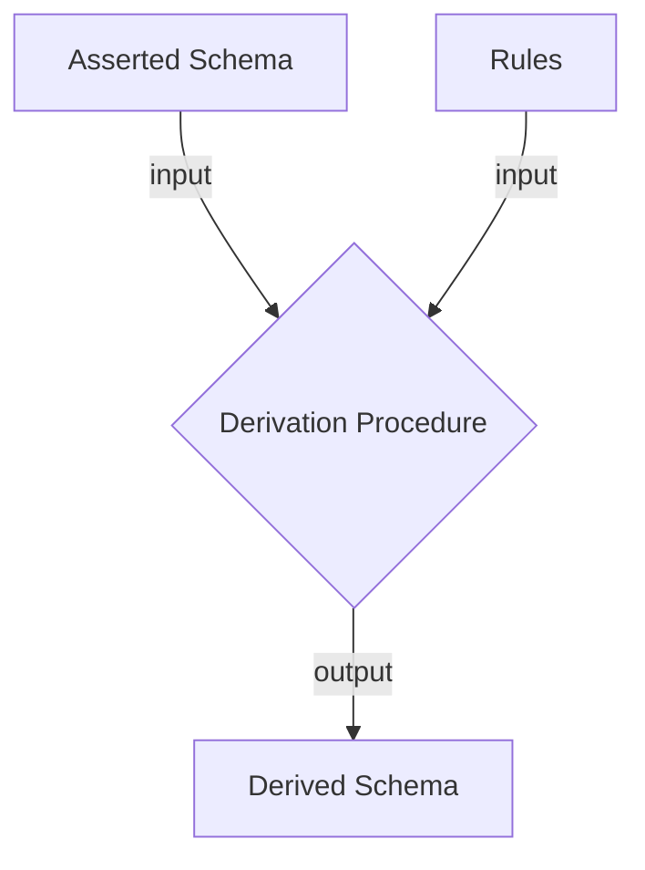

# Derived Schemas

This section describes rules that can be applied to a schema to obtain a *derived* schema.

The derived schema can be *materialized* as a static schema object, or it may be a dynamic *view* onto a schema object.

Derived schemas are also known as *induced* schemas or *inferred* schemas.



Derivations happen via *derivation rules*, using a collection of defined *functions*.

## Conventions

We use *m* to denote the input or asserted schema (model), and *m<sup>D</sup>* to denote the derived schema

## Informative Example

We provide a non-normative example of a schema in canonical YAML. This will be referred to
in the remainder of the document.

The schema is organized in a local folder as follows:

person.yaml:
```yaml
id: https://w3id.org/linkml/examples/person
name: person
prefixes:
  person: https://w3id.org/linkml/examples/person
  linkml: https://w3id.org/linkml/
default_prefix: person
imports:
  - linkml:types
  - core
  
classes:
  Person:
    is_a: NameThing
    description: >-
      A person, living or dead
    slots:
      - age_in_years
      - vital_status

slots:
    age_in_years:
      description: >-
        The age of a person in years
      range: integer
      multivalued: false
    vital_status:
      description: >-
        The vital status of a person
      range: VitalStatusEnum

enums:
  VitalStatusEnum:
    description: >-
      The vital status of a person
    permissible_values:
      ALIVE:
      DECEASED:
```

core.yaml:
```yaml
id: https://w3id.org/linkml/examples/core
name: person-core
prefixes:
  person: https://w3id.org/linkml/examples/person
  linkml: https://w3id.org/linkml/
default_prefix: person
imports:
  - linkml:types
  
classes:
  NamedThing:
    attributes:
      id:
        range: string
        identifier: true
      name:
        range: string
...
```


## Functions

This section defines functions that can be used in schema derivation rules.

### Normalize as List Function

The function **L**(*v*) normalizes `v` to a list/collection:

| *v*                                 | **L**(*v*)      |
|-------------------------------------|-----------------|
| `None`                              | `[]`            |
| `[v1, v2, ...]`                     | `[v1, v2, ...]` |
| `v` *if no preceding matches apply* | `[v]`           |

i.e.

```
L(v) = 
  [] if v == None
  v if v == [...]
  [v] otherwise
```

### Identifier Value Function

The function **K**(*v*) returns the identifier value of an **InstanceOfClassDefinition**, if present, otherwise `None`

In the metamodel, the identifier **SlotDefinitionName** is always `name`, so this can be calculated:

> **K**(*v*) = *v*.**name**

### URI and CURIE functions

- a CURIE is a string that conforms to the [W3 CURIE specification](https://www.w3.org/TR/curie/)
- a URI is a string that conforms to [rfc3987](https://www.ietf.org/rfc/rfc3987.txt)
- The function **URI**(*s*, *v*) takes a string as input and normalizes it to a URI
    - if the input is already a URI, then return it
    - if the input is a CURIE, then expand it using the prefix map in *s*; this is known as *expansion*
- The function **CURIE**(*s*, *v*) takes a string as input and normalizes it to a CURIE
    - if the input is already a CURIE, then return it
    - if the input is a URI, then shorten it using the prefix map in *s*; this is known as *contraction*

When a CURIE is expanded, it is first decomposed according to the grammar defined in [W3 CURIE specification](https://www.w3.org/TR/curie/):

> curie       :=   [ [ prefix ] ':' ] reference
> 
> prefix      :=   [NCName](http://www.w3.org/TR/1999/REC-xml-names-19990114/#NT-NCName)
>
> reference   :=   irelative-ref (as defined in [IRI](https://www.w3.org/TR/curie/#ref_IRI))

The following concatenation is applied

> **URI**(`<prefix>`: `<reference>`) = `m.prefixes`[`prefix`]`.prefix_reference` + `<reference>`

For the reverse operation, any URI that starts with a prefix reference can be used to generate a valid CURIE.
The one with the shortest reference is chosen as the canonical.

### Resolve Functions

The function **Resolve** takes as input a **InstanceOfReference** and returns an **InstanceOfClass**
that is the referenced object.

| *i*                    | **Resolve**(*i*)                            |
|------------------------|---------------------------------------------|
| `SlotDefinition&<V>`   | `m.slots[<V>]`                              |
| `ClassDefinition&<V>`  | `m.classes[<V>]`                            |
| `EnumDefinition&<V>`   | `m.enums[<V>]`                              |
| `TypeDefinition&<V>`   | `m.types[<V>]`                              |
| `SchemaDefinition&<V>` | see below                                   |
| [*i1*, *i2*, ...]      | [**Resolve**(*i1*), **Resolve**(*i2*), ...] |

The rules for schema resolution are as follows:

1. Determine the *location* of *V*, which may be on the local file system or on a network
    - if *V* is in a user-supplied *import map*, then look up this value
    - if *V* is a URL, then retrieve from this location
    - if *V* is a CURIE, then expand using the rules below, and retrieve from this location
    - otherwise retrieve from local file system, relative to the current schema, assuming a `.yaml` suffix
2. Load the YAML file at this location following the rules for parsing YAML in Part 6, yielding a SchemaDefinition instance.

Examples:

| *i*                           | **Resolve**(*i*) in *m<sup>D*                                          |
|-------------------------------|------------------------------------------------------------------------|
| `ClassDefinition&Person`      | `m.classes["Person"]` = `ClassDefinition(name="Person", ...)`          |
| `SlotDefinition&vital_status` | `m.slots["vital_status"]` = `SlotDefinition(name="vital_status", ...)` |

### Lookup Functions

The notation **i**.`<slot>` denotes a function that looks up the slot assignment `slot`
in instance `i`. If `i` is a **InstanceOfReference** it is first *Resolved*, as per the table above. If `i` is collection of
references, then each element is resolved.

### Closure Function 

The function **C**(*e*, *f*) takes as input an element *e* and a function *f* and returns
the mathematical closure of *f* 

```
C(e, f) = { f(e) } U { f(e') | e' in C(e, f) }
```

The *ReflexiveClosure* **C<sup>*</sup>** includes *e*

```
C*(e, f) = C(e, f) U { e }
```

### Function: Parents

**Parents** itself is the union of `is_a` and `mixins`, plus the builtin ClassDefinition `Any`:

> **P**(*e*) = **L**(*e*.`is_a`) ∪ **L**(*e*.`mixins`) } ∪ { `Any` }

### Function: Ancestors

The ancestors function **A** returns the **Closure** of the **Parents** function

> **A**(*e*) = **C**(*e*, **P**) 

The function **ReflexiveAncestors** **A*** uses the **ReflexiveClosure**.

> **A**`*`(*e*) = **C**`*`(*e*, **P**)

### Function: Imports Closure

The imports closure function **I** returns the reflexive **ReferenceClosure** of the direct imports.

> **I**(*s*) = **C**`*`(*s*, **s.imports**)

### Function: Element CURIEs and URIs

For each element in the schema, we can derive a model URI and an element URI. These *may* be identical.

The following table is used:

| Type                | Element URI   | Model URI                                |
|---------------------|---------------|------------------------------------------|
| `ClassDefinition`   | `e.class_uri` | `<m.default_prefix>:<SafeCamel(e.name)>` |
| `SlotDefinition`    | `e.slot_uri`  | `<m.default_prefix>:<SafeSnake(e.name)>` |
| `TypeDefinition`    | `e.uri`       | `<m.default_prefix>:<SafeCamel(e.name)>` |
| `EnumDefinition`    | `e.enum_uri`  | `<m.default_prefix>:<SafeCamel(e.name)>` |
| `PermissibleValue`  | `e.meaning`   | `ModelURI(Enum) + "." + Safe(e.text)`    |

If the element URI slot is not set, then the model URI is used as the element URI.

URIs can be contracted to CURIEs using the `prefixes` map in the model, see next function.

### Function: Applicable Slots

The applicable slots for a class are all valid slots to use for an instance of that class.
It is the set of all direct slots for that class and its ancestors.

> **ApplicableSlots**(*c*) = <sub>*c'* ∈ **A***(*c*)</sub> **DirectSlots**(*c'*)
> 
> **DirectSlots(c)** = **L**(c.`slots`) ∪ **L**(c.`attributes`)

### Algorithm: Combine Slots

The combine slot algorithm takes two slots s1 and s2. s1 is assumed to have *precedence* over s2.

```
CombineSlots(s1, s2) = 
  s = SlotDefinition()
  for ms in MetaModel.slots:
    s.ms = CombineSlotsMetaslots(ms, s1.ms, s2.ms)
```

The `CombineSlotsMetaslots` function is evaluated by looking up the table below:

| metaslot                 | v1     | v2     | expression                  |
|--------------------------|--------|--------|-----------------------------|
|                          | `v`    | `v`    | v                           |
|                          | `None` | `v2`   | v2                          |
|                          | `v1`   | `None` | v1                          |
| `.name == maximum_value` |        |        | `min(v1,v2)`                |
| `.name == minimum_value` |        |        | `max(v1,v2)`                |
| `.name == pattern`       |        |        | `CombinePattern(v1,v2)`     |
| `.name == range`         |        |        | **A***(*r1*) ∩ **A***(*r2*) |
| `.multivalued == True`   |        |        | `L(v1) U L(v2)`             |
| `.range == boolean`      |        |        | `v1 OR v2`                  |
|                          |        |        | `v1`                        |

The preconditions are matched in order of precedence, thus if no 
preconditions save the last one match, then the value is taken from the
first, higher precedence slot.

### Algorithm: Combine Schemas

Two schemas combined by combining their individual elements

```
CombineSchemas(m1, m2):
  m = SchemaDefinition()
  m.classes = CombineElements(m1.classes, m2.classes)
  m.types = CombineElements(m1.types, m2.types)
  m.slots = CombineElements(m1.slots, m2.slots)
  m.enums = CombineElements(m1.enums, m2.enums)
  m.subsets = CombineElements(m1.subsets, m2.subsets)  
```

```
CombineElements(E1, E2):
  E1ids = { e.id for e in E1 }
  E2ids = { e.id for e in E2 }
  for e in E1:
    if e.id in E2ids:
      raise Error
    else:
      yield e
  for e in E2:
    if e.id in E1ids:
      raise Error
    else:
      yield e    
```

### Algorithm: Calculate Derived Slot

**DerivedSlot(*s*, *c*)** takes a slot definition name *s* and a class definition name *c* and returns
a *derived* slot that is pre-populated with the appropriate inferred values.

The procedure first applies slot usage and attributes from the class and its ancestors, then
it applies top level slot definitions for that slot and the slot ancestors. In the latter case, only
metaslots marked inheritable are propagated.

```
DerivedSlot(m,s,c):
  d = SlotDefinition(name=s, alias=s)
  ApplySlotUsage(d,s,c)
  if s in m.slots:
    d = CombineSlots(d, m.slots[s])
    for s' in A(s):
      for ms in MetaModel.slots:
        if ms.inheritable:
          d.ms = CombineSlotsMetaslots(ms, d.ms, m.slots[s'].ms)   
  AddMissingValues(d, c) 
  return d
```

The `ApplySlotUsage` function iteratively combines the value of the `slot_usage` and `attributes`
metaslots for a class, and then for class ancestors, with mixins having priority.
   
```
ApplySlotUsage(d, s, c):
  for s' in { c.slot_usage, c.attributes}
    s' = CombineSlots(d, s')
  for c' in **L**(c.`mixins`) ∪ **L**(c.`is_a`)
    ApplySlotUsage(d, s, c') 
```

The function `AddMissingValues(s, c)` is calculated for a **SlotDefinition** according to the following table

| Preconditions            | Postconditions   |
|--------------------------|------------------|
| `s.inlined_as_dict=True` | `s.inlined=True` |
| `PK(c)=None`             | `s.inlined=True` |

### Algorithm: Calculate Permissible Values

The set of permissible values for an Enum may be specified as a static fixes list OR as a dynamic query OR both

```
PVs(e):
  pvs = Texts(e.permissible_values)
  for e' in e.inherits:
    pvs = pvs U PVs(e')
  for e' in e.minus:
    pvs = pvs - PVs(e')
  for pv in e.concepts:
    pvs = pvs U pv
  for q in e.reachable_from:
    pvs = pvs U ResolveQuery(q)
```

The `ResolveQuery` applied to `q` operates over an external ontology of vocabulary resource
indicated by `r.source_ontology`. Each such ontology has a *graph presentation* which the
query is resolved against. Each resource may choose to present itself as a graph in an application
specific way. For OWL ontologies, it is recommended that the OWL TBox is presented as a graph
following the Relation Graph pattern, i.e. axioms such as `A SubClassOf R some B` are presented as
edges from `A` to `B` with label `R`. 

```
ResolveQuery(q: EnumExpression):
  G = as_graph(q.source_ontology)
  G = FilterEdges(p in g.relationship_types)
  pvs = {}
  for n in q.source_nodes
    pvs = pvs U Closure(G, parent, n)
    if q.reflexive:
      pvs = pvs U {n}
  return pvs
```

## Derivation Rules

The following rules are applied to deduce a derived schema *m<sup>D</sup>*.

### Rule: Ensure Metamodel ids are unique

Each **m'** in **I**(*m*) must have a unique identifier, `m'.id`.

> not exists m' in **I**(*m*) and m' in **I**(*m*) and m'.id == m'.id

### Rule: Populate Schema Metadata

For each **m'** in **I**(*m*), populate the following metamodel slots:

* for each element `e` in `m'`, set `e.from_schema` to `m'`
* if `m'.default_range` is not set, set it to `string`.

### Rule: Combine Import Closure

A derived model *m*<sup>D</sup> is the result of combining the import closure of *m*:

*m<sup>D</sup>* = **Aggregate**(**CombineSchemas**, **I**(*m*))

When copying an element `x` from an import into *m<sup>D</sup>*, the name `x.name` must be unique - if the same name has been used in another model, the derivation procedure fails, and an error is thrown.

### Rule: Derived Attributes

Derived attributes are populated by applying the `DerivedSlot` algorithm to each applicable slot for any class

```
for c in m.classes:
  for s in ApplicableSlots(c):
    d = DerivedSlot(m,s,c)
    c.attributes[s] = d
```

### Rule: Derived Class and Slot URIs

For each class or slot, if a class_uri or slot_uri is not specified, then this is derived using the rules specified
for Element URIs above.

For example, given:

```yaml
prefixes:
  foo: http://example.org/foo/
  bar: http://example.org/bar/
default_prefix: foo
classes:
  A:
    class_uri: bar:A
    ...
  B:
    ...
```

the following values would be set:

 * `A.class_uri` = `http://example.org/bar/A`
 * `B.class_uri` = `http://example.org/foo/B`

### Rule: Derived Permissible Values

TODO

### Rule: Generation of patterns from structured patterns

For any slot `s`, if `s.structured_pattern = p` and `p` is not **None** then `s.pattern` is assigned a value based on the following
procedure:

If `p.interpolated` is True, then the value of `s.syntax` is *interpolated*, by replacing all occurrences of braced text `{VAR}`
with the value of `VAR`. The value of `VAR` is obtained using `m.settings[VAR]`, where *m* is the schema in which `p` is introduced.

If `p.interpolated` is not True, then the value of `s.syntax` is used directly.

If `p.partial_match` is not True, then `s.pattern` has a '^' character inserted at the beginning and a '$' character inserted as the end.

## Structural Conformance Rules

This section specifies conformance rules which the derived schema must satisfy.

Note that some of these rules may be derivable from treating the schema as an instance of
the metamodel and applying validation rules in part 5, but we still list them below for
completeness.

### Rule: Each referenced entity must be present

Every **ClassDefinition**, **ClassDefinitionReference**, **SlotDefinitionReference**, **EnumDefinitionReference**, and **TypeDefinitionReference** must be resolvable within *m<sup>D</sup>*

However, not every element needs to be referenced. For example, it is valid to have a list of SlotDefinitions that are never used in *m<sup>D</sup>*.

### ClassDefinition Structural Conformance Rules

Each `c` in *m<sup>D</sup>*`.classes` must conform to the rules below:

- `c` must be an instance of a **ClassDefinition**
- `c` must have a unique name `c.name`, and this name must not be shared by any other class or element in *m<sup>D</sup>*
- `c` lists permissible slots in `c.slots`, the range of this is a reference to a SlotDefinition in *m<sup>D</sup>*`.slots`
- `c` defines how slots are used in the context of `c` via a collection of SlotDefinitions specified in `c.slot_usage`
- `c` may define local slots using `c.attributes`, the value of this is a. collection of SlotDefinitions
- `c` may have certain boolean properties defined such as `c.mixin` and `c.abstract`
- `c` must have exactly one value for `c.class_uri` in *m<sup>D</sup>*, and the value must be an instance of the builtin type UriOrCurie
- `c` may have parent ClassDefinitions defined via `c.is_a` and `c.mixins`
    - the value of `c.is_a` must be a ClassDefinitionReference
    - the value of `c.mixins` must be a collection of ClassDefinitonReferences
   - For any parent `p` of `c`, if `p.mixin` is True, then `c.mixin` SHOULD be True
- `c` includes additional rules in `c.rules` and `c.classificiation_rules`
- `c` may have any number of additional slot-value assignments consistent with the validation rules provided here with the metamodel `MM`

### SlotDefinition Structural Conformance Rules

Each `s` in *m<sup>D</sup>*`.slots` must conform to the rules below:

- `s` must be an instance of a **SlotDefinition**
- `s` must have a unique name `s.name`, and this name must not be shared by any other type or element
- `s` must have a range specified via `s.range` in *m<sup>D</sup>*
- `s` may have an assignment `s.identifier` which is True if `s` plays the role of a unique identifier
- `s` may have certain boolean properties defined such as `s.mixin` and `s.abstract`
- `s` must have exactly one value for `s.slot_uri` in *m<sup>D</sup>*, and the value must be an instance of the builtin type UriOrCurie
- `s` may have parent SlotDefinitions defined via `s.is_a` and `s.mixins`
    - the value of `s.is_a` must be a **SlotDefinitionReference**
    - the value of `s.mixins` must be a collection of **SlotDefinitionReference**s
    - For any parent `p` of `s`, if `p.mixin` is True, then `s.mixin` SHOULD be True
- `s` may have any number of additional slot-value assignments consistent with the validation rules provided here with the metamodel `MM`

### TypeDefinition Structural Conformance Rules

Each `s` in *m<sup>D</sup>*`.types` must conform to the rules below:

- `t` must be an instance of a **TypeDefinition**
- `t` must have a unique name `t.name`, and this name must not be shared by any other type or element
- `t` must have a mapping to an xsd type provided via `t.uri` in *m<sup>D</sup>*
- `t` may have a parent type declared via `t.typeof`
- `t` may have any number of additional slot-value assignments consistent with the validation rules provided here with the metamodel `MM`

### EnumDefinition Structural Conformance Rules

Each `e` in *m<sup>D</sup>*`.enums` must conform to the rules below:

- `e` must be an instance of a **EnumDefinition**
- `e` must have a unique name `e.name`, and this name must not be shared by any other enum or element
- `e` lists all static permissible values via `e.permissible_values`, the value of which is a list of instances of the MM class PermissibleValue
- `e` may have any number of additional slot-value assignments consistent with the validation rules provided here with the metamodel `MM`

### ClassDefinitionReference Structural Conformance Rules

Each `r` in *m<sup>D</sup>*`.class_references` must conform to the rules below:

- `r` must be an instance of a **ClassDefinitionReference**
- `r` must have a unique name `r.name`, and this name must not be shared by any other type or element

### Metamodel Conformance Rules

Both the asserted and derived schema should be valid instances of the LinkML metamodel **MM**
using the instance validation rules described in the next section