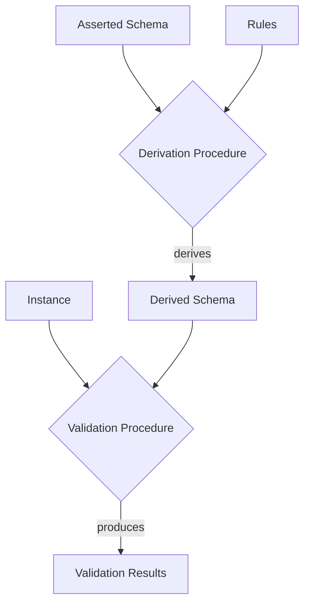

# Validation using Schemas

**Validation** is a procedure that takes as input a LinkML instance and a schema, and will
run a collection of *checks* against that instance.
    
The validation procedure will produce output that can be used to determine if the instance is *structurally and semantically valid* according to the schema.

The formal specification of the validation procedure takes as input a *derived* schema *m<sup>D</sup>*:



Formally, the validation is performed against the abstract instance model, but validator
implementations may choose to perform additional validation checks against the concrete
serialization. This includes checking collections using `inlined_as_dict`.

Actual implementations may choose to perform this composition or work directly on the asserted schema.

The following holds for any validation procedure:

- The output MUST include a boolean slot indicating whether the input can be demonstrated to be false
- The output SHOULD include additional information indicating types of validation errors and where they occur
- The output SHOULD be conformant with the LinkML validation schema.
- The output MAY also return cases where *recommendations* are not adhered to
- The output MAY also be combined with parsing to yield the precise location (i.e. line numbers) in the source serialization document where problems are found.
- The procedure MAY restrict validation to defined subsets (profiles) of the Metamodel
- The procedure  SHOULD return in its payload an indication of which profile and version is used.

## Types of checks

| Check                 | Type      | Description            | SHACL                             |
|-----------------------|-----------|------------------------|-----------------------------------|
| `Required`            | ERROR     |                        | `MinCountConstraintComponent`     |
| `Recommended`         | WARNING   |                        | `MinCountConstraintComponent`     |
| `Singlevalued`        | ERROR     |                        | `MaxCountConstraintComponent`     |
| `Multivalued`         | ERROR     |                        | `MinCountConstraintComponent`     |
| `Inlined`             | ERROR     |                        |                                   |
| `Referenced`          | ERROR     |                        |                                   |
| `ClassRange`          | ERROR     | class matches range    | `ClassConstraintComponent`        |
| `Datatype`            | ERROR     | datatype matches range | `DatatypeConstraintComponent`     |
| `NodeKind`            | ERROR     | range metatype         | `NodeKindConstraintComponent`     |
| `MinimumValue`        | ERROR     |                        | `MinInclusiveConstraintComponent` |
| `MaximumValue`        | ERROR     |                        | `MaxInclusiveConstraintComponent` |
| `Pattern`             | ERROR     |                        | `PatternConstraintComponent`      |
| `EqualsExpression`    | INFERENCE |                        | `EqualsConstraintComponent`       |
| `StringSerialization` | INFERENCE |                        | `EqualsConstraintComponent`       |
| `TypeDesignator`      | INFERENCE |                        |                                   |

For the `INFERENCE` type, the validation procedure MAY fill in missing values in the instance.
There is only an error if the inferred value is not consistent with the asserted value.

## Validation procedure for instances


```
Validate(i, m, t):
    mD = DeriveSchema(m)
    s = new SlotDefinition(range=t)
    for check in Checks:
      if (s,i) matches check:
        yield check
      if i == <Class>(a1, ..., an):
        for s' = i' in a1, ..., an:
          Validate(i', mD, DerivedSlot(s', <Class>))
```

Matches are performed against the tables below. The element `i` is checked against
the `Element` column. If the comparison type value **T** is `=`, this must be identical. If `i` is a Collection,
then the match is performed against all members of the collection.


The notation `[...]` indicates a collection with at least one value.

### Core checks

The following core checks apply to multiple instance definition types.

| **T** | Element                            | Check Name     | Fail Condition                                                             |
|-------|------------------------------------|----------------|----------------------------------------------------------------------------|
| `=`   | `None`                             | `Required`     | `<slot>.required=True`                                                     |
| `=`   | `[]`                               | `Required`     | `<slot>.required=True`                                                     |
| `=`   | `None`                             | `Recommended`  | `<slot>.required=True`                                                     |
| `=`   | `[]`                               | `Recommended`  | `<slot>.required=True`                                                     |
| `=`   | `[...]`                            | `Singlevalued` | `<slot>.multivalued=False`                                                 |
| `=`   | `[...]`                            | `UniqueKey`    | **not** **Unique**(`[...]`)                                                |
| `=`   | `<V>` `<V> != [...]` `<V> != None` | `Multivalued`  |  `<slot>.multivalued=True`                                                 |
| `in`  | `<Type>&<Value>`                   | `NodeKind`     | `<slot>.range  ∉ m.types`                                                  |
| `in`  | `<Enum>[<PermissibleValue>]`       | `NodeKind`     | `<slot>.range  ∉ m.enums`                                                  |
| `in`  | `<Class>&<Reference>`              | `Inlined`      | `<slot>.range.inlined=True`                                                |
| `in`  | `<Class>(<Assignments>)`           | `Referenced`   | `<slot>.range.inlined=False`                                               |
| `in`  | `<Class>(<Assignments>)`           | `NodeKind`     | `<slot>.range  ∉ m.classes`                                                |

The condition **Unique** checks a list of objects for uniqueness.

For each `ClassDefinition` in the list, the primary key value is calculated, and this is assumed to be unique.

### Deprecation checks

The following checks match multiple different instance definition types and check for usage of deprecated elements.

| **T** | Element                      | Check              | Fail Condition                                                             |
|-------|------------------------------|--------------------|----------------------------------------------------------------------------|
| `in`  |                              | `DeprecatedSlot`   | `<slot>.deprecated=True`                                                   |
| `in`  | `<Type>&<Value>`             | `DeprecatedType`   | `<Type>.deprecated=True`                                                   |
| `in`  | `<Enum>[<PermissibleValue>]` | `DeprecatedEnum`   | `<Enum>.deprecated=True`                                                   |
| `in`  | `<Class>&<Reference>`        | `DeprecatedClass`  | `<Class>.deprecated=True`                                                  |
| `in`  | `<Class>(<Assignments>)`     | `DeprecatedClass`  | `<Class>.deprecated=True`                                                  |


### Atomic Checks

The following checks only match when `i` is an **AtomicInstance**

| **T**  | Element               | Check                 | Fail Condition                                              |
|--------|-----------------------|-----------------------|-------------------------------------------------------------|
| `in`   | `<Type>^<Value>`      | `Datatype`            | **Conforms**(`<Value>`, `<Type>.uri`)                       |
| `in`   | `<Type>^<Value>`      | `MaximumValue`        | `<Value> > <slot>.maximum_value`                            |
| `in`   | `<Type>^<Value>`      | `MinimumValue`        | `<Value> < <slot>.minimum_value`                            |
| `in`   | `<Type>^<Value>`      | `Pattern`             | `<Value> !~ <slot>.pattern`                                 |
| `in`   | `<Class>&<Reference>` | `Pattern`             | `<Reference> !~ <slot>.pattern`                             |
| `in`   | `<Type>^<Value>`      | `EqualsExpression`    | `<Value> != Eval(<slot>.equals_expression(parent))`         |
| `in`   | `<Type>^<Value>`      | `StringSerialization` | `<Value> != Stringify(<slot>.string_serialization(parent))` |


### Class Checks

The following checks only match when `i` is an **InstanceOfClass**

| **T**  | Element                            | Check             | Fail Condition                                                                  |
|--------|------------------------------------|-------------------|---------------------------------------------------------------------------------|
| `in`   | `<Class>(<Assignments>)`           | `Abstract`        | `Class.abstract`                                                                |
| `in`   | `<Class>(<Assignments>)`           | `Mixin`           | `Class.mixin`                                                                   |
| `in`   | `<Class>(<Assignments>)`           | `ClassRange`      | `slot.range ∉ A*(<Class>)`                                                      |
| `in`   | `<Class>(..., <subslot>=<V>, ...)` | `ApplicableSlot`  | `subslot ∉ <Class>.attributes`                                                  |
| `in`   | `<Class>(..., <ts>=<V>, ...)`      | `DesignatedType`  | `∃ v ∈ L(<V>): v ∉ Norm(A*(<Class>), ts.range)` and `ts.designates_type = True` |

For the DesignatedType check, the `Norm` function takes as input as a list of classes,
and expands these according to the range of the slot `ts` that designates the type.


| Range        | Match                                                |
|--------------|------------------------------------------------------|
| `string`     | { `c.name` }                                         |
| `curie`      | { **CURIE**(`c.class_uri`) }                         |
| `uri`        | { **URI**(`c.class_uri`) }                           |
| `uriorcurie` | { **CURIE**(`c.class_uri`), **URI**(`c.class_uri`) } |

For example, given an instance

> `Organization(name="acme", type=String^"Business")`

And a schema that includes:

```python
ClassDefinition(
  name="Business",
  is_a=ClassDefinition&Organization,
)
ClassDefinition(
  name="Organization",
  attributes=[
    SlotDefinition(name="type", range=TypeDefinition&string),
    ...
```

This will pass the `DesignatedType` check, because:

* `A*(ClassDefinition&Business) = { ..., ClassDefinition&Organization, ... }`
* `Norm(A*(ClassDefinition&Business), TypeDefinition&string) = { ..., String^"Business", ... }`
* `String^"Business" ∉ { ..., String^"Business", ... }`

DesignatedType checks can also executed in inference mode, where an inference engine
may choose to assign the most specific value allowed to the slot.

### Enum checks


| **T**  | Element         | Check         | Fail Condition                     |
|--------|-----------------|---------------|------------------------------------|
| `in`   | `<Enum>[<PV>]`  | `Permissible` | `<PV>  ∉ <Enum>.permissible_value` |

### Rules

### Uniqueness checks


### Boolean combinations of expressions

There are 4 boolean operator metaslots:

- any_of
- exactly_one_of
- none_of
- all_of

These can apply to classes, slots, types, or enums. The range is always a list of operand expressions
of the same type.

In all cases, the semantics are as follows:

- any_of: true if there exists a member of the operands that evaluates to true
  * for empty lists this is always false
- exactly_one_of: true if there exists a member of the operands that evaluates to true, and all other members evaluate to false
  * for empty lists this is always false
- none_of: true if there does not exist a member of the operands that evaluates to true
  * for empty lists this is always true
  * for lists of length 1 this is the same as the logical NOT operator
  * for lists of length 2 this is the same as the logical XOR operator
- all_of: true if there are no members that evaluate to false
  * for empty lists this is always true
   
### Rule evaluation

For each rule `r` in *C*.rules:

- if `r.preconditions` is `None` or `r.preconditions` is satisfied, then
- `r.postconditions` are applied

### Classification Rule evaluation

## Validation of TypeDefinitions

For each slot `s` in **Assignments**, if `i.<s>` is not `None`, and `s.range` is in `m*.types`,
where `i.<s> = *T*( **AtomicValue** )` must match `s.range`,

here `T.uri` is used to determine the type:

- for xsd floats, doubles, and decimals, AtomicValue must be a decimal- for xsd floats, doubles, and decimals, AtomicValue must be a decimal
- for xsd ints, AtomicValue must be an Integer
- for xsd dates, datetimes, and times, AtomicValue must be a string conforming to the relevant ISO type
- for xsd booleans, AtomicValue must be `True` or `False`


## Inference of new values

## Schema Validation

A LinkML schema is a LinkML instance that conforms to the LinkML metamodel. As such, it can be validated
in the same way as any other LinkML instance.

### Metamodel refinement using annotations

#### Background

The LinkML model provides a fixed set of metamodel slots which can be applied to any schema element.
Any schema that assigns slot values not in the metamodel is invalid.

Sometimes it is useful to attach additional information to elements in a schema, this is called
schema *extension*. Alternatively, it may be useful to be able to make the metamodel more restrictive
in some contexts; for example, making the `description` metamodel slot `required` rather than `recommended`.

The LinkML metamodel can be effectively extended through the use of `annotation` slot assignments.
Annotations are `tag`-`value` pairs.

As an example, if we want to add a metamodel slot `review` intended to store a review of a schema element.

```yaml
classes:
  Person:
    annotations:
      review: A very useful class that is well defined
      ...
```

#### Annotation validation

By default, all annotation tags and values are valid. 

LinkML 1.6 introduces the ability to validate annotation tags and values.

This is done by adding an `instantiates` slot-value assignment onto any schema element. The range of
the `instantiates` slot is a `uriorcurie` that references a class that serves as a metamodel extension class.

If a schema element instantiates at least one class then *all* annotations are validated.

For example:

```yaml
classes:
  Person:
    instantiates:
     - mymetamodel:Reviewable
    annotations:
      review: A very useful class that is well defined
      ...
```

The `Reviewable` class is defined as follows:

```yaml
classes:
  Reviewable:
    class_uri: mymetamodel:Reviewable
    slots:
      description: an expert review of a schema element
      review: string
```


