# KITCHEN_SINK


**metamodel version:** 1.7.0

**version:** None


Kitchen Sink Schema

This schema does not do anything useful. It exists to test all features of linkml.

This particular text field exists to demonstrate markdown within a text field:

Lists:

   * a
   * b
   * c

And links, e.g to [Person](Person.md)


## Class Diagram

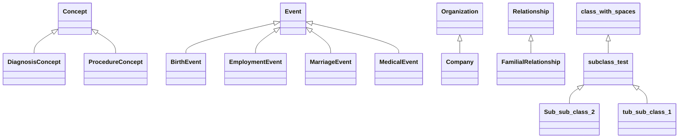

## ERD Diagrams


### Component 1 (Address, AnyObject, BirthEvent...)

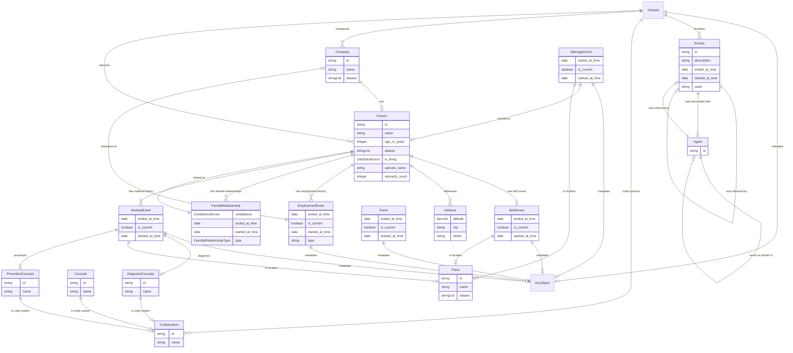

### Component 2 (Sub sub class 2, class with spaces, subclass test...)

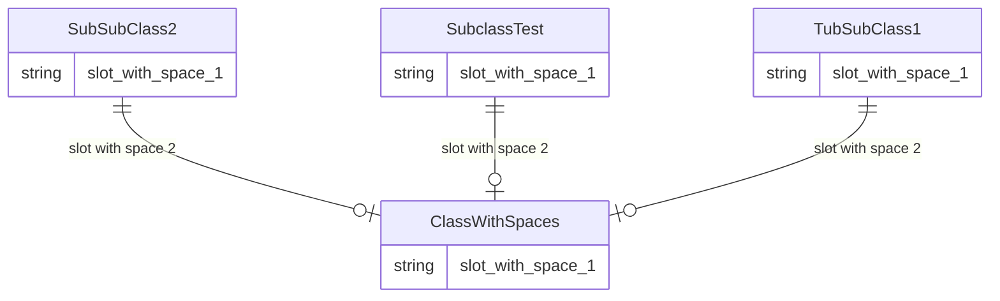

## Base Classes


Foundational classes in the hierarchy (root classes and direct children of Thing):

| Class | Description |
| --- | --- |
| [Concept](#concept) |  |
| [Event](#event) |  |
| [Organization](#organization) | An organization. This description includes newlines ## Markdown headers * and * a * list |
| [Relationship](#relationship) |  |
| [ClassWithSpaces](#classwithspaces) |  |

## Standalone Classes


These classes are completely isolated with no relationships and are not used as base classes:

| Class | Description |
| --- | --- |
| [AnyOfClasses](#anyofclasses) |  |
| [AnyOfEnums](#anyofenums) |  |
| [AnyOfMix](#anyofmix) |  |
| [AnyOfSimpleType](#anyofsimpletype) |  |
| [EqualsString](#equalsstring) |  |
| [EqualsStringIn](#equalsstringin) |  |
| [FakeClass](#fakeclass) |  |

## Abstract Classes


### Friend


#### Attributes

| Name | Cardinality: | Type | Description |
| --- | --- | --- | --- |
| **[name](#name)** | <sub>0..1</sub> | string |  |


## Classes


### Dataset


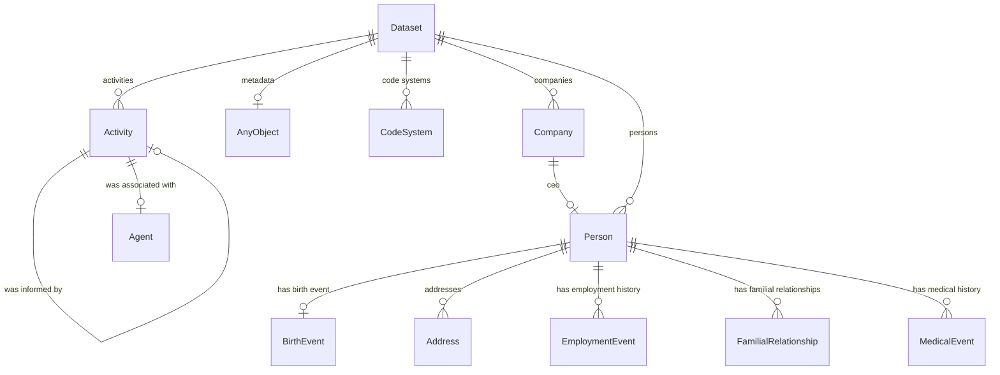

#### Attributes

| Name | Cardinality: | Type | Description |
| --- | --- | --- | --- |
| **[activities](#activities)** | <sub>0..\*</sub> | [Activity](#activity) |  |
| **[code systems](#code systems)** | <sub>0..\*</sub> | [CodeSystem](#codesystem) |  |
| **[companies](#companies)** | <sub>0..\*</sub> | [Company](#company) |  |
| **[metadata](#metadata)** | <sub>0..1</sub> | [AnyObject](#anyobject) | Example of a slot that has an unconstrained range |
| **[persons](#persons)** | <sub>0..\*</sub> | [Person](#person) |  |


### Person

A person, living or dead

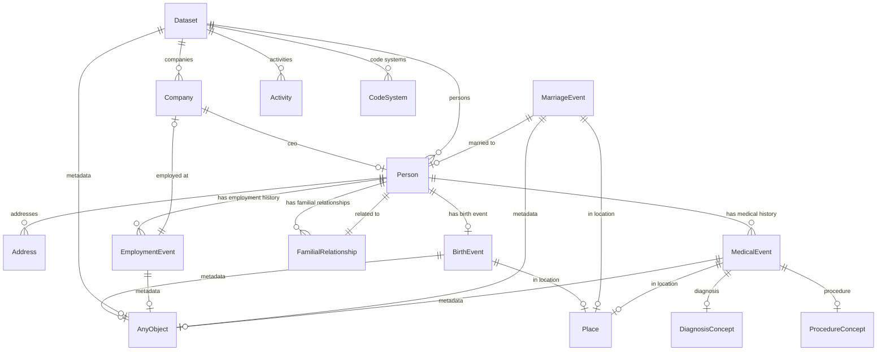

### Identifier prefixes

 * P

#### Attributes

| Name | Cardinality: | Type | Description |
| --- | --- | --- | --- |
| **[id](#id)** | <sub>0..1</sub> | string |  |
| **[name](#name)** | <sub>0..1</sub> | string |  |
| **[aliases](#aliases)** | <sub>0..\*</sub> | string |  |
| **[has medical history](#has medical history)** | <sub>0..\*</sub> | [MedicalEvent](#medicalevent) |  |
| **[has employment history](#has employment history)** | <sub>0..\*</sub> | [EmploymentEvent](#employmentevent) |  |
| **[addresses](#addresses)** | <sub>0..\*</sub> | [Address](#address) |  |
| **[age in years](#age in years)** | <sub>0..1</sub> | integer | number of years since birth |
| **[has birth event](#has birth event)** | <sub>0..1</sub> | [BirthEvent](#birthevent) |  |
| **[has familial relationships](#has familial relationships)** | <sub>0..\*</sub> | [FamilialRelationship](#familialrelationship) |  |
| **[is_living](#is_living)** | <sub>0..1</sub> | [LifeStatusEnum](#lifestatusenum) |  |
| **[species name](#species name)** | <sub>0..1</sub> | string |  |
| **[stomach count](#stomach count)** | <sub>0..1</sub> | integer |  |

#### Uses

 *  mixin: [HasAliases](#hasaliases)

#### Referenced by:

 *  **[FamilialRelationship](#familialrelationship)** : related to  <sub>1..1</sub> 
 *  **[Company](#company)** : company__ceo  <sub>0..1</sub> 
 *  **[Dataset](#dataset)** : dataset__persons  <sub>0..\*</sub> 
 *  **[MarriageEvent](#marriageevent)** : married to  <sub>0..1</sub> 


### Organization

An organization.

This description
includes newlines

## Markdown headers

 * and
 * a
 * list


#### Local class diagram

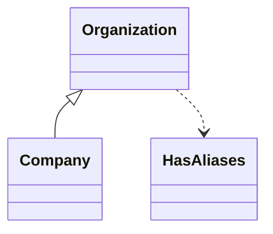

### Identifier prefixes

 * ROR

#### Attributes

| Name | Cardinality: | Type | Description |
| --- | --- | --- | --- |
| **[id](#id)** | <sub>1..1</sub> | string |  |
| **[name](#name)** | <sub>0..1</sub> | string |  |
| **[aliases](#aliases)** | <sub>0..\*</sub> | string |  |

#### Children

 * [Company](#company)

#### Uses

 *  mixin: [HasAliases](#hasaliases)


### FamilialRelationship


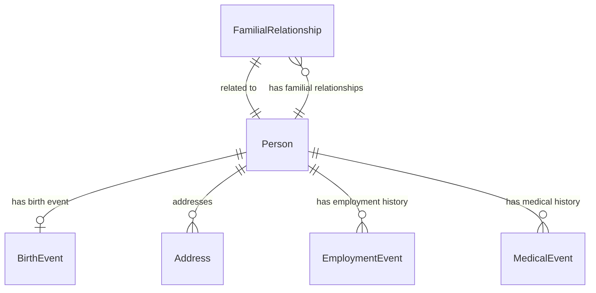

#### Attributes

| Name | Cardinality: | Type | Description |
| --- | --- | --- | --- |
| **[ended at time](#ended at time)** | <sub>0..1</sub> | date |  |
| **[started at time](#started at time)** | <sub>0..1</sub> | date |  |
| **[cordialness](#cordialness)** | <sub>0..1</sub> | [CordialnessEnum](#cordialnessenum) |  |
| **[related to](#related to)** | <sub>1..1</sub> | [Person](#person) |  |
| **[type](#type)** | <sub>1..1</sub> | [FamilialRelationshipType](#familialrelationshiptype) |  |

#### Parents

 * [Relationship](#relationship)

#### Referenced by:

 *  **[Person](#person)** : has familial relationships  <sub>0..\*</sub> 


### EmploymentEvent


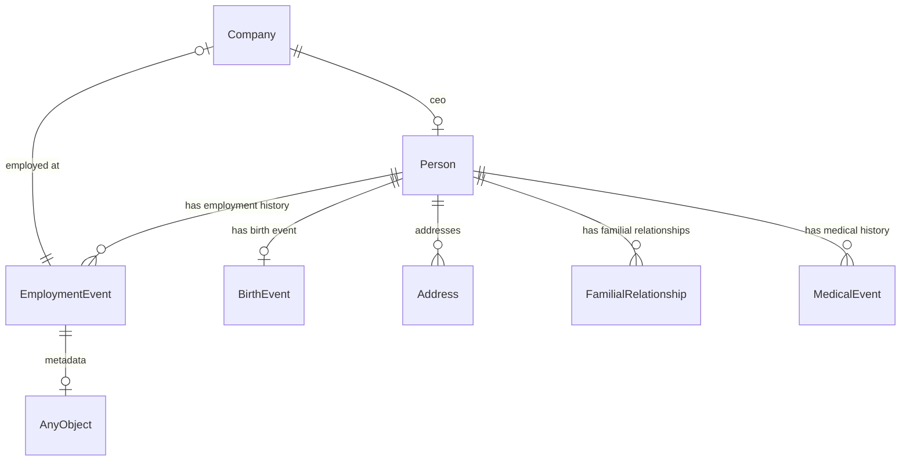

#### Attributes

| Name | Cardinality: | Type | Description |
| --- | --- | --- | --- |
| **[ended at time](#ended at time)** | <sub>0..1</sub> | date |  |
| **[is current](#is current)** | <sub>0..1</sub> | boolean |  |
| **[metadata](#metadata)** | <sub>0..1</sub> | [AnyObject](#anyobject) | Example of a slot that has an unconstrained range |
| **[started at time](#started at time)** | <sub>0..1</sub> | date |  |
| **[employed at](#employed at)** | <sub>0..1</sub> | [Company](#company) |  |
| **[type](#type)** | <sub>0..1</sub> | string |  |

#### Parents

 * [Event](#event)

#### Referenced by:

 *  **[Person](#person)** : has employment history  <sub>0..\*</sub> 


### Address


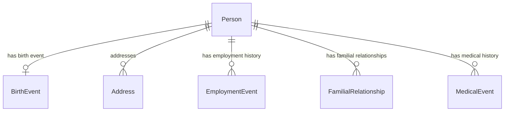

#### Attributes

| Name | Cardinality: | Type | Description |
| --- | --- | --- | --- |
| **[altitude](#altitude)** | <sub>0..1</sub> | decimal |  |
| **[city](#city)** | <sub>0..1</sub> | string |  |
| **[street](#street)** | <sub>0..1</sub> | string |  |

#### Referenced by:

 *  **[Person](#person)** : addresses  <sub>0..\*</sub> 


### AnyObject

Example of unconstrained class

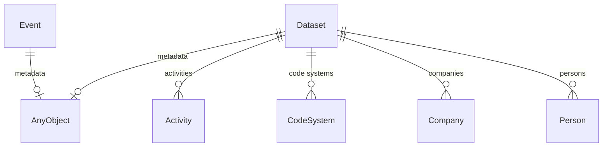

This class has no attributes


#### Referenced by:

 *  **[Dataset](#dataset)** : metadata  <sub>0..1</sub> 
 *  **[Event](#event)** : metadata  <sub>0..1</sub> 


### AnyOfClasses


#### Attributes

| Name | Cardinality: | Type | Description |
| --- | --- | --- | --- |
| **[attribute2](#attribute2)** | <sub>0..1</sub> | string |  |


### AnyOfEnums


#### Attributes

| Name | Cardinality: | Type | Description |
| --- | --- | --- | --- |
| **[attribute3](#attribute3)** | <sub>0..1</sub> | string |  |


### AnyOfMix


#### Attributes

| Name | Cardinality: | Type | Description |
| --- | --- | --- | --- |
| **[attribute4](#attribute4)** | <sub>0..1</sub> | string |  |


### AnyOfSimpleType


#### Attributes

| Name | Cardinality: | Type | Description |
| --- | --- | --- | --- |
| **[attribute1](#attribute1)** | <sub>0..1</sub> | string |  |


### BirthEvent


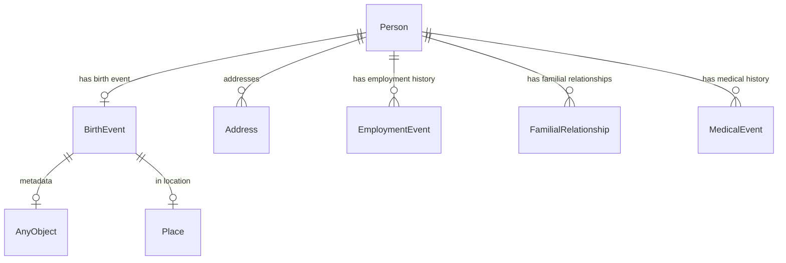

#### Attributes

| Name | Cardinality: | Type | Description |
| --- | --- | --- | --- |
| **[ended at time](#ended at time)** | <sub>0..1</sub> | date |  |
| **[is current](#is current)** | <sub>0..1</sub> | boolean |  |
| **[metadata](#metadata)** | <sub>0..1</sub> | [AnyObject](#anyobject) | Example of a slot that has an unconstrained range |
| **[started at time](#started at time)** | <sub>0..1</sub> | date |  |
| **[in location](#in location)** | <sub>0..1</sub> | [Place](#place) |  |

#### Parents

 * [Event](#event)

#### Referenced by:

 *  **[Person](#person)** : has birth event  <sub>0..1</sub> 


### CodeSystem


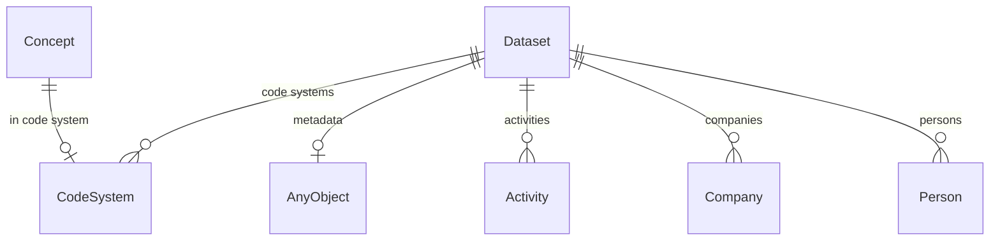

#### Attributes

| Name | Cardinality: | Type | Description |
| --- | --- | --- | --- |
| **[id](#id)** | <sub>1..1</sub> | string |  |
| **[name](#name)** | <sub>0..1</sub> | string |  |

#### Referenced by:

 *  **[Dataset](#dataset)** : dataset__code_systems  <sub>0..\*</sub> 
 *  **[Concept](#concept)** : in code system  <sub>0..1</sub> 


### Company


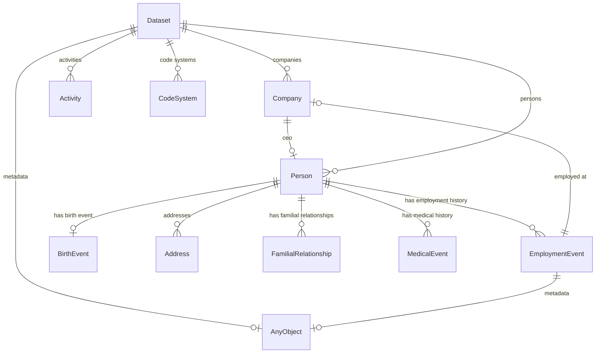

#### Attributes

| Name | Cardinality: | Type | Description |
| --- | --- | --- | --- |
| **[id](#id)** | <sub>1..1</sub> | string |  |
| **[name](#name)** | <sub>0..1</sub> | string |  |
| **[ceo](#ceo)** | <sub>0..1</sub> | [Person](#person) |  |
| **[aliases](#aliases)** | <sub>0..\*</sub> | string |  |

#### Parents

 * [Organization](#organization) - An organization.

#### Referenced by:

 *  **[Dataset](#dataset)** : dataset__companies  <sub>0..\*</sub> 
 *  **[EmploymentEvent](#employmentevent)** : employed at  <sub>0..1</sub> 


### Concept


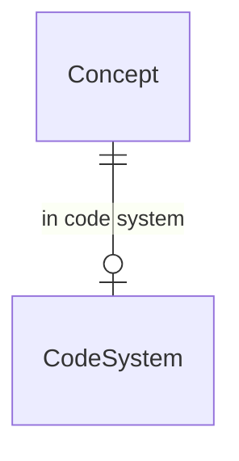

### Identifier prefixes

 * CODE

#### Attributes

| Name | Cardinality: | Type | Description |
| --- | --- | --- | --- |
| **[id](#id)** | <sub>1..1</sub> | string |  |
| **[name](#name)** | <sub>0..1</sub> | string |  |
| **[in code system](#in code system)** | <sub>0..1</sub> | [CodeSystem](#codesystem) |  |

#### Children

 * [DiagnosisConcept](#diagnosisconcept)
 * [ProcedureConcept](#procedureconcept)


### DiagnosisConcept


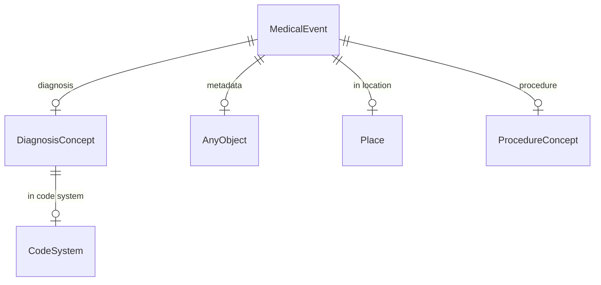

#### Attributes

| Name | Cardinality: | Type | Description |
| --- | --- | --- | --- |
| **[id](#id)** | <sub>1..1</sub> | string |  |
| **[name](#name)** | <sub>0..1</sub> | string |  |
| **[in code system](#in code system)** | <sub>0..1</sub> | [CodeSystem](#codesystem) |  |

#### Parents

 * [Concept](#concept)

#### Referenced by:

 *  **[MedicalEvent](#medicalevent)** : diagnosis  <sub>0..1</sub> 


### EqualsString


#### Attributes

| Name | Cardinality: | Type | Description |
| --- | --- | --- | --- |
| **[attribute5](#attribute5)** | <sub>0..1</sub> | string |  |


### EqualsStringIn


#### Attributes

| Name | Cardinality: | Type | Description |
| --- | --- | --- | --- |
| **[attribute6](#attribute6)** | <sub>0..1</sub> | string |  |


### Event


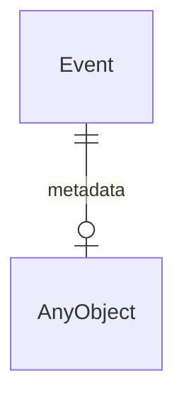

#### Attributes

| Name | Cardinality: | Type | Description |
| --- | --- | --- | --- |
| **[ended at time](#ended at time)** | <sub>0..1</sub> | date |  |
| **[is current](#is current)** | <sub>0..1</sub> | boolean |  |
| **[metadata](#metadata)** | <sub>0..1</sub> | [AnyObject](#anyobject) | Example of a slot that has an unconstrained range |
| **[started at time](#started at time)** | <sub>0..1</sub> | date |  |

#### Children

 * [BirthEvent](#birthevent)
 * [EmploymentEvent](#employmentevent)
 * [MarriageEvent](#marriageevent)
 * [MedicalEvent](#medicalevent)


### ~~FakeClass~~ _(deprecated)_


#### Attributes

| Name | Cardinality: | Type | Description |
| --- | --- | --- | --- |
| **[test_attribute](#test_attribute)** | <sub>0..1</sub> | string |  |


### MarriageEvent


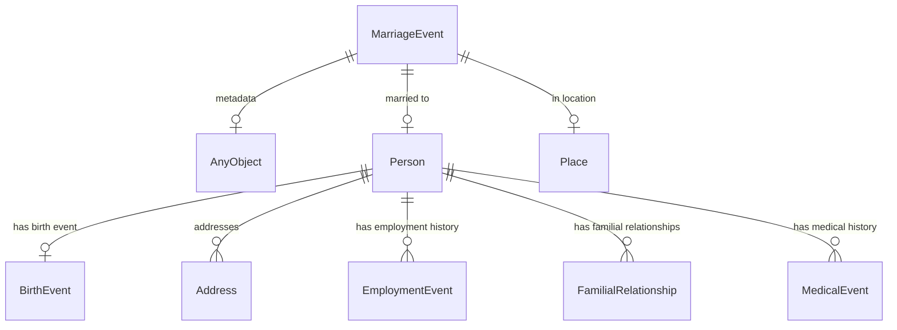

#### Attributes

| Name | Cardinality: | Type | Description |
| --- | --- | --- | --- |
| **[ended at time](#ended at time)** | <sub>0..1</sub> | date |  |
| **[is current](#is current)** | <sub>0..1</sub> | boolean |  |
| **[metadata](#metadata)** | <sub>0..1</sub> | [AnyObject](#anyobject) | Example of a slot that has an unconstrained range |
| **[started at time](#started at time)** | <sub>0..1</sub> | date |  |
| **[in location](#in location)** | <sub>0..1</sub> | [Place](#place) |  |
| **[married to](#married to)** | <sub>0..1</sub> | [Person](#person) |  |

#### Parents

 * [Event](#event)

#### Uses

 *  mixin: [WithLocation](#withlocation)

#### Referenced by:


### MedicalEvent


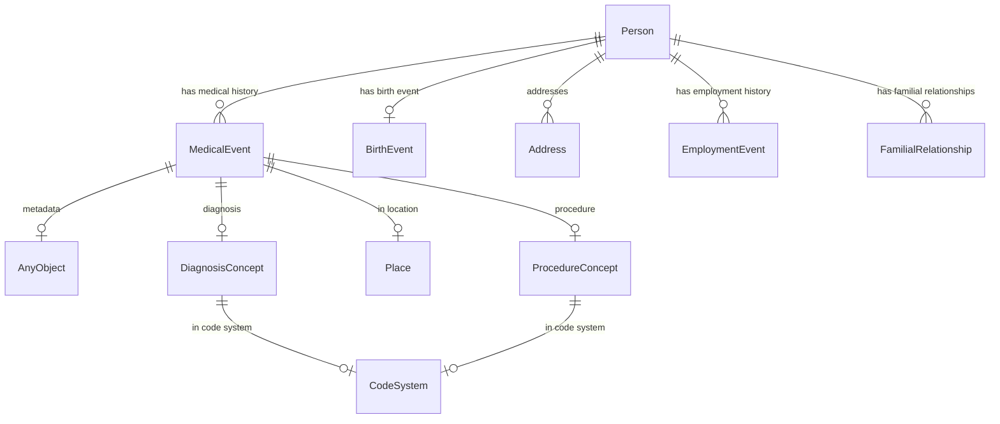

#### Attributes

| Name | Cardinality: | Type | Description |
| --- | --- | --- | --- |
| **[ended at time](#ended at time)** | <sub>0..1</sub> | date |  |
| **[is current](#is current)** | <sub>0..1</sub> | boolean |  |
| **[metadata](#metadata)** | <sub>0..1</sub> | [AnyObject](#anyobject) | Example of a slot that has an unconstrained range |
| **[started at time](#started at time)** | <sub>0..1</sub> | date |  |
| **[diagnosis](#diagnosis)** | <sub>0..1</sub> | [DiagnosisConcept](#diagnosisconcept) |  |
| **[in location](#in location)** | <sub>0..1</sub> | [Place](#place) |  |
| **[procedure](#procedure)** | <sub>0..1</sub> | [ProcedureConcept](#procedureconcept) |  |

#### Parents

 * [Event](#event)

#### Referenced by:

 *  **[Person](#person)** : has medical history  <sub>0..\*</sub> 


### Place


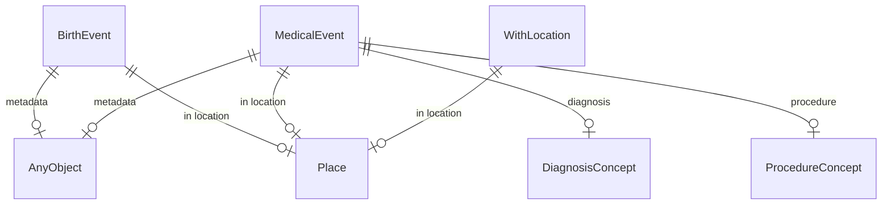

#### Attributes

| Name | Cardinality: | Type | Description |
| --- | --- | --- | --- |
| **[id](#id)** | <sub>1..1</sub> | string |  |
| **[name](#name)** | <sub>0..1</sub> | string |  |
| **[aliases](#aliases)** | <sub>0..\*</sub> | string |  |

#### Uses

 *  mixin: [HasAliases](#hasaliases)

#### Referenced by:

 *  **[BirthEvent](#birthevent)** : in location  <sub>0..1</sub> 
 *  **[MedicalEvent](#medicalevent)** : in location  <sub>0..1</sub> 
 *  **[WithLocation](#withlocation)** : in location  <sub>0..1</sub> 


### ProcedureConcept


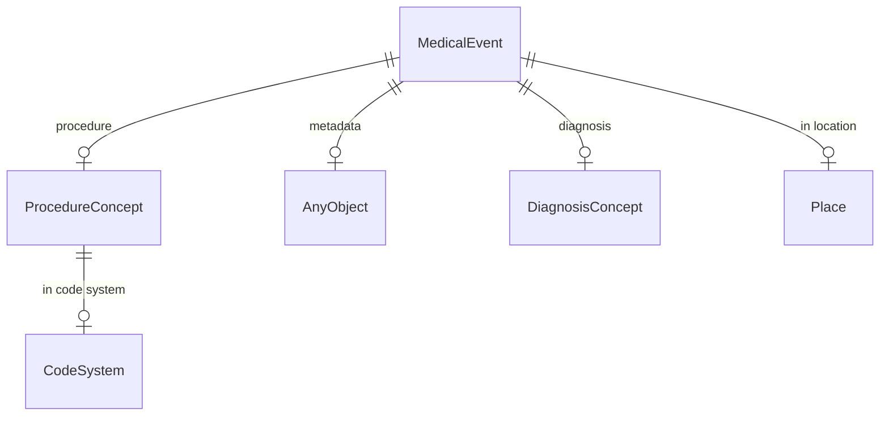

#### Attributes

| Name | Cardinality: | Type | Description |
| --- | --- | --- | --- |
| **[id](#id)** | <sub>1..1</sub> | string |  |
| **[name](#name)** | <sub>0..1</sub> | string |  |
| **[in code system](#in code system)** | <sub>0..1</sub> | [CodeSystem](#codesystem) |  |

#### Parents

 * [Concept](#concept)

#### Referenced by:

 *  **[MedicalEvent](#medicalevent)** : procedure  <sub>0..1</sub> 


### Relationship


#### Local class diagram

```mermaid
classDiagram
Relationship <|-- FamilialRelationship
```

#### Attributes

| Name | Cardinality: | Type | Description |
| --- | --- | --- | --- |
| **[cordialness](#cordialness)** | <sub>0..1</sub> | [CordialnessEnum](#cordialnessenum) |  |
| **[ended at time](#ended at time)** | <sub>0..1</sub> | date |  |
| **[related to](#related to)** | <sub>0..1</sub> | string |  |
| **[started at time](#started at time)** | <sub>0..1</sub> | date |  |
| **[type](#type)** | <sub>0..1</sub> | string |  |

#### Children

 * [FamilialRelationship](#familialrelationship)


### SubSubClass2


```mermaid
erDiagram
ClassWithSpaces {

}
SubSubClass2 {

}

SubSubClass2 ||--|o ClassWithSpaces : "slot with space 2"

```

#### Attributes

| Name | Cardinality: | Type | Description |
| --- | --- | --- | --- |
| **[slot with space 1](#slot with space 1)** | <sub>0..1</sub> | string |  |
| **[slot with space 2](#slot with space 2)** | <sub>0..1</sub> | [ClassWithSpaces](#classwithspaces) |  |

#### Parents

 * [SubclassTest](#subclasstest)


### Activity

a provence-generating activity

```mermaid
erDiagram
Activity {

}
Agent {

}
Dataset {

}

Activity ||--|o Activity : "was informed by"
Activity ||--|o Agent : "was associated with"
Agent ||--|o Activity : "was informed by"
Agent ||--|o Agent : "acted on behalf of"
Dataset ||--|o AnyObject : "metadata"
Dataset ||--}o Activity : "activities"
Dataset ||--}o CodeSystem : "code systems"
Dataset ||--}o Company : "companies"
Dataset ||--}o Person : "persons"

```

#### Attributes

| Name | Cardinality: | Type | Description |
| --- | --- | --- | --- |
| **[id](#id)** | <sub>1..1</sub> | string |  |
| **[description](#description)** | <sub>0..1</sub> | string |  |
| **[ended at time](#ended at time)** | <sub>0..1</sub> | date |  |
| **[started at time](#started at time)** | <sub>0..1</sub> | date |  |
| **[used](#used)** | <sub>0..1</sub> | string |  |
| **[was associated with](#was associated with)** | <sub>0..1</sub> | [Agent](#agent) |  |
| **[was informed by](#was informed by)** | <sub>0..1</sub> | [Activity](#activity) |  |

#### Referenced by:

 *  **[Dataset](#dataset)** : dataset__activities  <sub>0..\*</sub> 
 *  **[Activity](#activity)** : was informed by  <sub>0..1</sub> 
 *  **[Agent](#agent)** : was informed by  <sub>0..1</sub> 


### Agent

a provence-generating agent

```mermaid
erDiagram
Activity {

}
Agent {

}

Activity ||--|o Activity : "was informed by"
Activity ||--|o Agent : "was associated with"
Agent ||--|o Activity : "was informed by"
Agent ||--|o Agent : "acted on behalf of"

```

#### Attributes

| Name | Cardinality: | Type | Description |
| --- | --- | --- | --- |
| **[id](#id)** | <sub>1..1</sub> | string |  |
| **[acted on behalf of](#acted on behalf of)** | <sub>0..1</sub> | [Agent](#agent) |  |
| **[was informed by](#was informed by)** | <sub>0..1</sub> | [Activity](#activity) |  |

#### Referenced by:

 *  **[Agent](#agent)** : acted on behalf of  <sub>0..1</sub> 
 *  **[Activity](#activity)** : was associated with  <sub>0..1</sub> 


### ClassWithSpaces


```mermaid
erDiagram
ClassWithSpaces {

}
SubclassTest {

}

SubclassTest ||--|o ClassWithSpaces : "slot with space 2"

```

#### Attributes

| Name | Cardinality: | Type | Description |
| --- | --- | --- | --- |
| **[slot with space 1](#slot with space 1)** | <sub>0..1</sub> | string |  |

#### Children

 * [SubclassTest](#subclasstest)

#### Referenced by:

 *  **[SubclassTest](#subclasstest)** : subclassTest__slot_with_space_2  <sub>0..1</sub> 


### SubclassTest


```mermaid
erDiagram
ClassWithSpaces {

}
SubclassTest {

}

SubclassTest ||--|o ClassWithSpaces : "slot with space 2"

```

#### Attributes

| Name | Cardinality: | Type | Description |
| --- | --- | --- | --- |
| **[slot with space 1](#slot with space 1)** | <sub>0..1</sub> | string |  |
| **[slot with space 2](#slot with space 2)** | <sub>0..1</sub> | [ClassWithSpaces](#classwithspaces) |  |

#### Parents

 * [ClassWithSpaces](#classwithspaces)

#### Children

 * [SubSubClass2](#subsubclass2)
 * [TubSubClass1](#tubsubclass1) - Same depth as Sub sub class 1


### TubSubClass1

Same depth as Sub sub class 1

```mermaid
erDiagram
ClassWithSpaces {

}
TubSubClass1 {

}

TubSubClass1 ||--|o ClassWithSpaces : "slot with space 2"

```

#### Attributes

| Name | Cardinality: | Type | Description |
| --- | --- | --- | --- |
| **[slot with space 1](#slot with space 1)** | <sub>0..1</sub> | string |  |
| **[slot with space 2](#slot with space 2)** | <sub>0..1</sub> | [ClassWithSpaces](#classwithspaces) |  |

#### Parents

 * [SubclassTest](#subclasstest)


## Mixins


### HasAliases


#### Attributes

| Name | Cardinality: | Type | Description |
| --- | --- | --- | --- |
| **[aliases](#aliases)** | <sub>0..\*</sub> | string |  |

#### Used as mixin by

 * [Organization](#organization) - An organization.
 * [Person](#person) - A person, living or dead
 * [Place](#place)

### WithLocation


```mermaid
erDiagram
Place {

}
WithLocation {

}

WithLocation ||--|o Place : "in location"

```

#### Attributes

| Name | Cardinality: | Type | Description |
| --- | --- | --- | --- |
| **[in location](#in location)** | <sub>0..1</sub> | [Place](#place) |  |

#### Used as mixin by

 * [MarriageEvent](#marriageevent)

## Slots

| Name | Cardinality/Range | Used By |
| --- | --- | --- |
| <a id="id"></a>**id** | <sub>1..1</sub><br/>string | [CodeSystem](#codesystem), [Company](#company), [Concept](#concept), [DiagnosisConcept](#diagnosisconcept), [Organization](#organization), [Person](#person), [Place](#place), [ProcedureConcept](#procedureconcept), [Activity](#activity), [Agent](#agent) |
| <a id="name"></a>**name** | <sub>0..1</sub><br/>string | [CodeSystem](#codesystem), [Company](#company), [Concept](#concept), [DiagnosisConcept](#diagnosisconcept), [Friend](#friend), [Organization](#organization), [Person](#person), [Place](#place), [ProcedureConcept](#procedureconcept) |
| <a id="description"></a>**description** | <sub>0..1</sub><br/>string | [Activity](#activity) |
| <a id="person_name"></a>**Person_name** | <sub>0..1</sub><br/>string |  |
| <a id="has medical history"></a>**has medical history** | <sub>0..\*</sub><br/>[MedicalEvent](#medicalevent) | [Person](#person) |
| <a id="has employment history"></a>**has employment history** | <sub>0..\*</sub><br/>[EmploymentEvent](#employmentevent) | [Person](#person) |
| <a id="employmentevent_type"></a>**EmploymentEvent_type** | <sub>0..1</sub><br/>string |  |
| <a id="familialrelationship_cordialness"></a>**FamilialRelationship_cordialness** | <sub>0..1</sub><br/>[CordialnessEnum](#cordialnessenum) |  |
| <a id="familialrelationship_related to"></a>**FamilialRelationship_related to** | <sub>1..1</sub><br/>[Person](#person) |  |
| <a id="familialrelationship_type"></a>**FamilialRelationship_type** | <sub>1..1</sub><br/>[FamilialRelationshipType](#familialrelationshiptype) |  |
| <a id="person_species name"></a>**Person_species name** | <sub>0..1</sub><br/>string |  |
| <a id="person_stomach count"></a>**Person_stomach count** | <sub>0..1</sub><br/>integer |  |
| <a id="relationship_cordialness"></a>**Relationship_cordialness** | <sub>0..1</sub><br/>[CordialnessEnum](#cordialnessenum) |  |
| <a id="acted on behalf of"></a>**acted on behalf of** | <sub>0..1</sub><br/>[Agent](#agent) | [Agent](#agent) |
| <a id="activity set"></a>**activity set** | <sub>0..\*</sub><br/>[Activity](#activity) |  |
| <a id="addresses"></a>**addresses** | <sub>0..\*</sub><br/>[Address](#address) | [Person](#person) |
| <a id="age in years"></a>**age in years**<br/>number of years since birth | <sub>0..1</sub><br/>integer | [Person](#person) |
| <a id="agent set"></a>**agent set** | <sub>0..\*</sub><br/>[Agent](#agent) |  |
| <a id="altitude"></a>**altitude** | <sub>0..1</sub><br/>decimal | [Address](#address) |
| <a id="anyofclasses__attribute2"></a>**anyOfClasses__attribute2** | <sub>0..1</sub><br/>string |  |
| <a id="anyofenums__attribute3"></a>**anyOfEnums__attribute3** | <sub>0..1</sub><br/>string |  |
| <a id="anyofmix__attribute4"></a>**anyOfMix__attribute4** | <sub>0..1</sub><br/>string |  |
| <a id="anyofsimpletype__attribute1"></a>**anyOfSimpleType__attribute1** | <sub>0..1</sub><br/>string |  |
| <a id="city"></a>**city** | <sub>0..1</sub><br/>string | [Address](#address) |
| <a id="classwithspaces__slot_with_space_1"></a>**classWithSpaces__slot_with_space_1** | <sub>0..1</sub><br/>string |  |
| <a id="company__ceo"></a>**company__ceo** | <sub>0..1</sub><br/>[Person](#person) |  |
| <a id="cordialness"></a>**cordialness** | <sub>0..1</sub><br/>string | [FamilialRelationship](#familialrelationship), [Relationship](#relationship) |
| <a id="dataset__activities"></a>**dataset__activities** | <sub>0..\*</sub><br/>[Activity](#activity) |  |
| <a id="dataset__code_systems"></a>**dataset__code_systems** | <sub>0..\*</sub><br/>[CodeSystem](#codesystem) |  |
| <a id="dataset__companies"></a>**dataset__companies** | <sub>0..\*</sub><br/>[Company](#company) |  |
| <a id="dataset__persons"></a>**dataset__persons** | <sub>0..\*</sub><br/>[Person](#person) |  |
| <a id="diagnosis"></a>**diagnosis** | <sub>0..1</sub><br/>[DiagnosisConcept](#diagnosisconcept) | [MedicalEvent](#medicalevent) |
| <a id="employed at"></a>**employed at** | <sub>0..1</sub><br/>[Company](#company) | [EmploymentEvent](#employmentevent) |
| <a id="ended at time"></a>**ended at time** | <sub>0..1</sub><br/>date | [BirthEvent](#birthevent), [EmploymentEvent](#employmentevent), [Event](#event), [FamilialRelationship](#familialrelationship), [MarriageEvent](#marriageevent), [MedicalEvent](#medicalevent), [Relationship](#relationship), [Activity](#activity) |
| <a id="equalsstringin__attribute6"></a>**equalsStringIn__attribute6** | <sub>0..1</sub><br/>string |  |
| <a id="equalsstring__attribute5"></a>**equalsString__attribute5** | <sub>0..1</sub><br/>string |  |
| <a id="fakeclass__test_attribute"></a>**fakeClass__test_attribute** | <sub>0..1</sub><br/>string |  |
| <a id="has birth event"></a>**has birth event** | <sub>0..1</sub><br/>[BirthEvent](#birthevent) | [Person](#person) |
| <a id="has familial relationships"></a>**has familial relationships** | <sub>0..\*</sub><br/>[FamilialRelationship](#familialrelationship) | [Person](#person) |
| <a id="has marriage history"></a>**has marriage history** | <sub>0..\*</sub><br/>[MarriageEvent](#marriageevent) |  |
| <a id="hasaliases__aliases"></a>**hasAliases__aliases** | <sub>0..\*</sub><br/>string |  |
| <a id="in code system"></a>**in code system** | <sub>0..1</sub><br/>[CodeSystem](#codesystem) | [Concept](#concept), [DiagnosisConcept](#diagnosisconcept), [ProcedureConcept](#procedureconcept) |
| <a id="in location"></a>**in location** | <sub>0..1</sub><br/>[Place](#place) | [BirthEvent](#birthevent), [MarriageEvent](#marriageevent), [MedicalEvent](#medicalevent), [WithLocation](#withlocation) |
| <a id="is current"></a>**is current** | <sub>0..1</sub><br/>boolean | [BirthEvent](#birthevent), [EmploymentEvent](#employmentevent), [Event](#event), [MarriageEvent](#marriageevent), [MedicalEvent](#medicalevent) |
| <a id="life_status"></a>**life_status** | <sub>0..1</sub><br/>[LifeStatusEnum](#lifestatusenum) |  |
| <a id="married to"></a>**married to** | <sub>0..1</sub><br/>[Person](#person) | [MarriageEvent](#marriageevent) |
| <a id="metadata"></a>**metadata**<br/>Example of a slot that has an unconstrained range | <sub>0..1</sub><br/>[AnyObject](#anyobject) | [BirthEvent](#birthevent), [Dataset](#dataset), [EmploymentEvent](#employmentevent), [Event](#event), [MarriageEvent](#marriageevent), [MedicalEvent](#medicalevent) |
| <a id="mixin_slot_i"></a>**mixin_slot_I** | <sub>0..1</sub><br/>string |  |
| <a id="person__is_living"></a>**person__is_living** | <sub>0..1</sub><br/>[LifeStatusEnum](#lifestatusenum) |  |
| <a id="procedure"></a>**procedure** | <sub>0..1</sub><br/>[ProcedureConcept](#procedureconcept) | [MedicalEvent](#medicalevent) |
| <a id="related to"></a>**related to** | <sub>0..1</sub><br/>string | [FamilialRelationship](#familialrelationship), [Relationship](#relationship) |
| <a id="species name"></a>**species name** | <sub>0..1</sub><br/>string | [Person](#person) |
| <a id="started at time"></a>**started at time** | <sub>0..1</sub><br/>date | [BirthEvent](#birthevent), [EmploymentEvent](#employmentevent), [Event](#event), [FamilialRelationship](#familialrelationship), [MarriageEvent](#marriageevent), [MedicalEvent](#medicalevent), [Relationship](#relationship), [Activity](#activity) |
| <a id="stomach count"></a>**stomach count** | <sub>0..1</sub><br/>integer | [Person](#person) |
| <a id="street"></a>**street** | <sub>0..1</sub><br/>string | [Address](#address) |
| <a id="subclasstest__slot_with_space_2"></a>**subclassTest__slot_with_space_2** | <sub>0..1</sub><br/>[ClassWithSpaces](#classwithspaces) |  |
| <a id="tree_slot_a"></a>**tree_slot_A** | <sub>0..1</sub><br/>string |  |
| <a id="tree_slot_b"></a>**tree_slot_B** | <sub>0..1</sub><br/>string |  |
| <a id="tree_slot_c"></a>**tree_slot_C** | <sub>0..1</sub><br/>string |  |
| <a id="type"></a>**type** | <sub>0..1</sub><br/>string | [EmploymentEvent](#employmentevent), [FamilialRelationship](#familialrelationship), [Relationship](#relationship) |
| <a id="used"></a>**used** | <sub>0..1</sub><br/>string | [Activity](#activity) |
| <a id="was associated with"></a>**was associated with** | <sub>0..1</sub><br/>[Agent](#agent) | [Activity](#activity) |
| <a id="was generated by"></a>**was generated by** | <sub>0..1</sub><br/>[Activity](#activity) |  |
| <a id="was informed by"></a>**was informed by** | <sub>0..1</sub><br/>[Activity](#activity) | [Activity](#activity), [Agent](#agent) |

## Enums


### CordialnessEnum


| Text | Meaning: | Description |
| --- | --- | --- |
| hateful | None | spiteful |
| heartfelt | None | warm and hearty friendliness |
| indifferent | None | not overly friendly nor obnoxiously spiteful |

#### Used by

 *  **[FamilialRelationship](#familialrelationship)** *[FamilialRelationship_cordialness](#familialrelationship_cordialness)*  <sub>0..1</sub> 
 *  **[Relationship](#relationship)** *[Relationship_cordialness](#relationship_cordialness)*  <sub>0..1</sub> 

### DiagnosisType


| Text | Meaning: | Description |
| --- | --- | --- |
| TODO | None |  |

### EmploymentEventType

codes for different kinds of employment/HR related events

| Text | Meaning: | Description |
| --- | --- | --- |
| FIRE | bizcodes:002 |  |
| HIRE | bizcodes:001 | event for a new employee |
| PROMOTION | bizcodes:003 | promotion event |
| TRANSFER | bizcodes:004 | transfer internally |

### FamilialRelationshipType


| Text | Meaning: | Description |
| --- | --- | --- |
| CHILD_OF | None |  |
| PARENT_OF | None |  |
| SIBLING_OF | None |  |

#### Used by

 *  **[FamilialRelationship](#familialrelationship)** *[FamilialRelationship_type](#familialrelationship_type)*  <sub>1..1</sub> 

### KitchenStatus


| Text | Meaning: | Description |
| --- | --- | --- |
| CLEAN | None |  |
| DIRTY | None |  |

### LifeStatusEnum


| Text | Meaning: | Description |
| --- | --- | --- |
| DEAD | None |  |
| LIVING | None |  |
| UNKNOWN | None |  |

#### Used by

 *  **[Person](#person)** *[person__is_living](#person__is_living)*  <sub>0..1</sub> 

### OtherCodes


| Text | Meaning: | Description |
| --- | --- | --- |
| a b | None |  |
