# PERSONINFO

**metamodel version:** 1.7.0

**version:** 0.0.1

Information about people, based on [schema.org](http://schema.org)

## Class Diagram

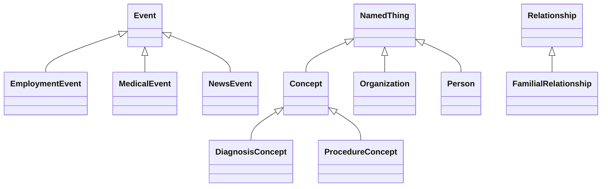

## ERD Diagram

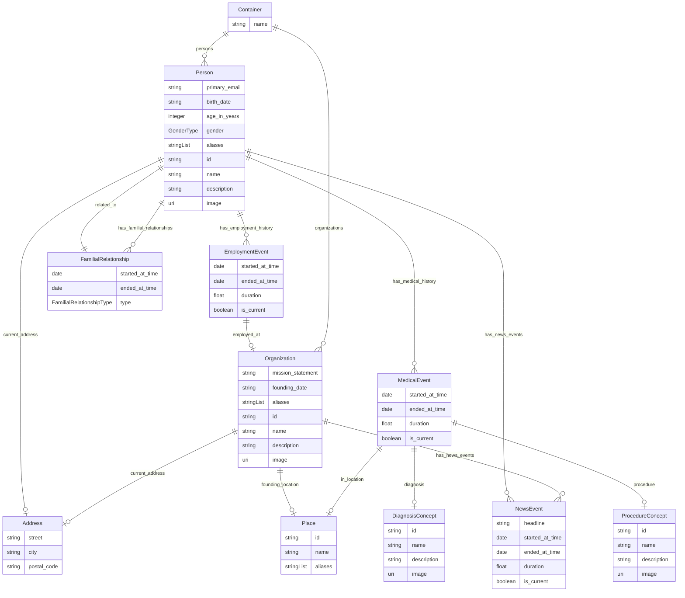

## Classes

### Address

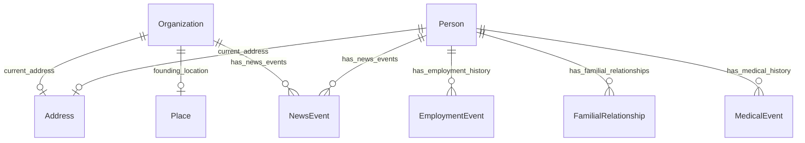

#### Attributes

| Name | Cardinality: | Type | Description |
| --- | --- | --- | --- |
| **city** | 0..1 | string |  |
| **postal_code** | 0..1 | string |  |
| **street** | 0..1 | string |  |

#### Referenced by:

 *  **[Organization](#organization)** : *[current_address](#current_address)*  0..1 
 *  **[Person](#person)** : *[current_address](#current_address)*  0..1 

### Concept

#### Local class diagram

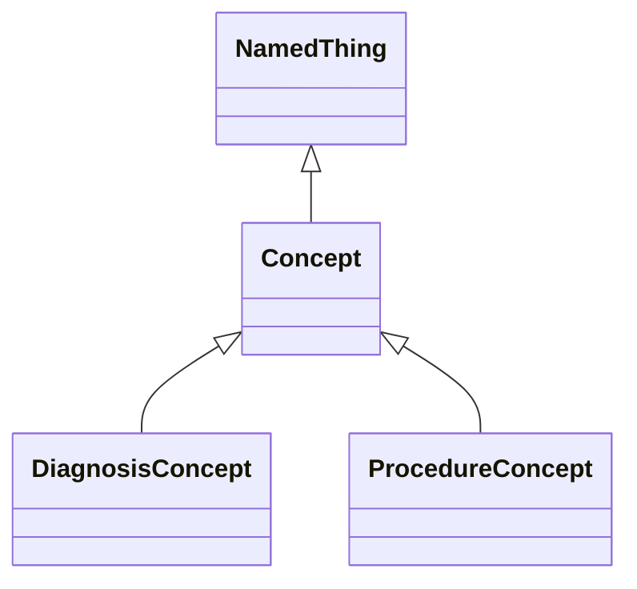

#### Attributes

| Name | Cardinality: | Type | Description |
| --- | --- | --- | --- |
| id | 1..1 | string | ID string to uniquely identify the object |
| name | 0..1 | string | Short human readable object name |
| description | 0..1 | string | Detailed free form description of the object |
| image | 0..1 | uri | image that visually represents the object |

#### Parents

 * [NamedThing](#namedthing) - A generic grouping for any identifiable entity

#### Children

 * [DiagnosisConcept](#diagnosisconcept)
 * [ProcedureConcept](#procedureconcept)

### Container

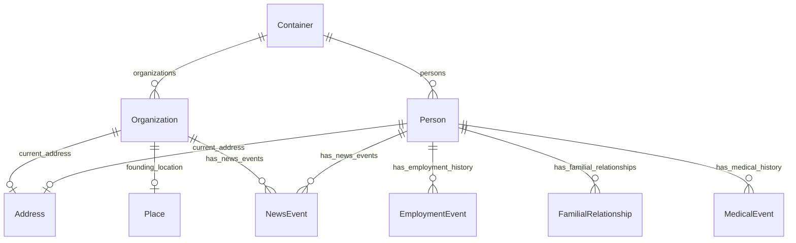

#### Attributes

| Name | Cardinality: | Type | Description |
| --- | --- | --- | --- |
| **name** | 0..1 | string | Short human readable object name |
| **organizations** | 0..\* | [Organization](#organization) |  |
| **persons** | 0..\* | [Person](#person) |  |

### DiagnosisConcept

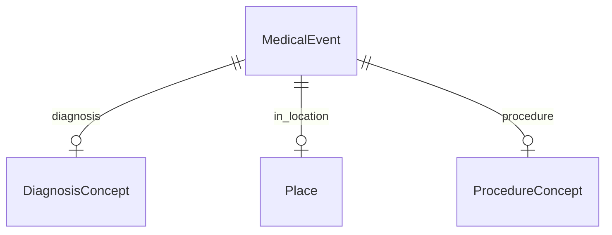

#### Attributes

| Name | Cardinality: | Type | Description |
| --- | --- | --- | --- |
| id | 1..1 | string | ID string to uniquely identify the object |
| name | 0..1 | string | Short human readable object name |
| description | 0..1 | string | Detailed free form description of the object |
| image | 0..1 | uri | image that visually represents the object |

#### Parents

 * [Concept](#concept)

#### Referenced by:

 *  **[MedicalEvent](#medicalevent)** : *[diagnosis](#diagnosis)*  0..1 

### EmploymentEvent

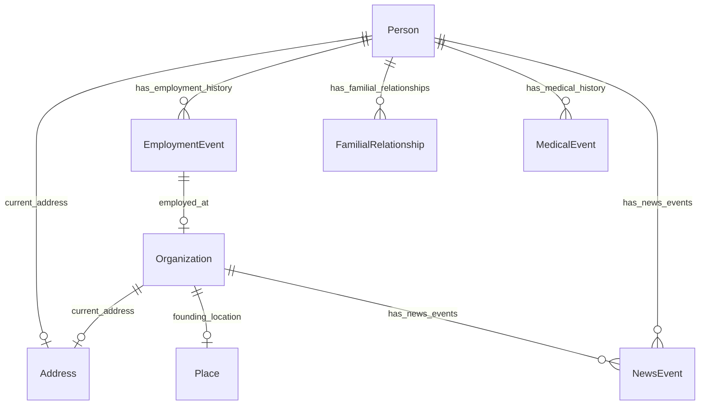

#### Attributes

| Name | Cardinality: | Type | Description |
| --- | --- | --- | --- |
| duration | 0..1 | float |  |
| ended_at_time | 0..1 | date |  |
| is_current | 0..1 | boolean |  |
| started_at_time | 0..1 | date |  |
| **employed_at** | 0..1 | [Organization](#organization) |  |

#### Parents

 * [Event](#event)

#### Referenced by:

 *  **[Person](#person)** : *[has_employment_history](#has_employment_history)*  0..\* 

### Event

#### Local class diagram

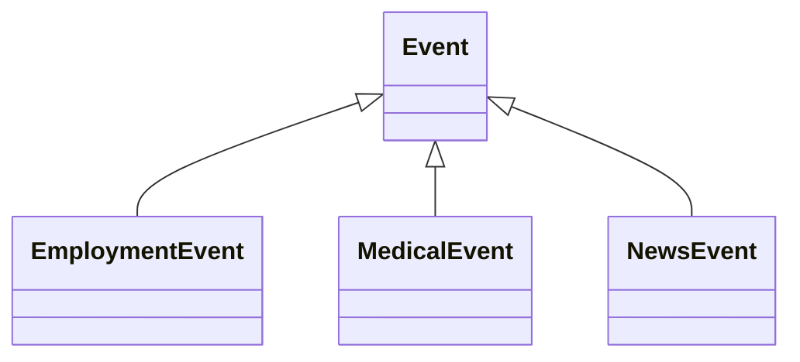

#### Attributes

| Name | Cardinality: | Type | Description |
| --- | --- | --- | --- |
| **duration** | 0..1 | float |  |
| **ended_at_time** | 0..1 | date |  |
| **is_current** | 0..1 | boolean |  |
| **started_at_time** | 0..1 | date |  |

#### Children

 * [EmploymentEvent](#employmentevent)
 * [MedicalEvent](#medicalevent)
 * [NewsEvent](#newsevent)

### FamilialRelationship

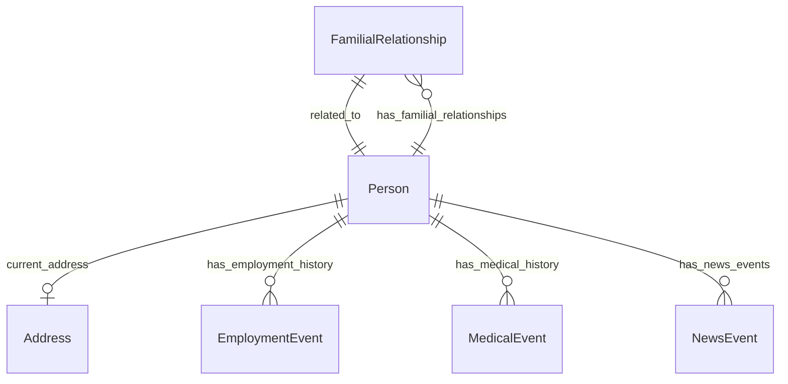

#### Attributes

| Name | Cardinality: | Type | Description |
| --- | --- | --- | --- |
| ended_at_time | 0..1 | date |  |
| related_to | 0..1 | string |  |
| started_at_time | 0..1 | date |  |
| type | 0..1 | string |  |
| **FamilialRelationship_related_to** | 1..1 | [Person](#person) |  |
| **FamilialRelationship_type** | 1..1 | [FamilialRelationshipType](#familialrelationshiptype) |  |

#### Parents

 * [Relationship](#relationship)

#### Referenced by:

 *  **[Person](#person)** : *[has_familial_relationships](#has_familial_relationships)*  0..\* 

### IntegerPrimaryKeyObject

#### Attributes

| Name | Cardinality: | Type | Description |
| --- | --- | --- | --- |
| **int_id** | 1..1 | integer |  |

### MedicalEvent

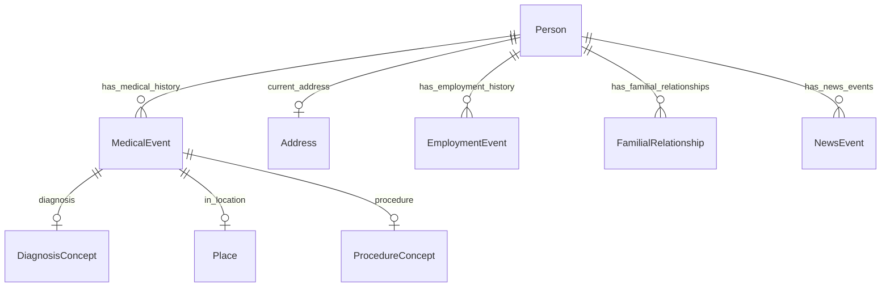

#### Attributes

| Name | Cardinality: | Type | Description |
| --- | --- | --- | --- |
| duration | 0..1 | float |  |
| ended_at_time | 0..1 | date |  |
| is_current | 0..1 | boolean |  |
| started_at_time | 0..1 | date |  |
| **diagnosis** | 0..1 | [DiagnosisConcept](#diagnosisconcept) |  |
| **in_location** | 0..1 | [Place](#place) |  |
| **procedure** | 0..1 | [ProcedureConcept](#procedureconcept) |  |

#### Parents

 * [Event](#event)

#### Referenced by:

 *  **[Person](#person)** : *[has_medical_history](#has_medical_history)*  0..\* 

### NamedThing

A generic grouping for any identifiable entity

#### Local class diagram

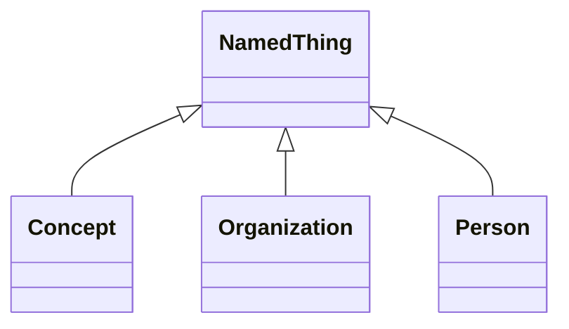

#### Attributes

| Name | Cardinality: | Type | Description |
| --- | --- | --- | --- |
| **id** | 1..1 | string | ID string to uniquely identify the object |
| **name** | 0..1 | string | Short human readable object name |
| **description** | 0..1 | string | Detailed free form description of the object |
| **image** | 0..1 | uri | image that visually represents the object |

#### Children

 * [Concept](#concept)
 * [Organization](#organization) - An organization such as a company or university
 * [Person](#person) - A person (alive, dead, undead, or fictional).

### NewsEvent

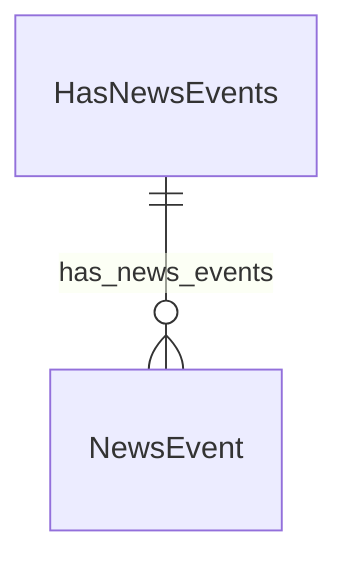

#### Attributes

| Name | Cardinality: | Type | Description |
| --- | --- | --- | --- |
| duration | 0..1 | float |  |
| ended_at_time | 0..1 | date |  |
| is_current | 0..1 | boolean |  |
| started_at_time | 0..1 | date |  |
| **headline** | 0..1 | None |  |
| **newsEvent__headline** | 0..1 | string |  |

#### Parents

 * [Event](#event)

#### Referenced by:

 *  **[HasNewsEvents](#hasnewsevents)** : *[hasNewsEvents__has_news_events](#hasNewsEvents__has_news_events)*  0..\* 

### Organization

An organization such as a company or university

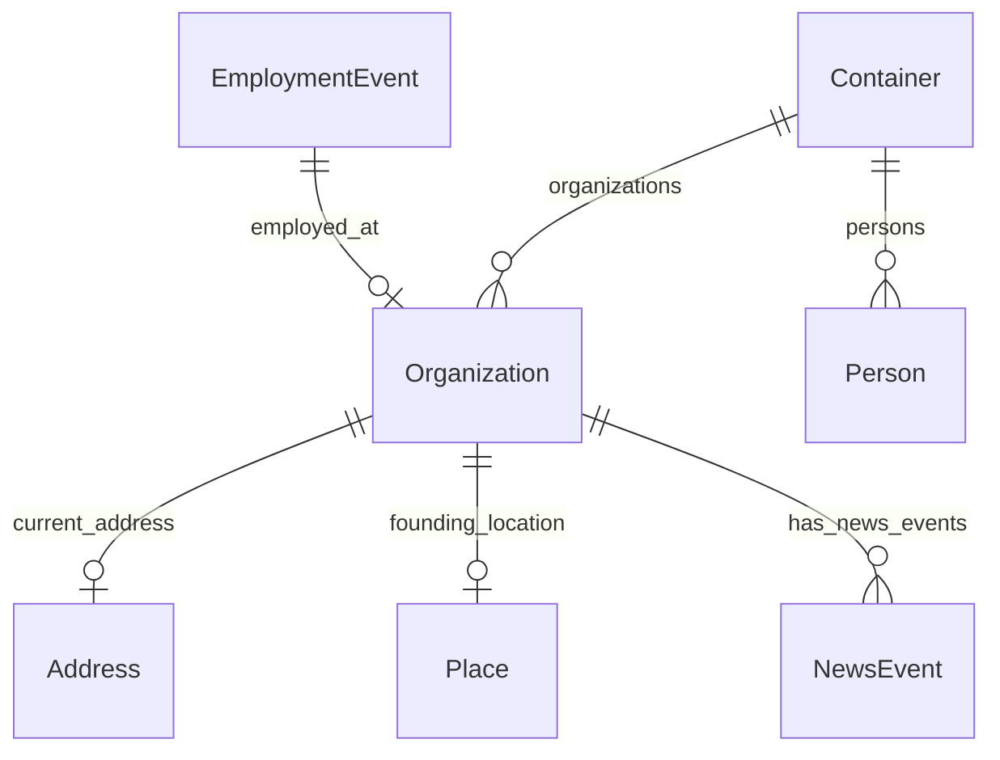

#### Attributes

| Name | Cardinality: | Type | Description |
| --- | --- | --- | --- |
| id | 1..1 | string | ID string to uniquely identify the object |
| name | 0..1 | string | Short human readable object name |
| description | 0..1 | string | Detailed free form description of the object |
| image | 0..1 | uri | image that visually represents the object |
| *aliases* | 0..\* | None |  |
| *hasAliases__aliases* | 0..\* | string |  |
| *hasNewsEvents__has_news_events* | 0..\* | [NewsEvent](#newsevent) |  |
| *has_news_events* | 0..\* | [NewsEvent](#newsevent) |  |
| **current_address** | 0..1 | [Address](#address) | The address at which a person currently lives |
| **founding_date** | 0..1 | string |  |
| **founding_location** | 0..1 | [Place](#place) |  |
| **mission_statement** | 0..1 | string |  |

#### Parents

 * [NamedThing](#namedthing) - A generic grouping for any identifiable entity

#### Uses

 *  mixin: [HasAliases](#hasaliases) - A mixin applied to any class that can have aliases/alternateNames
 *  mixin: [HasNewsEvents](#hasnewsevents)

#### Referenced by:

 *  **[EmploymentEvent](#employmentevent)** : *[employed_at](#employed_at)*  0..1 
 *  **[Container](#container)** : *[organizations](#organizations)*  0..\* 

### Person

A person (alive, dead, undead, or fictional).

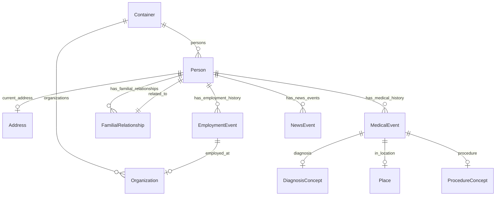

#### Attributes

| Name | Cardinality: | Type | Description |
| --- | --- | --- | --- |
| id | 1..1 | string | ID string to uniquely identify the object |
| name | 0..1 | string | Short human readable object name |
| description | 0..1 | string | Detailed free form description of the object |
| image | 0..1 | uri | image that visually represents the object |
| *aliases* | 0..\* | None |  |
| *hasAliases__aliases* | 0..\* | string |  |
| *hasNewsEvents__has_news_events* | 0..\* | [NewsEvent](#newsevent) |  |
| *has_news_events* | 0..\* | [NewsEvent](#newsevent) |  |
| **Person_primary_email** | 0..1 | string |  |
| **age_in_years** | 0..1 | integer |  |
| **birth_date** | 0..1 | string |  |
| **current_address** | 0..1 | [Address](#address) | The address at which a person currently lives |
| **gender** | 0..1 | [GenderType](#gendertype) |  |
| **has_employment_history** | 0..\* | [EmploymentEvent](#employmentevent) |  |
| **has_familial_relationships** | 0..\* | [FamilialRelationship](#familialrelationship) |  |
| **has_medical_history** | 0..\* | [MedicalEvent](#medicalevent) |  |

#### Parents

 * [NamedThing](#namedthing) - A generic grouping for any identifiable entity

#### Uses

 *  mixin: [HasAliases](#hasaliases) - A mixin applied to any class that can have aliases/alternateNames
 *  mixin: [HasNewsEvents](#hasnewsevents)

#### Referenced by:

 *  **[FamilialRelationship](#familialrelationship)** : *[FamilialRelationship_related_to](#FamilialRelationship_related_to)*  1..1 
 *  **[Container](#container)** : *[persons](#persons)*  0..\* 

### Place

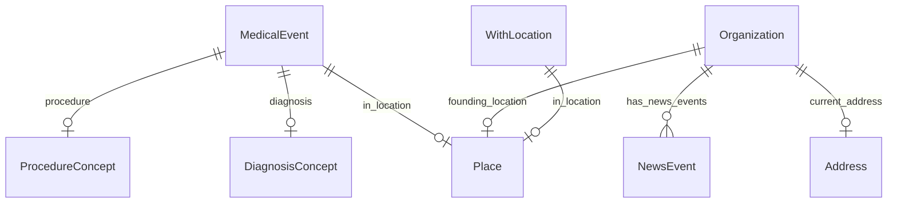

#### Attributes

| Name | Cardinality: | Type | Description |
| --- | --- | --- | --- |
| *aliases* | 0..\* | None |  |
| *hasAliases__aliases* | 0..\* | string |  |
| **id** | 1..1 | string | ID string to uniquely identify the object |
| **name** | 0..1 | string | Short human readable object name |

#### Uses

 *  mixin: [HasAliases](#hasaliases) - A mixin applied to any class that can have aliases/alternateNames

#### Referenced by:

 *  **[Organization](#organization)** : *[founding_location](#founding_location)*  0..1 
 *  **[MedicalEvent](#medicalevent)** : *[in_location](#in_location)*  0..1 
 *  **[WithLocation](#withlocation)** : *[in_location](#in_location)*  0..1 

### ProcedureConcept

#### Attributes

| Name | Cardinality: | Type | Description |
| --- | --- | --- | --- |
| id | 1..1 | string | ID string to uniquely identify the object |
| name | 0..1 | string | Short human readable object name |
| description | 0..1 | string | Detailed free form description of the object |
| image | 0..1 | uri | image that visually represents the object |

#### Parents

 * [Concept](#concept)

#### Referenced by:

 *  **[MedicalEvent](#medicalevent)** : *[procedure](#procedure)*  0..1 

### Relationship

#### Local class diagram

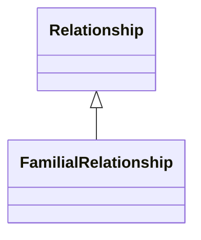

#### Attributes

| Name | Cardinality: | Type | Description |
| --- | --- | --- | --- |
| **ended_at_time** | 0..1 | date |  |
| **related_to** | 0..1 | string |  |
| **started_at_time** | 0..1 | date |  |
| **type** | 0..1 | string |  |

#### Children

 * [FamilialRelationship](#familialrelationship)

## Mixins

### HasAliases

A mixin applied to any class that can have aliases/alternateNames

#### Attributes

| Name | Cardinality: | Type | Description |
| --- | --- | --- | --- |
| **aliases** | 0..\* | None |  |
| **hasAliases__aliases** | 0..\* | string |  |

#### Used as mixin by

 * [Organization](#organization) - An organization such as a company or university
 * [Person](#person) - A person (alive, dead, undead, or fictional).
 * [Place](#place)

### HasNewsEvents

#### Attributes

| Name | Cardinality: | Type | Description |
| --- | --- | --- | --- |
| **hasNewsEvents__has_news_events** | 0..\* | [NewsEvent](#newsevent) |  |
| **has_news_events** | 0..\* | [NewsEvent](#newsevent) |  |

#### Used as mixin by

 * [Organization](#organization) - An organization such as a company or university
 * [Person](#person) - A person (alive, dead, undead, or fictional).

### WithLocation

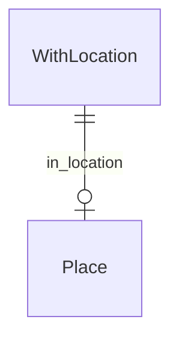

#### Attributes

| Name | Cardinality: | Type | Description |
| --- | --- | --- | --- |
| **in_location** | 0..1 | [Place](#place) |  |

## Enums

### DiagnosisType

### FamilialRelationshipType

| Text | Meaning: | Description |
| --- | --- | --- |
| CHILD_OF | famrel:01 |  |
| PARENT_OF | famrel:02 |  |
| SIBLING_OF | famrel:01 |  |

#### Used by

 *  **[FamilialRelationship](#familialrelationship)** *[FamilialRelationship_type](#FamilialRelationship_type)*  1..1 

### GenderType

| Text | Meaning: | Description |
| --- | --- | --- |
| cisgender man | GSSO:000371 |  |
| cisgender woman | GSSO:000385 |  |
| nonbinary man | GSSO:009254 |  |
| nonbinary woman | GSSO:009253 |  |
| transgender man | GSSO:000372 |  |
| transgender woman | GSSO:000384 |  |

#### Used by

 *  **[Person](#person)** *[gender](#gender)*  0..1
