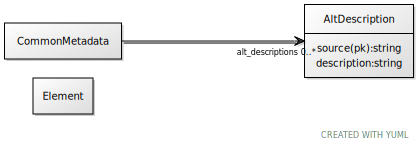

# Class: AltDescription

an attributed description

URI: [linkml:AltDescription](https://w3id.org/linkml/AltDescription)

## Referenced by class

 *  **[Element](Element.md)** *[alt_descriptions](alt_descriptions.md)*  0..*
  **[AltDescription](AltDescription.md)**

## Attributes

### Own

 * [alt_description➞source](alt_description_source.md)  REQ

     * Description: the source of an attributed description
     * range: [String](types/String.md)
 * [alt_description➞description](alt_description_text.md)  REQ

     * Description: text of an attributed description
     * range: [String](types/String.md)
