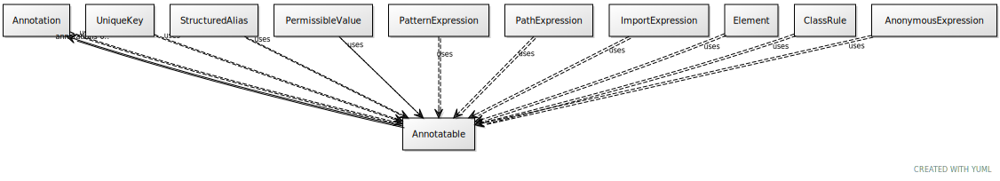

# Class: annotatable

mixin for classes that support annotations

URI: [linkml:Annotatable](https://w3id.org/linkml/Annotatable)

## Mixin for

 * [Annotation](Annotation.md) (mixin)  - a tag/value pair with the semantics of OWL Annotation
 * [Element](Element.md) (mixin)  - a named element in the model
 * [PermissibleValue](PermissibleValue.md) (mixin)  - a permissible value, accompanied by intended text and an optional mapping to a concept URI
 * [UniqueKey](UniqueKey.md) (mixin)  - a collection of slots whose values uniquely identify an instance of a class

## Referenced by Class

## Attributes

### Own

 * [annotations](annotations.md)  0..\*
     * Description: a collection of tag/text tuples with the semantics of OWL Annotation
     * Range: [Annotation](Annotation.md)
