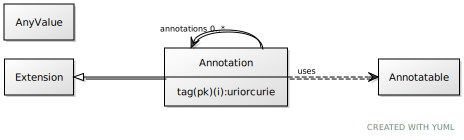

# Class: annotation

a tag/value pair with the semantics of OWL Annotation

URI: [linkml:Annotation](https://w3id.org/linkml/Annotation)

## Parents

 *  is_a: [Extension](Extension.md) - a tag/value pair used to add non-model information to an entry

## Uses Mixin

 *  mixin: [Annotatable](Annotatable.md) - mixin for classes that support annotations

## Referenced by Class

 *  **[Annotatable](Annotatable.md)** *[annotations](annotations.md)*  0..\*  **[Annotation](Annotation.md)**

## Attributes

### Own

 * [annotations](annotations.md)  0..\*
     * Description: a collection of tag/text tuples with the semantics of OWL Annotation
     * Range: [Annotation](Annotation.md)

### Inherited from extension:

 * [extension➞tag](extension_tag.md)  1..1
     * Description: a tag associated with an extension
     * Range: [Uriorcurie](types/Uriorcurie.md)
 * [extension➞value](extension_value.md)  1..1
     * Description: the actual annotation
     * Range: [String](types/String.md)
 * [extensions](extensions.md)  0..\*
     * Description: a tag/text tuple attached to an arbitrary element
     * Range: [Extension](Extension.md)
