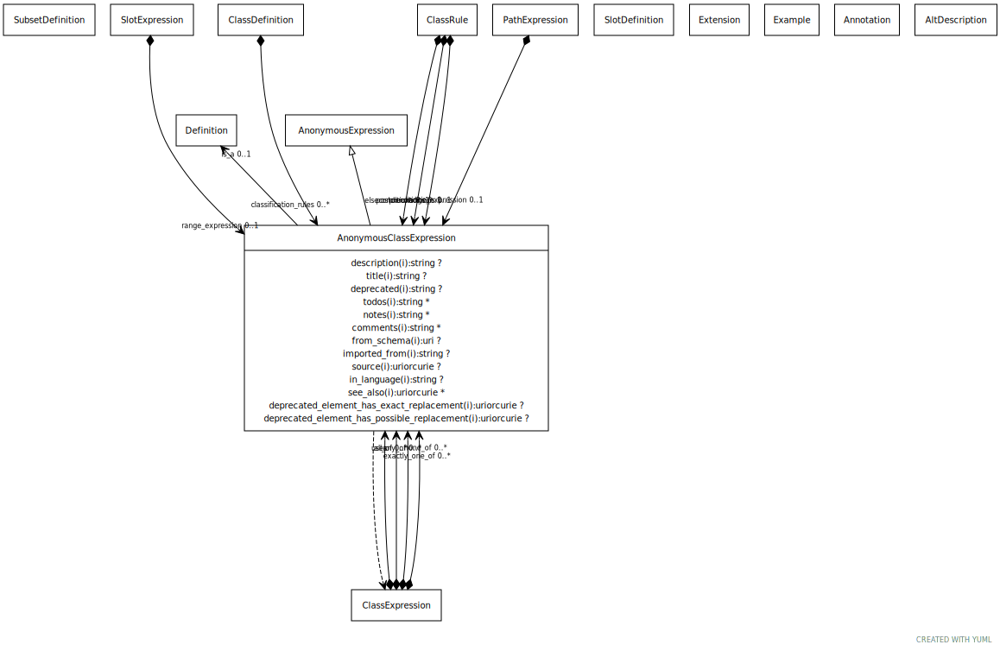

# Class: anonymous_class_expression

URI: [linkml:AnonymousClassExpression](https://w3id.org/linkml/AnonymousClassExpression)

## Parents

 *  is_a: [AnonymousExpression](AnonymousExpression.md)

## Uses Mixin

 *  mixin: [ClassExpression](ClassExpression.md) - A boolean expression that can be used to dynamically determine membership of a class

## Referenced by Class

 *  **[ClassExpression](ClassExpression.md)** *[class_expression➞all_of](class_expression_all_of.md)*  0..\*  **[AnonymousClassExpression](AnonymousClassExpression.md)**
 *  **[ClassExpression](ClassExpression.md)** *[class_expression➞any_of](class_expression_any_of.md)*  0..\*  **[AnonymousClassExpression](AnonymousClassExpression.md)**
 *  **[ClassExpression](ClassExpression.md)** *[class_expression➞exactly_one_of](class_expression_exactly_one_of.md)*  0..\*  **[AnonymousClassExpression](AnonymousClassExpression.md)**
 *  **[ClassExpression](ClassExpression.md)** *[class_expression➞none_of](class_expression_none_of.md)*  0..\*  **[AnonymousClassExpression](AnonymousClassExpression.md)**
 *  **[ClassDefinition](ClassDefinition.md)** *[classification_rules](classification_rules.md)*  0..\*  **[AnonymousClassExpression](AnonymousClassExpression.md)**
 *  **None** *[elseconditions](elseconditions.md)*  0..1  **[AnonymousClassExpression](AnonymousClassExpression.md)**
 *  **None** *[postconditions](postconditions.md)*  0..1  **[AnonymousClassExpression](AnonymousClassExpression.md)**
 *  **None** *[preconditions](preconditions.md)*  0..1  **[AnonymousClassExpression](AnonymousClassExpression.md)**
 *  **[SlotExpression](SlotExpression.md)** *[range_expression](range_expression.md)*  0..1  **[AnonymousClassExpression](AnonymousClassExpression.md)**

## Attributes

### Own

 * [is_a](is_a.md)  0..1
     * Description: specifies single-inheritance between classes or slots. While multiple inheritance is not allowed, mixins can be provided effectively providing the same thing. The semantics are the same when translated to formalisms that allow MI (e.g. RDFS/OWL). When translating to a SI framework (e.g. java classes, python classes) then is a is used. When translating a framework without polymorphism (e.g. json-schema, solr document schema) then is a and mixins are recursively unfolded
     * Range: [Definition](Definition.md)

### Mixed in from class_expression:

 * [class_expression➞any_of](class_expression_any_of.md)  0..\*
     * Description: holds if at least one of the expressions hold
     * Range: [AnonymousClassExpression](AnonymousClassExpression.md)

### Mixed in from class_expression:

 * [class_expression➞exactly_one_of](class_expression_exactly_one_of.md)  0..\*
     * Description: holds if only one of the expressions hold
     * Range: [AnonymousClassExpression](AnonymousClassExpression.md)

### Mixed in from class_expression:

 * [class_expression➞none_of](class_expression_none_of.md)  0..\*
     * Description: holds if none of the expressions hold
     * Range: [AnonymousClassExpression](AnonymousClassExpression.md)

### Mixed in from class_expression:

 * [class_expression➞all_of](class_expression_all_of.md)  0..\*
     * Description: holds if all of the expressions hold
     * Range: [AnonymousClassExpression](AnonymousClassExpression.md)

### Mixed in from class_expression:

 * [slot_conditions](slot_conditions.md)  0..\*
     * Description: the redefinition of a slot in the context of the containing class definition.
     * Range: [SlotDefinition](SlotDefinition.md)
