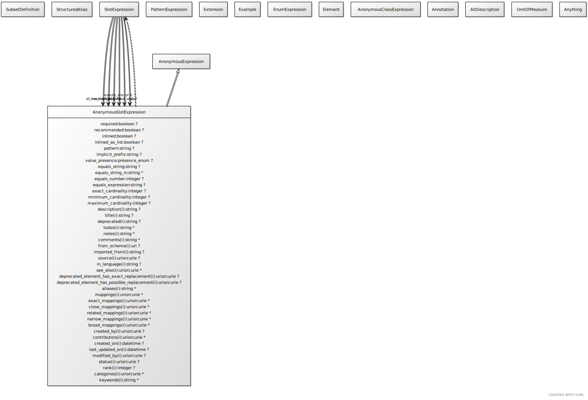

# Class: anonymous_slot_expression


URI: [linkml:AnonymousSlotExpression](https://w3id.org/linkml/AnonymousSlotExpression)


[](images/AnonymousSlotExpression.svg)

## Parents

 *  is_a: [AnonymousExpression](AnonymousExpression.md)

## Uses Mixin

 *  mixin: [SlotExpression](SlotExpression.md) - an expression that constrains the range of values a slot can take

## Referenced by Class

 *  **None** *[has_member](has_member.md)*  <sub>0..1</sub>  **[AnonymousSlotExpression](AnonymousSlotExpression.md)**
 *  **[SlotExpression](SlotExpression.md)** *[slot_expression➞all_of](slot_expression_all_of.md)*  <sub>0..\*</sub>  **[AnonymousSlotExpression](AnonymousSlotExpression.md)**
 *  **[SlotExpression](SlotExpression.md)** *[slot_expression➞any_of](slot_expression_any_of.md)*  <sub>0..\*</sub>  **[AnonymousSlotExpression](AnonymousSlotExpression.md)**
 *  **[SlotExpression](SlotExpression.md)** *[slot_expression➞exactly_one_of](slot_expression_exactly_one_of.md)*  <sub>0..\*</sub>  **[AnonymousSlotExpression](AnonymousSlotExpression.md)**
 *  **[SlotExpression](SlotExpression.md)** *[slot_expression➞none_of](slot_expression_none_of.md)*  <sub>0..\*</sub>  **[AnonymousSlotExpression](AnonymousSlotExpression.md)**

## Attributes


### Mixed in from slot_expression:

 * [range](range.md)  <sub>0..1</sub>
     * Description: defines the type of the object of the slot.  Given the following slot definition
  S1:
    domain: C1
    range:  C2
the declaration
  X:
    S1: Y

implicitly asserts Y is an instance of C2

     * Range: [Element](Element.md)

### Mixed in from slot_expression:

 * [range_expression](range_expression.md)  <sub>0..1</sub>
     * Description: A range that is described as a boolean expression combining existing ranges
     * Range: [AnonymousClassExpression](AnonymousClassExpression.md)

### Mixed in from slot_expression:

 * [required](required.md)  <sub>0..1</sub>
     * Description: true means that the slot must be present in the loaded definition
     * Range: [Boolean](types/Boolean.md)

### Mixed in from slot_expression:

 * [recommended](recommended.md)  <sub>0..1</sub>
     * Description: true means that the slot should be present in the loaded definition, but this is not required
     * Range: [Boolean](types/Boolean.md)

### Mixed in from slot_expression:

 * [minimum_value](minimum_value.md)  <sub>0..1</sub>
     * Description: for slots with ranges of type number, the value must be equal to or higher than this
     * Range: [Integer](types/Integer.md)

### Mixed in from slot_expression:

 * [maximum_value](maximum_value.md)  <sub>0..1</sub>
     * Description: for slots with ranges of type number, the value must be equal to or lowe than this
     * Range: [Integer](types/Integer.md)

### Mixed in from slot_expression:

 * [pattern](pattern.md)  <sub>0..1</sub>
     * Description: the string value of the slot must conform to this regular expression
     * Range: [String](types/String.md)

### Mixed in from slot_expression:

 * [equals_string](equals_string.md)  <sub>0..1</sub>
     * Description: the slot must have range string and the value of the slot must equal the specified value
     * Range: [String](types/String.md)

### Mixed in from slot_expression:

 * [equals_string_in](equals_string_in.md)  <sub>0..\*</sub>
     * Description: the slot must have range string and the value of the slot must equal one of the specified values
     * Range: [String](types/String.md)

### Mixed in from slot_expression:

 * [equals_number](equals_number.md)  <sub>0..1</sub>
     * Description: the slot must have range of a number and the value of the slot must equal the specified value
     * Range: [Integer](types/Integer.md)

### Mixed in from slot_expression:

 * [equals_expression](equals_expression.md)  <sub>0..1</sub>
     * Description: the value of the slot must equal the value of the evaluated expression
     * Range: [String](types/String.md)

### Mixed in from slot_expression:

 * [minimum_cardinality](minimum_cardinality.md)  <sub>0..1</sub>
     * Description: the minimum number of entries for a multivalued slot
     * Range: [Integer](types/Integer.md)

### Mixed in from slot_expression:

 * [maximum_cardinality](maximum_cardinality.md)  <sub>0..1</sub>
     * Description: the maximum number of entries for a multivalued slot
     * Range: [Integer](types/Integer.md)

### Mixed in from slot_expression:

 * [has_member](has_member.md)  <sub>0..1</sub>
     * Description: the values of the slot is multivalued with at least one member satisfying the condition
     * Range: [AnonymousSlotExpression](AnonymousSlotExpression.md)

### Mixed in from slot_expression:

 * [all_members](all_members.md)  <sub>0..\*</sub>
     * Description: the value of the multiavlued slot is a list where all elements conform to the specified values.
this defines a dynamic class with named slots according to matching constraints

E.g to state that all members of a list are between 1 and 10
```
all_members:
  x:
    range: integer
    minimum_value: 10
    maximum_value: 10
```
     * Range: [SlotDefinition](SlotDefinition.md)

### Mixed in from slot_expression:

 * [slot_expression➞none_of](slot_expression_none_of.md)  <sub>0..\*</sub>
     * Description: holds if none of the expressions hold
     * Range: [AnonymousSlotExpression](AnonymousSlotExpression.md)

### Mixed in from slot_expression:

 * [slot_expression➞exactly_one_of](slot_expression_exactly_one_of.md)  <sub>0..\*</sub>
     * Description: holds if only one of the expressions hold
     * Range: [AnonymousSlotExpression](AnonymousSlotExpression.md)

### Mixed in from slot_expression:

 * [slot_expression➞any_of](slot_expression_any_of.md)  <sub>0..\*</sub>
     * Description: holds if at least one of the expressions hold
     * Range: [AnonymousSlotExpression](AnonymousSlotExpression.md)

### Mixed in from slot_expression:

 * [slot_expression➞all_of](slot_expression_all_of.md)  <sub>0..\*</sub>
     * Description: holds if all of the expressions hold
     * Range: [AnonymousSlotExpression](AnonymousSlotExpression.md)
