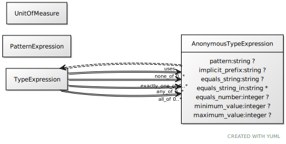

# Class: anonymous_type_expression

URI: [linkml:AnonymousTypeExpression](https://w3id.org/linkml/AnonymousTypeExpression)

## Uses Mixin

 *  mixin: [TypeExpression](TypeExpression.md)

## Referenced by Class

 *  **[TypeExpression](TypeExpression.md)** *[type_expression➞all_of](type_expression_all_of.md)*  0..\*  **[AnonymousTypeExpression](AnonymousTypeExpression.md)**
 *  **[TypeExpression](TypeExpression.md)** *[type_expression➞any_of](type_expression_any_of.md)*  0..\*  **[AnonymousTypeExpression](AnonymousTypeExpression.md)**
 *  **[TypeExpression](TypeExpression.md)** *[type_expression➞exactly_one_of](type_expression_exactly_one_of.md)*  0..\*  **[AnonymousTypeExpression](AnonymousTypeExpression.md)**
 *  **[TypeExpression](TypeExpression.md)** *[type_expression➞none_of](type_expression_none_of.md)*  0..\*  **[AnonymousTypeExpression](AnonymousTypeExpression.md)**

## Attributes

### Mixed in from type_expression:

 * [pattern](pattern.md)  0..1
     * Description: the string value of the slot must conform to this regular expression expressed in the string
     * Range: [String](types/String.md)
     * in subsets: (basic)

### Mixed in from type_expression:

 * [structured_pattern](structured_pattern.md)  0..1
     * Description: the string value of the slot must conform to the regular expression in the pattern expression
     * Range: [PatternExpression](PatternExpression.md)

### Mixed in from type_expression:

 * [equals_string](equals_string.md)  0..1
     * Description: the slot must have range string and the value of the slot must equal the specified value
     * Range: [String](types/String.md)

### Mixed in from type_expression:

 * [equals_string_in](equals_string_in.md)  0..\*
     * Description: the slot must have range string and the value of the slot must equal one of the specified values
     * Range: [String](types/String.md)

### Mixed in from type_expression:

 * [equals_number](equals_number.md)  0..1
     * Description: the slot must have range of a number and the value of the slot must equal the specified value
     * Range: [Integer](types/Integer.md)

### Mixed in from type_expression:

 * [minimum_value](minimum_value.md)  0..1
     * Description: for slots with ranges of type number, the value must be equal to or higher than this
     * Range: [Integer](types/Integer.md)
     * in subsets: (basic)

### Mixed in from type_expression:

 * [maximum_value](maximum_value.md)  0..1
     * Description: for slots with ranges of type number, the value must be equal to or lowe than this
     * Range: [Integer](types/Integer.md)
     * in subsets: (basic)

### Mixed in from type_expression:

 * [type_expression➞none_of](type_expression_none_of.md)  0..\*
     * Description: holds if none of the expressions hold
     * Range: [AnonymousTypeExpression](AnonymousTypeExpression.md)

### Mixed in from type_expression:

 * [type_expression➞exactly_one_of](type_expression_exactly_one_of.md)  0..\*
     * Description: holds if only one of the expressions hold
     * Range: [AnonymousTypeExpression](AnonymousTypeExpression.md)

### Mixed in from type_expression:

 * [type_expression➞any_of](type_expression_any_of.md)  0..\*
     * Description: holds if at least one of the expressions hold
     * Range: [AnonymousTypeExpression](AnonymousTypeExpression.md)

### Mixed in from type_expression:

 * [type_expression➞all_of](type_expression_all_of.md)  0..\*
     * Description: holds if all of the expressions hold
     * Range: [AnonymousTypeExpression](AnonymousTypeExpression.md)
