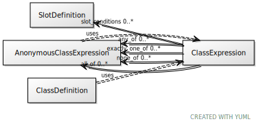

# Class: class_expression

A boolean expression that can be used to dynamically determine membership of a class

URI: [linkml:ClassExpression](https://w3id.org/linkml/ClassExpression)

## Mixin for

 * [AnonymousClassExpression](AnonymousClassExpression.md) (mixin) 
 * [ClassDefinition](ClassDefinition.md) (mixin)  - the definition of a class or interface

## Referenced by Class

## Attributes

### Own

 * [class_expression➞any_of](class_expression_any_of.md)  0..\*
     * Description: holds if at least one of the expressions hold
     * Range: [AnonymousClassExpression](AnonymousClassExpression.md)
 * [class_expression➞exactly_one_of](class_expression_exactly_one_of.md)  0..\*
     * Description: holds if only one of the expressions hold
     * Range: [AnonymousClassExpression](AnonymousClassExpression.md)
 * [class_expression➞none_of](class_expression_none_of.md)  0..\*
     * Description: holds if none of the expressions hold
     * Range: [AnonymousClassExpression](AnonymousClassExpression.md)
 * [class_expression➞all_of](class_expression_all_of.md)  0..\*
     * Description: holds if all of the expressions hold
     * Range: [AnonymousClassExpression](AnonymousClassExpression.md)
 * [slot_conditions](slot_conditions.md)  0..\*
     * Description: the redefinition of a slot in the context of the containing class definition.
     * Range: [SlotDefinition](SlotDefinition.md)
