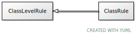

# Class: class_level_rule

A rule that is applied to classes

URI: [linkml:ClassLevelRule](https://w3id.org/linkml/ClassLevelRule)

## Children

 * [ClassRule](ClassRule.md) - A rule that applies to instances of a class

## Referenced by Class

## Attributes

