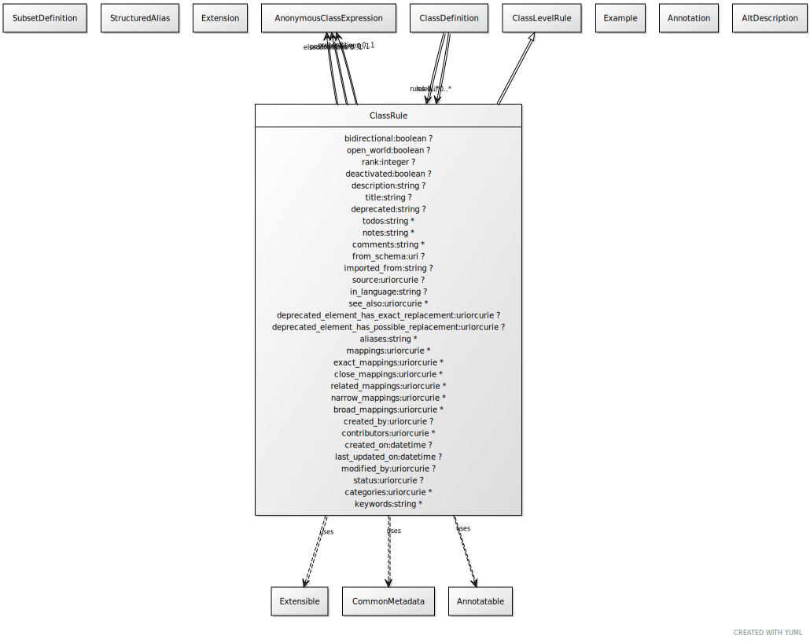

# Class: class_rule

A rule that applies to instances of a class

URI: [linkml:ClassRule](https://w3id.org/linkml/ClassRule)

## Parents

 *  is_a: [ClassLevelRule](ClassLevelRule.md) - A rule that is applied to classes

## Uses Mixin

 *  mixin: [Extensible](Extensible.md) - mixin for classes that support extension
 *  mixin: [Annotatable](Annotatable.md) - mixin for classes that support annotations
 *  mixin: [CommonMetadata](CommonMetadata.md) - Generic metadata shared across definitions

## Referenced by Class

 *  **[ClassDefinition](ClassDefinition.md)** *[class_definition➞rules](class_definition_rules.md)*  0..\*  **[ClassRule](ClassRule.md)**
 *  **[ClassDefinition](ClassDefinition.md)** *[rules](rules.md)*  0..\*  **[ClassRule](ClassRule.md)**

## Attributes

### Own

 * [preconditions](preconditions.md)  0..1
     * Description: an expression that must hold in order for the rule to be applicable to an instance
     * Range: [AnonymousClassExpression](AnonymousClassExpression.md)
 * [postconditions](postconditions.md)  0..1
     * Description: an expression that must hold for an instance of the class, if the preconditions hold
     * Range: [AnonymousClassExpression](AnonymousClassExpression.md)
 * [elseconditions](elseconditions.md)  0..1
     * Description: an expression that must hold for an instance of the class, if the preconditions no not hold
     * Range: [AnonymousClassExpression](AnonymousClassExpression.md)
 * [bidirectional](bidirectional.md)  0..1
     * Description: in addition to preconditions entailing postconditions, the postconditions entail the preconditions
     * Range: [Boolean](types/Boolean.md)
 * [open_world](open_world.md)  0..1
     * Description: if true, the the postconditions may be omitted in instance data, but it is valid for an inference engine to add these
     * Range: [Boolean](types/Boolean.md)
 * [precedence](precedence.md)  0..1
     * Description: the relative order in which the rule is applied
     * Range: [Integer](types/Integer.md)
 * [deactivated](deactivated.md)  0..1
     * Description: a deactivated rule is not executed by the rules engine
     * Range: [Boolean](types/Boolean.md)

### Mixed in from extensible:

 * [extensions](extensions.md)  0..\*
     * Description: a tag/text tuple attached to an arbitrary element
     * Range: [Extension](Extension.md)

### Mixed in from annotatable:

 * [annotations](annotations.md)  0..\*
     * Description: a collection of tag/text tuples with the semantics of OWL Annotation
     * Range: [Annotation](Annotation.md)

### Mixed in from common_metadata:

 * [description](description.md)  0..1
     * Description: a description of the element's purpose and use
     * Range: [String](types/String.md)
     * in subsets: (owl)

### Mixed in from common_metadata:

 * [alt_descriptions](alt_descriptions.md)  0..\*
     * Range: [AltDescription](AltDescription.md)

### Mixed in from common_metadata:

 * [title](title.md)  0..1
     * Description: the official title of the element
     * Range: [String](types/String.md)
     * in subsets: (owl)

### Mixed in from common_metadata:

 * [deprecated](deprecated.md)  0..1
     * Description: Description of why and when this element will no longer be used
     * Range: [String](types/String.md)

### Mixed in from common_metadata:

 * [todos](todos.md)  0..\*
     * Description: Outstanding issue that needs resolution
     * Range: [String](types/String.md)

### Mixed in from common_metadata:

 * [notes](notes.md)  0..\*
     * Description: editorial notes about an element intended for internal consumption
     * Range: [String](types/String.md)
     * in subsets: (owl)

### Mixed in from common_metadata:

 * [comments](comments.md)  0..\*
     * Description: notes and comments about an element intended for external consumption
     * Range: [String](types/String.md)
     * in subsets: (owl)

### Mixed in from common_metadata:

 * [examples](examples.md)  0..\*
     * Description: example usages of an element
     * Range: [Example](Example.md)
     * in subsets: (owl)

### Mixed in from common_metadata:

 * [in_subset](in_subset.md)  0..\*
     * Description: used to indicate membership of a term in a defined subset of terms used for a particular domain or application (e.g. the translator_minimal subset holding the minimal set of predicates used in a translator knowledge graph)
     * Range: [SubsetDefinition](SubsetDefinition.md)

### Mixed in from common_metadata:

 * [from_schema](from_schema.md)  0..1
     * Description: id of the schema that defined the element
     * Range: [Uri](types/Uri.md)

### Mixed in from common_metadata:

 * [imported_from](imported_from.md)  0..1
     * Description: the imports entry that this element was derived from.  Empty means primary source
     * Range: [String](types/String.md)

### Mixed in from common_metadata:

 * [see_also](see_also.md)  0..\*
     * Description: a reference
     * Range: [Uriorcurie](types/Uriorcurie.md)
     * in subsets: (owl)

### Mixed in from common_metadata:

 * [deprecated element has exact replacement](deprecated_element_has_exact_replacement.md)  0..1
     * Description: When an element is deprecated, it can be automatically replaced by this uri or curie
     * Range: [Uriorcurie](types/Uriorcurie.md)

### Mixed in from common_metadata:

 * [deprecated element has possible replacement](deprecated_element_has_possible_replacement.md)  0..1
     * Description: When an element is deprecated, it can be potentially replaced by this uri or curie
     * Range: [Uriorcurie](types/Uriorcurie.md)

## Other properties

|  |  |  |
| --- | --- | --- |
| **Aliases:** | | if rule |
| **Close Mappings:** | | sh:TripleRule |
|  | | swrl:Imp |

