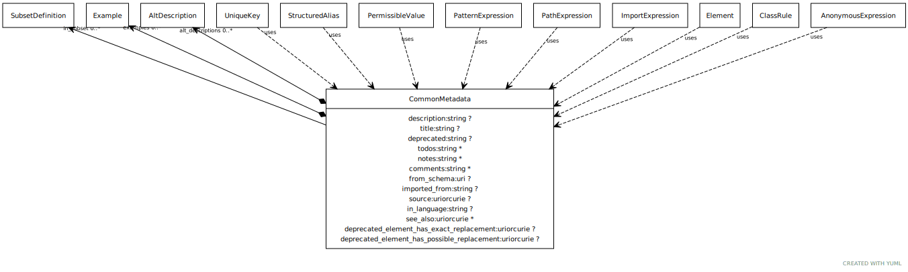

# Class: common_metadata

Generic metadata shared across definitions

URI: [linkml:CommonMetadata](https://w3id.org/linkml/CommonMetadata)

## Mixin for

 * [Element](Element.md) (mixin)  - a named element in the model
 * [PermissibleValue](PermissibleValue.md) (mixin)  - a permissible value, accompanied by intended text and an optional mapping to a concept URI

## Referenced by Class

## Attributes

### Own

 * [description](description.md)  0..1
     * Description: a description of the element's purpose and use
     * Range: [String](types/String.md)
     * in subsets: (owl)
 * [alt_descriptions](alt_descriptions.md)  0..\*
     * Range: [AltDescription](AltDescription.md)
 * [deprecated](deprecated.md)  0..1
     * Description: Description of why and when this element will no longer be used
     * Range: [String](types/String.md)
 * [todos](todos.md)  0..\*
     * Description: Outstanding issue that needs resolution
     * Range: [String](types/String.md)
 * [notes](notes.md)  0..\*
     * Description: editorial notes about an element intended for internal consumption
     * Range: [String](types/String.md)
     * in subsets: (owl)
 * [comments](comments.md)  0..\*
     * Description: notes and comments about an element intended for external consumption
     * Range: [String](types/String.md)
     * in subsets: (owl)
 * [examples](examples.md)  0..\*
     * Description: example usages of an element
     * Range: [Example](Example.md)
     * in subsets: (owl)
 * [in_subset](in_subset.md)  0..\*
     * Description: used to indicate membership of a term in a defined subset of terms used for a particular domain or application (e.g. the translator_minimal subset holding the minimal set of predicates used in a translator knowledge graph)
     * Range: [SubsetDefinition](SubsetDefinition.md)
 * [from_schema](from_schema.md)  0..1
     * Description: id of the schema that defined the element
     * Range: [Uri](types/Uri.md)
 * [imported_from](imported_from.md)  0..1
     * Description: the imports entry that this element was derived from.  Empty means primary source
     * Range: [String](types/String.md)
 * [see_also](see_also.md)  0..\*
     * Description: a reference
     * Range: [Uriorcurie](types/Uriorcurie.md)
     * in subsets: (owl)
 * [deprecated element has exact replacement](deprecated_element_has_exact_replacement.md)  0..1
     * Description: When an element is deprecated, it can be automatically replaced by this uri or curie
     * Range: [Uriorcurie](types/Uriorcurie.md)
 * [deprecated element has possible replacement](deprecated_element_has_possible_replacement.md)  0..1
     * Description: When an element is deprecated, it can be potentially replaced by this uri or curie
     * Range: [Uriorcurie](types/Uriorcurie.md)
