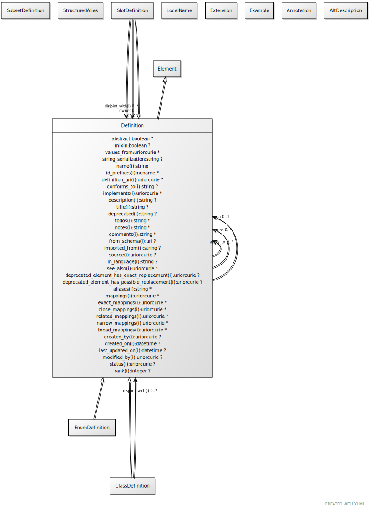

# Class: definition

base class for definitions

URI: [linkml:Definition](https://w3id.org/linkml/Definition)

## Parents

 *  is_a: [Element](Element.md) - a named element in the model

## Children

 * [ClassDefinition](ClassDefinition.md) - the definition of a class or interface
 * [SlotDefinition](SlotDefinition.md) - the definition of a property or a slot

## Referenced by class

 *  **[Definition](Definition.md)** *[apply_to](apply_to.md)*  0..\*  **[Definition](Definition.md)**
 *  **[Definition](Definition.md)** *[is_a](is_a.md)*  0..1  **[Definition](Definition.md)**
 *  **[Definition](Definition.md)** *[mixins](mixins.md)*  0..\*  **[Definition](Definition.md)**
 *  **[SlotDefinition](SlotDefinition.md)** *[owner](owner.md)*  0..1  **[Definition](Definition.md)**

## Attributes

### Own

 * [is_a](is_a.md)  0..1
     * Description: specifies single-inheritance between classes or slots. While multiple inheritance is not allowed, mixins can be provided effectively providing the same thing. The semantics are the same when translated to formalisms that allow MI (e.g. RDFS/OWL). When translating to a SI framework (e.g. java classes, python classes) then is a is used. When translating a framework without polymorphism (e.g. json-schema, solr document schema) then is a and mixins are recursively unfolded
     * Range: [Definition](Definition.md)
 * [abstract](abstract.md)  0..1
     * Description: an abstract class is a high level class or slot that is typically used to group common slots together and cannot be directly instantiated.
     * Range: [Boolean](types/Boolean.md)
 * [mixin](mixin.md)  0..1
     * Description: this slot or class can only be used as a mixin.
     * Range: [Boolean](types/Boolean.md)
 * [mixins](mixins.md)  0..\*
     * Description: List of definitions to be mixed in. Targets may be any definition of the same type
     * Range: [Definition](Definition.md)
 * [apply_to](apply_to.md)  0..\*
     * Description: Used to extend class or slot definitions. For example, if we have a core schema where a gene has two slots for identifier and symbol, and we have a specialized schema for my_organism where we wish to add a slot systematic_name, we can avoid subclassing by defining a class gene_my_organism, adding the slot to this class, and then adding an apply_to pointing to the gene class. The new slot will be 'injected into' the gene class.
     * Range: [Definition](Definition.md)
 * [values_from](values_from.md)  0..\*
     * Description: the identifier of a "value set" -- a set of identifiers that form the possible values for the range of a slot
     * Range: [Uriorcurie](types/Uriorcurie.md)
 * [created_by](created_by.md)  0..1
     * Description: agent that created the element
     * Range: [Uriorcurie](types/Uriorcurie.md)
 * [created_on](created_on.md)  0..1
     * Description: time at which the element was created
     * Range: [Datetime](types/Datetime.md)
 * [last_updated_on](last_updated_on.md)  0..1
     * Description: time at which the element was last updated
     * Range: [Datetime](types/Datetime.md)
 * [modified_by](modified_by.md)  0..1
     * Description: agent that modified the element
     * Range: [Uriorcurie](types/Uriorcurie.md)
 * [status](status.md)  0..1
     * Description: status of the element
     * Range: [Uriorcurie](types/Uriorcurie.md)
     * Example: bibo:draft None

### Inherited from element:

 * [name](name.md)  1..1
     * Description: the unique name of the element within the context of the schema.  Name is combined with the default prefix to form the globally unique subject of the target class.
     * Range: [String](types/String.md)
     * in subsets: (owl)
 * [id_prefixes](id_prefixes.md)  0..\*
     * Description: the identifier of this class or slot must begin with one of the URIs referenced by this prefix
     * Range: [Ncname](types/Ncname.md)
 * [definition_uri](definition_uri.md)  0..1
     * Description: the "native" URI of the element
     * Range: [Uriorcurie](types/Uriorcurie.md)
 * [aliases](aliases.md)  0..\*
     * Range: [String](types/String.md)
 * [local_names](local_names.md)  0..\*
     * Range: [LocalName](LocalName.md)
 * [mappings](mappings.md)  0..\*
     * Description: A list of terms from different schemas or terminology systems that have comparable meaning. These may include terms that are precisely equivalent, broader or narrower in meaning, or otherwise semantically related but not equivalent from a strict ontological perspective.
     * Range: [Uriorcurie](types/Uriorcurie.md)
 * [description](description.md)  0..1
     * Description: a description of the element's purpose and use
     * Range: [String](types/String.md)
     * in subsets: (owl)
 * [alt_descriptions](alt_descriptions.md)  0..\*
     * Range: [AltDescription](AltDescription.md)
 * [deprecated](deprecated.md)  0..1
     * Description: Description of why and when this element will no longer be used
     * Range: [String](types/String.md)
 * [todos](todos.md)  0..\*
     * Description: Outstanding issue that needs resolution
     * Range: [String](types/String.md)
 * [notes](notes.md)  0..\*
     * Description: editorial notes about an element intended for internal consumption
     * Range: [String](types/String.md)
     * in subsets: (owl)
 * [comments](comments.md)  0..\*
     * Description: notes and comments about an element intended for external consumption
     * Range: [String](types/String.md)
     * in subsets: (owl)
 * [examples](examples.md)  0..\*
     * Description: example usages of an element
     * Range: [Example](Example.md)
     * in subsets: (owl)
 * [in_subset](in_subset.md)  0..\*
     * Description: used to indicate membership of a term in a defined subset of terms used for a particular domain or application (e.g. the translator_minimal subset holding the minimal set of predicates used in a translator knowledge graph)
     * Range: [SubsetDefinition](SubsetDefinition.md)
 * [from_schema](from_schema.md)  0..1
     * Description: id of the schema that defined the element
     * Range: [Uri](types/Uri.md)
 * [imported_from](imported_from.md)  0..1
     * Description: the imports entry that this element was derived from.  Empty means primary source
     * Range: [String](types/String.md)
 * [see_also](see_also.md)  0..\*
     * Description: a reference
     * Range: [Uriorcurie](types/Uriorcurie.md)
     * in subsets: (owl)
 * [exact mappings](exact_mappings.md)  0..\*
     * Description: A list of terms from different schemas or terminology systems that have identical meaning.
     * Range: [Uriorcurie](types/Uriorcurie.md)
 * [close mappings](close_mappings.md)  0..\*
     * Description: A list of terms from different schemas or terminology systems that have close meaning.
     * Range: [Uriorcurie](types/Uriorcurie.md)
 * [related mappings](related_mappings.md)  0..\*
     * Description: A list of terms from different schemas or terminology systems that have related meaning.
     * Range: [Uriorcurie](types/Uriorcurie.md)
 * [narrow mappings](narrow_mappings.md)  0..\*
     * Description: A list of terms from different schemas or terminology systems that have narrower meaning.
     * Range: [Uriorcurie](types/Uriorcurie.md)
 * [broad mappings](broad_mappings.md)  0..\*
     * Description: A list of terms from different schemas or terminology systems that have broader meaning.
     * Range: [Uriorcurie](types/Uriorcurie.md)
 * [deprecated element has exact replacement](deprecated_element_has_exact_replacement.md)  0..1
     * Description: When an element is deprecated, it can be automatically replaced by this uri or curie
     * Range: [Uriorcurie](types/Uriorcurie.md)
 * [deprecated element has possible replacement](deprecated_element_has_possible_replacement.md)  0..1
     * Description: When an element is deprecated, it can be potentially replaced by this uri or curie
     * Range: [Uriorcurie](types/Uriorcurie.md)

## Other properties

|  |  |  |
| --- | --- | --- |
| **See also:** | | https://en.wikipedia.org/wiki/Data_element_definition |

