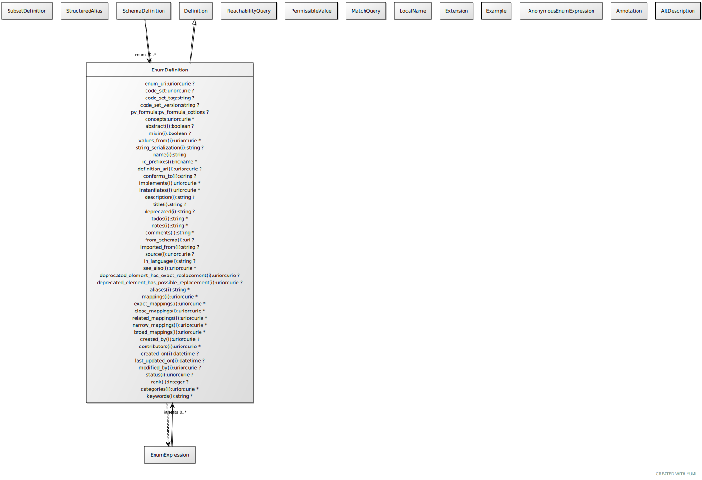

# Class: enum_definition

List of values that constrain the range of a slot

URI: [linkml:EnumDefinition](https://w3id.org/linkml/EnumDefinition)

## Parents

 *  is_a: [Element](Element.md) - a named element in the model

## Referenced by Class

 *  **[SchemaDefinition](SchemaDefinition.md)** *[enums](enums.md)*  0..\*  **[EnumDefinition](EnumDefinition.md)**

## Attributes

### Own

 * [code_set](code_set.md)  0..1
     * Description: the identifier of an enumeration code set.
     * Range: [Uriorcurie](types/Uriorcurie.md)
     * in subsets: (basic)
 * [code_set_tag](code_set_tag.md)  0..1
     * Description: the version tag of the enumeration code set
     * Range: [String](types/String.md)
     * in subsets: (basic)
 * [code_set_version](code_set_version.md)  0..1
     * Description: the version identifier of the enumeration code set
     * Range: [String](types/String.md)
     * in subsets: (basic)
 * [pv_formula](pv_formula.md)  0..1
     * Description: Defines the specific formula to be used to generate the permissible values.
     * Range: [pv_formula_options](pv_formula_options.md)
     * in subsets: (basic)
 * [permissible_values](permissible_values.md)  0..\*
     * Description: A list of possible values for a slot range
     * Range: [PermissibleValue](PermissibleValue.md)
     * in subsets: (basic)

### Inherited from element:

 * [name](name.md)  1..1
     * Description: the unique name of the element within the context of the schema.  Name is combined with the default prefix to form the globally unique subject of the target class.
     * Range: [String](types/String.md)
     * in subsets: (owl,minimal,basic,relational_model,object_oriented)
 * [id_prefixes](id_prefixes.md)  0..\*
     * Description: the identifier of this class or slot must begin with the URIs referenced by this prefix
     * Range: [Ncname](types/Ncname.md)
     * in subsets: (basic)
 * [definition_uri](definition_uri.md)  0..1
     * Description: the "native" URI of the element
     * Range: [Uriorcurie](types/Uriorcurie.md)
 * [local_names](local_names.md)  0..\*
     * Range: [LocalName](LocalName.md)
 * [conforms_to](conforms_to.md)  0..1
     * Description: An established standard to which the element conforms.
     * Range: [String](types/String.md)
     * in subsets: (owl,basic)

## Other properties

|  |  |  |
| --- | --- | --- |
| **In Subsets:** | | basic |
|  | | relational_model |
|  | | object_oriented |
| **Close Mappings:** | | qb:HierarchicalCodeList |

