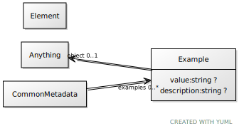

# Class: Example

usage example and description

URI: [linkml:Example](https://w3id.org/linkml/Example)

## Referenced by class

 *  **[Element](Element.md)** *[examples](examples.md)*  0..\*  **[Example](Example.md)**

## Attributes

### Own

 * [value](value.md)  OPT
     * Description: example value
     * Range: [String](types/String.md)
 * [example➞description](value_description.md)  OPT
     * Description: description of what the value is doing
     * Range: [String](types/String.md)
