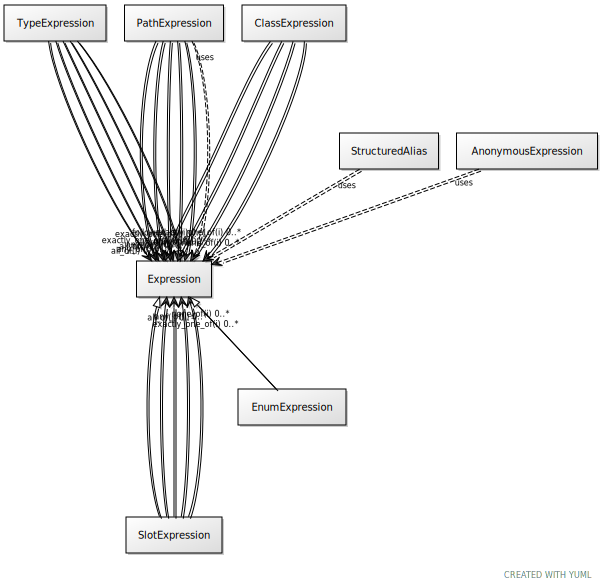

# Class: expression

todo

URI: [linkml:Expression](https://w3id.org/linkml/Expression)

## Children

 * [SlotExpression](SlotExpression.md) - an expression that constrains the range of values a slot can take
 * [TypeExpression](TypeExpression.md)

## Mixin for

 * [AnonymousExpression](AnonymousExpression.md) (mixin) 

## Referenced by Class

 *  **None** *[all_of](all_of.md)*  0..\*  **[Expression](Expression.md)**
 *  **None** *[any_of](any_of.md)*  0..\*  **[Expression](Expression.md)**
 *  **None** *[boolean_slot](boolean_slot.md)*  0..\*  **[Expression](Expression.md)**
 *  **None** *[exactly_one_of](exactly_one_of.md)*  0..\*  **[Expression](Expression.md)**
 *  **None** *[none_of](none_of.md)*  0..\*  **[Expression](Expression.md)**

## Attributes

