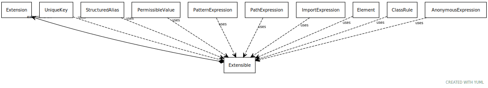

# Class: Extensible

mixin for classes that support extension

URI: [linkml:Extensible](https://w3id.org/linkml/Extensible)

## Mixin for

 * [Element](Element.md) (mixin)  - a named element in the model
 * [PermissibleValue](PermissibleValue.md) (mixin)  - a permissible value, accompanied by intended text and an optional mapping to a concept URI

## Referenced by class

## Attributes

### Own

 * [extensions](extensions.md)  0..*

     * Description: a tag/text tuple attached to an arbitrary element
     * range: [Extension](Extension.md)
