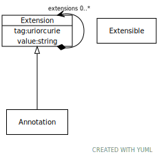

# Class: extension

a tag/value pair used to add non-model information to an entry

URI: [linkml:Extension](https://w3id.org/linkml/Extension)

## Children

 * [Annotation](Annotation.md) - a tag/value pair with the semantics of OWL Annotation

## Referenced by Class

 *  **[Extensible](Extensible.md)** *[extensions](extensions.md)*  0..\*  **[Extension](Extension.md)**

## Attributes

### Own

 * [extension➞tag](extension_tag.md)  1..1
     * Description: a tag associated with an extension
     * Range: [Uriorcurie](types/Uriorcurie.md)
 * [extension➞value](extension_value.md)  1..1
     * Description: the actual annotation
     * Range: [String](types/String.md)
 * [extensions](extensions.md)  0..\*
     * Description: a tag/text tuple attached to an arbitrary element
     * Range: [Extension](Extension.md)
