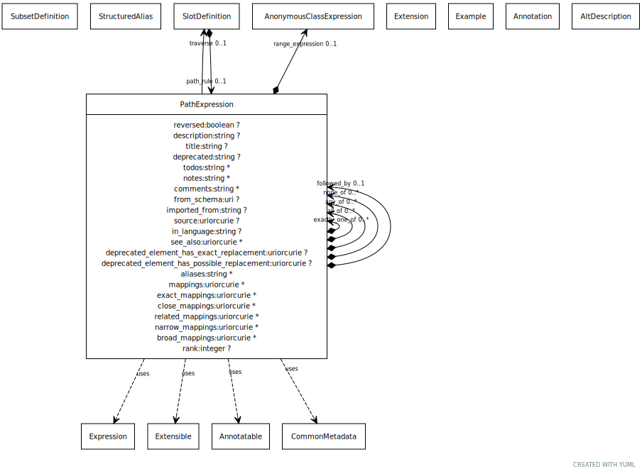

# Class: path_expression

An expression that describes an abstract path from an object to another through a sequence of slot lookups

URI: [linkml:PathExpression](https://w3id.org/linkml/PathExpression)

## Uses Mixin

 *  mixin: [Expression](Expression.md) - general mixin for any class that can represent some form of expression
 *  mixin: [Extensible](Extensible.md) - mixin for classes that support extension
 *  mixin: [Annotatable](Annotatable.md) - mixin for classes that support annotations
 *  mixin: [CommonMetadata](CommonMetadata.md) - Generic metadata shared across definitions

## Referenced by Class

 *  **[PathExpression](PathExpression.md)** *[path_expression➞all_of](path_expression_all_of.md)*  0..\*  **[PathExpression](PathExpression.md)**
 *  **[PathExpression](PathExpression.md)** *[path_expression➞any_of](path_expression_any_of.md)*  0..\*  **[PathExpression](PathExpression.md)**
 *  **[PathExpression](PathExpression.md)** *[path_expression➞exactly_one_of](path_expression_exactly_one_of.md)*  0..\*  **[PathExpression](PathExpression.md)**
 *  **[PathExpression](PathExpression.md)** *[path_expression➞followed_by](path_expression_followed_by.md)*  0..1  **[PathExpression](PathExpression.md)**
 *  **[PathExpression](PathExpression.md)** *[path_expression➞none_of](path_expression_none_of.md)*  0..\*  **[PathExpression](PathExpression.md)**
 *  **[SlotDefinition](SlotDefinition.md)** *[path_rule](path_rule.md)*  0..1  **[PathExpression](PathExpression.md)**

## Attributes

### Own

 * [path_expression➞followed_by](path_expression_followed_by.md)  0..1
     * Description: in a sequential list, this indicates the next member
     * Range: [PathExpression](PathExpression.md)
 * [path_expression➞none_of](path_expression_none_of.md)  0..\*
     * Description: holds if none of the expressions hold
     * Range: [PathExpression](PathExpression.md)
 * [path_expression➞any_of](path_expression_any_of.md)  0..\*
     * Description: holds if at least one of the expressions hold
     * Range: [PathExpression](PathExpression.md)
 * [path_expression➞all_of](path_expression_all_of.md)  0..\*
     * Description: holds if all of the expressions hold
     * Range: [PathExpression](PathExpression.md)
 * [path_expression➞exactly_one_of](path_expression_exactly_one_of.md)  0..\*
     * Description: holds if only one of the expressions hold
     * Range: [PathExpression](PathExpression.md)
 * [reversed](reversed.md)  0..1
     * Description: true if the slot is to be inversed
     * Range: [Boolean](types/Boolean.md)
 * [traverse](traverse.md)  0..1
     * Description: the slot to traverse
     * Range: [SlotDefinition](SlotDefinition.md)
 * [range_expression](range_expression.md)  0..1
     * Description: A range that is described as a boolean expression combining existing ranges
     * Range: [AnonymousClassExpression](AnonymousClassExpression.md)

### Mixed in from extensible:

 * [extensions](extensions.md)  0..\*
     * Description: a tag/text tuple attached to an arbitrary element
     * Range: [Extension](Extension.md)

### Mixed in from annotatable:

 * [annotations](annotations.md)  0..\*
     * Description: a collection of tag/text tuples with the semantics of OWL Annotation
     * Range: [Annotation](Annotation.md)

### Mixed in from common_metadata:

 * [description](description.md)  0..1
     * Description: a description of the element's purpose and use
     * Range: [String](types/String.md)
     * in subsets: (basic)

### Mixed in from common_metadata:

 * [alt_descriptions](alt_descriptions.md)  0..\*
     * Range: [AltDescription](AltDescription.md)
     * in subsets: (basic)

### Mixed in from common_metadata:

 * [title](title.md)  0..1
     * Description: the official title of the element
     * Range: [String](types/String.md)
     * in subsets: (owl,basic)

### Mixed in from common_metadata:

 * [deprecated](deprecated.md)  0..1
     * Description: Description of why and when this element will no longer be used
     * Range: [String](types/String.md)
     * in subsets: (basic)

### Mixed in from common_metadata:

 * [todos](todos.md)  0..\*
     * Description: Outstanding issue that needs resolution
     * Range: [String](types/String.md)
     * in subsets: (basic)

### Mixed in from common_metadata:

 * [notes](notes.md)  0..\*
     * Description: editorial notes about an element intended for internal consumption
     * Range: [String](types/String.md)
     * in subsets: (owl,basic)

### Mixed in from common_metadata:

 * [comments](comments.md)  0..\*
     * Description: notes and comments about an element intended for external consumption
     * Range: [String](types/String.md)
     * in subsets: (owl,basic)

### Mixed in from common_metadata:

 * [examples](examples.md)  0..\*
     * Description: example usages of an element
     * Range: [Example](Example.md)
     * in subsets: (owl,basic)

### Mixed in from common_metadata:

 * [in_subset](in_subset.md)  0..\*
     * Description: used to indicate membership of a term in a defined subset of terms used for a particular domain or application (e.g. the translator_minimal subset holding the minimal set of predicates used in a translator knowledge graph)
     * Range: [SubsetDefinition](SubsetDefinition.md)
     * in subsets: (basic)

### Mixed in from common_metadata:

 * [from_schema](from_schema.md)  0..1
     * Description: id of the schema that defined the element
     * Range: [Uri](types/Uri.md)

### Mixed in from common_metadata:

 * [imported_from](imported_from.md)  0..1
     * Description: the imports entry that this element was derived from.  Empty means primary source
     * Range: [String](types/String.md)

### Mixed in from common_metadata:

 * [source](source.md)  0..1
     * Description: A related resource from which the element is derived.
     * Range: [Uriorcurie](types/Uriorcurie.md)
     * in subsets: (basic)

### Mixed in from common_metadata:

 * [in_language](in_language.md)  0..1
     * Range: [String](types/String.md)

### Mixed in from common_metadata:

 * [see_also](see_also.md)  0..\*
     * Description: a reference
     * Range: [Uriorcurie](types/Uriorcurie.md)
     * in subsets: (owl,basic)

### Mixed in from common_metadata:

 * [deprecated element has exact replacement](deprecated_element_has_exact_replacement.md)  0..1
     * Description: When an element is deprecated, it can be automatically replaced by this uri or curie
     * Range: [Uriorcurie](types/Uriorcurie.md)

### Mixed in from common_metadata:

 * [deprecated element has possible replacement](deprecated_element_has_possible_replacement.md)  0..1
     * Description: When an element is deprecated, it can be potentially replaced by this uri or curie
     * Range: [Uriorcurie](types/Uriorcurie.md)

### Mixed in from common_metadata:

 * [aliases](aliases.md)  0..\*
     * Range: [String](types/String.md)
     * in subsets: (basic)

### Mixed in from common_metadata:

 * [structured_aliases](structured_aliases.md)  0..\*
     * Description: A list of structured_alias objects.
     * Range: [StructuredAlias](StructuredAlias.md)

### Mixed in from common_metadata:

 * [mappings](mappings.md)  0..\*
     * Description: A list of terms from different schemas or terminology systems that have comparable meaning. These may include terms that are precisely equivalent, broader or narrower in meaning, or otherwise semantically related but not equivalent from a strict ontological perspective.
     * Range: [Uriorcurie](types/Uriorcurie.md)

### Mixed in from common_metadata:

 * [exact mappings](exact_mappings.md)  0..\*
     * Description: A list of terms from different schemas or terminology systems that have identical meaning.
     * Range: [Uriorcurie](types/Uriorcurie.md)

### Mixed in from common_metadata:

 * [close mappings](close_mappings.md)  0..\*
     * Description: A list of terms from different schemas or terminology systems that have close meaning.
     * Range: [Uriorcurie](types/Uriorcurie.md)

### Mixed in from common_metadata:

 * [related mappings](related_mappings.md)  0..\*
     * Description: A list of terms from different schemas or terminology systems that have related meaning.
     * Range: [Uriorcurie](types/Uriorcurie.md)

### Mixed in from common_metadata:

 * [narrow mappings](narrow_mappings.md)  0..\*
     * Description: A list of terms from different schemas or terminology systems that have narrower meaning.
     * Range: [Uriorcurie](types/Uriorcurie.md)

### Mixed in from common_metadata:

 * [broad mappings](broad_mappings.md)  0..\*
     * Description: A list of terms from different schemas or terminology systems that have broader meaning.
     * Range: [Uriorcurie](types/Uriorcurie.md)

### Mixed in from common_metadata:

 * [rank](rank.md)  0..1
     * Description: the relative order in which the element occurs, lower values are given precedence
     * Range: [Integer](types/Integer.md)
     * in subsets: (basic)
