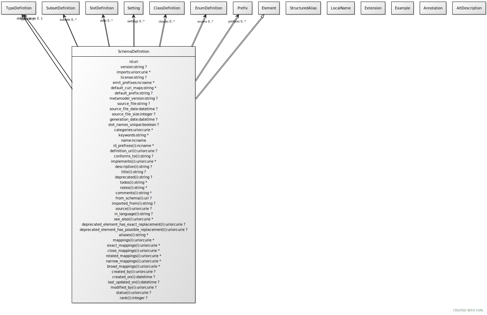

# Class: schema_definition

a collection of subset, type, slot and class definitions

URI: [linkml:SchemaDefinition](https://w3id.org/linkml/SchemaDefinition)

## Parents

 *  is_a: [Element](Element.md) - a named element in the model

## Referenced by Class

## Attributes

### Own

 * [id](id.md)  1..1
     * Description: The official schema URI
     * Range: [Uri](types/Uri.md)
 * [version](version.md)  0..1
     * Description: particular version of schema
     * Range: [String](types/String.md)
     * in subsets: (owl)
 * [imports](imports.md)  0..\*
     * Description: other schemas that are included in this schema
     * Range: [Uriorcurie](types/Uriorcurie.md)
 * [license](license.md)  0..1
     * Description: license for the schema
     * Range: [String](types/String.md)
     * in subsets: (owl)
 * [prefixes](prefixes.md)  0..\*
     * Description: prefix / URI definitions to be added to the context beyond those fetched from prefixcommons in id prefixes
     * Range: [Prefix](Prefix.md)
 * [emit_prefixes](emit_prefixes.md)  0..\*
     * Description: a list of Curie prefixes that are used in the representation of instances of the model.  All prefixes in this list are added to the prefix sections of the target models.
     * Range: [Ncname](types/Ncname.md)
 * [default_curi_maps](default_curi_maps.md)  0..\*
     * Description: ordered list of prefixcommon biocontexts to be fetched to resolve id prefixes and inline prefix variables
     * Range: [String](types/String.md)
 * [default_prefix](default_prefix.md)  0..1
     * Description: default and base prefix -- used for ':' identifiers, @base and @vocab
     * Range: [String](types/String.md)
 * [default_range](default_range.md)  0..1
     * Description: default slot range to be used if range element is omitted from a slot definition
     * Range: [TypeDefinition](TypeDefinition.md)
 * [subsets](subsets.md)  0..\*
     * Description: list of subsets referenced in this model
     * Range: [SubsetDefinition](SubsetDefinition.md)
 * [types](types.md)  0..\*
     * Description: data types used in the model
     * Range: [TypeDefinition](TypeDefinition.md)
 * [enums](enums.md)  0..\*
     * Description: enumerated ranges
     * Range: [EnumDefinition](EnumDefinition.md)
 * [schema_definition➞slots](slot_definitions.md)  0..\*
     * Description: slot definitions
     * Range: [SlotDefinition](SlotDefinition.md)
 * [classes](classes.md)  0..\*
     * Description: class definitions
     * Range: [ClassDefinition](ClassDefinition.md)
 * [metamodel_version](metamodel_version.md)  0..1
     * Description: Version of the metamodel used to load the schema
     * Range: [String](types/String.md)
     * in subsets: (owl)
 * [source_file](source_file.md)  0..1
     * Description: name, uri or description of the source of the schema
     * Range: [String](types/String.md)
     * in subsets: (owl)
 * [source_file_date](source_file_date.md)  0..1
     * Description: modification date of the source of the schema
     * Range: [Datetime](types/Datetime.md)
     * in subsets: (owl)
 * [source_file_size](source_file_size.md)  0..1
     * Description: size in bytes of the source of the schema
     * Range: [Integer](types/Integer.md)
     * in subsets: (owl)
 * [generation_date](generation_date.md)  0..1
     * Description: date and time that the schema was loaded/generated
     * Range: [Datetime](types/Datetime.md)
     * in subsets: (owl)
 * [schema_definition➞name](schema_definition_name.md)  1..1
     * Description: the unique name of the element within the context of the schema.  Name is combined with the default prefix to form the globally unique subject of the target class.
     * Range: [Ncname](types/Ncname.md)
     * in subsets: (owl)

### Inherited from element:

 * [title](title.md)  0..1
     * Description: the official title of the element
     * Range: [String](types/String.md)
     * in subsets: (owl)
 * [id_prefixes](id_prefixes.md)  0..\*
     * Description: the identifier of this class or slot must begin with the URIs referenced by this prefix
     * Range: [Ncname](types/Ncname.md)
 * [definition_uri](definition_uri.md)  0..1
     * Description: the "native" URI of the element
     * Range: [Uriorcurie](types/Uriorcurie.md)
 * [aliases](aliases.md)  0..\*
     * Range: [String](types/String.md)
 * [local_names](local_names.md)  0..\*
     * Range: [LocalName](LocalName.md)
 * [mappings](mappings.md)  0..\*
     * Description: A list of terms from different schemas or terminology systems that have comparable meaning. These may include terms that are precisely equivalent, broader or narrower in meaning, or otherwise semantically related but not equivalent from a strict ontological perspective.
     * Range: [Uriorcurie](types/Uriorcurie.md)
 * [exact mappings](exact_mappings.md)  0..\*
     * Description: A list of terms from different schemas or terminology systems that have identical meaning.
     * Range: [Uriorcurie](types/Uriorcurie.md)
 * [close mappings](close_mappings.md)  0..\*
     * Description: A list of terms from different schemas or terminology systems that have close meaning.
     * Range: [Uriorcurie](types/Uriorcurie.md)
 * [related mappings](related_mappings.md)  0..\*
     * Description: A list of terms from different schemas or terminology systems that have related meaning.
     * Range: [Uriorcurie](types/Uriorcurie.md)
 * [narrow mappings](narrow_mappings.md)  0..\*
     * Description: A list of terms from different schemas or terminology systems that have narrower meaning.
     * Range: [Uriorcurie](types/Uriorcurie.md)
 * [broad mappings](broad_mappings.md)  0..\*
     * Description: A list of terms from different schemas or terminology systems that have broader meaning.
     * Range: [Uriorcurie](types/Uriorcurie.md)

## Other properties

|  |  |  |
| --- | --- | --- |
| **Aliases:** | | data dictionary |
| **See also:** | | https://en.wikipedia.org/wiki/Data_dictionary |

