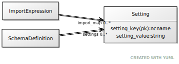

# Class: setting

assignment of a key to a value

URI: [linkml:Setting](https://w3id.org/linkml/Setting)

## Referenced by Class

 *  **[ImportExpression](ImportExpression.md)** *[import_map](import_map.md)*  0..\*  **[Setting](Setting.md)**
 *  **[SchemaDefinition](SchemaDefinition.md)** *[settings](settings.md)*  0..\*  **[Setting](Setting.md)**

## Attributes

### Own

 * [setting_key](setting_key.md)  1..1
     * Description: the variable name for a setting
     * Range: [Ncname](types/Ncname.md)
 * [setting_value](setting_value.md)  1..1
     * Description: The value assigned for a setting
     * Range: [String](types/String.md)
