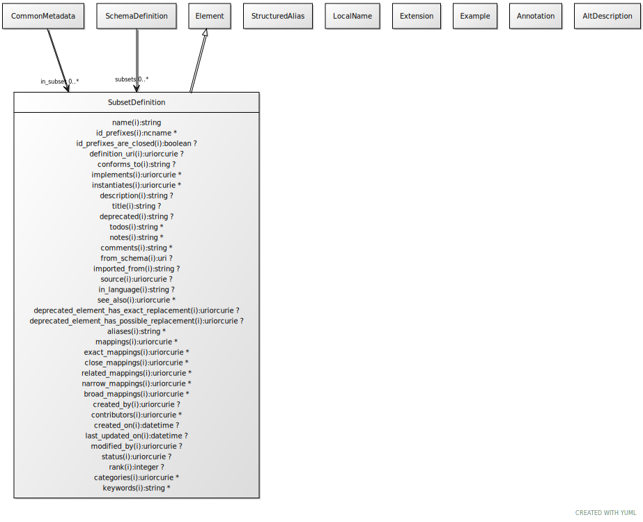

# Class: subset_definition

the name and description of a subset

URI: [linkml:SubsetDefinition](https://w3id.org/linkml/SubsetDefinition)

## Parents

 *  is_a: [Element](Element.md) - a named element in the model

## Referenced by Class

 *  **[Element](Element.md)** *[in_subset](in_subset.md)*  0..\*  **[SubsetDefinition](SubsetDefinition.md)**
 *  **[SchemaDefinition](SchemaDefinition.md)** *[subsets](subsets.md)*  0..\*  **[SubsetDefinition](SubsetDefinition.md)**

## Attributes

### Inherited from element:

 * [name](name.md)  1..1
     * Description: the unique name of the element within the context of the schema.  Name is combined with the default prefix to form the globally unique subject of the target class.
     * Range: [String](types/String.md)
     * in subsets: (owl)
 * [title](title.md)  0..1
     * Description: the official title of the element
     * Range: [String](types/String.md)
     * in subsets: (owl)
 * [id_prefixes](id_prefixes.md)  0..\*
     * Description: the identifier of this class or slot must begin with the URIs referenced by this prefix
     * Range: [Ncname](types/Ncname.md)
 * [definition_uri](definition_uri.md)  0..1
     * Description: the "native" URI of the element
     * Range: [Uriorcurie](types/Uriorcurie.md)
 * [aliases](aliases.md)  0..\*
     * Range: [String](types/String.md)
 * [local_names](local_names.md)  0..\*
     * Range: [LocalName](LocalName.md)
 * [mappings](mappings.md)  0..\*
     * Description: A list of terms from different schemas or terminology systems that have comparable meaning. These may include terms that are precisely equivalent, broader or narrower in meaning, or otherwise semantically related but not equivalent from a strict ontological perspective.
     * Range: [Uriorcurie](types/Uriorcurie.md)
 * [exact mappings](exact_mappings.md)  0..\*
     * Description: A list of terms from different schemas or terminology systems that have identical meaning.
     * Range: [Uriorcurie](types/Uriorcurie.md)
 * [close mappings](close_mappings.md)  0..\*
     * Description: A list of terms from different schemas or terminology systems that have close meaning.
     * Range: [Uriorcurie](types/Uriorcurie.md)
 * [related mappings](related_mappings.md)  0..\*
     * Description: A list of terms from different schemas or terminology systems that have related meaning.
     * Range: [Uriorcurie](types/Uriorcurie.md)
 * [narrow mappings](narrow_mappings.md)  0..\*
     * Description: A list of terms from different schemas or terminology systems that have narrower meaning.
     * Range: [Uriorcurie](types/Uriorcurie.md)
 * [broad mappings](broad_mappings.md)  0..\*
     * Description: A list of terms from different schemas or terminology systems that have broader meaning.
     * Range: [Uriorcurie](types/Uriorcurie.md)
