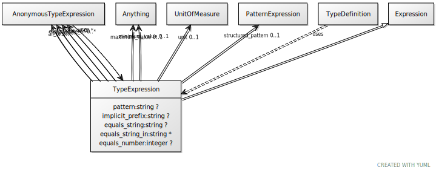

# Class: type_expression

URI: [linkml:TypeExpression](https://w3id.org/linkml/TypeExpression)

## Parents

 *  is_a: [Expression](Expression.md) - todo

## Mixin for

 * [AnonymousTypeExpression](AnonymousTypeExpression.md) (mixin) 
 * [TypeDefinition](TypeDefinition.md) (mixin)  - A data type definition.

## Referenced by Class

## Attributes

### Own

 * [pattern](pattern.md)  0..1
     * Description: the string value of the slot must conform to this regular expression
     * Range: [String](types/String.md)
 * [equals_string](equals_string.md)  0..1
     * Description: the slot must have range string and the value of the slot must equal the specified value
     * Range: [String](types/String.md)
 * [equals_string_in](equals_string_in.md)  0..\*
     * Description: the slot must have range string and the value of the slot must equal one of the specified values
     * Range: [String](types/String.md)
 * [equals_number](equals_number.md)  0..1
     * Description: the slot must have range of a number and the value of the slot must equal the specified value
     * Range: [Integer](types/Integer.md)
 * [type_expression➞none_of](type_expression_none_of.md)  0..\*
     * Description: holds if none of the expressions hold
     * Range: [AnonymousTypeExpression](AnonymousTypeExpression.md)
 * [type_expression➞exactly_one_of](type_expression_exactly_one_of.md)  0..\*
     * Description: holds if only one of the expressions hold
     * Range: [AnonymousTypeExpression](AnonymousTypeExpression.md)
 * [type_expression➞any_of](type_expression_any_of.md)  0..\*
     * Description: holds if at least one of the expressions hold
     * Range: [AnonymousTypeExpression](AnonymousTypeExpression.md)
 * [type_expression➞all_of](type_expression_all_of.md)  0..\*
     * Description: holds if all of the expressions hold
     * Range: [AnonymousTypeExpression](AnonymousTypeExpression.md)
