# KITCHEN_SINK


**metamodel version:** 1.7.0

**version:** None


Kitchen Sink Schema

This schema does not do anything useful. It exists to test all features of linkml.

This particular text field exists to demonstrate markdown within a text field:

Lists:

   * a
   * b
   * c

And links, e.g to [Person](Person.md)


## Class Diagram

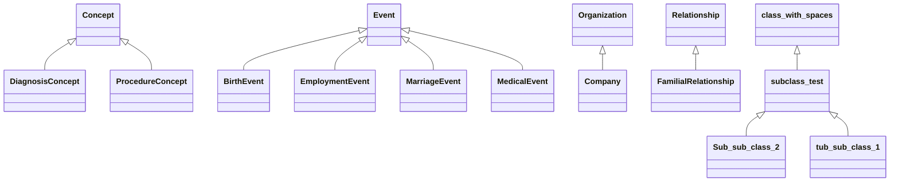

## ERD Diagram

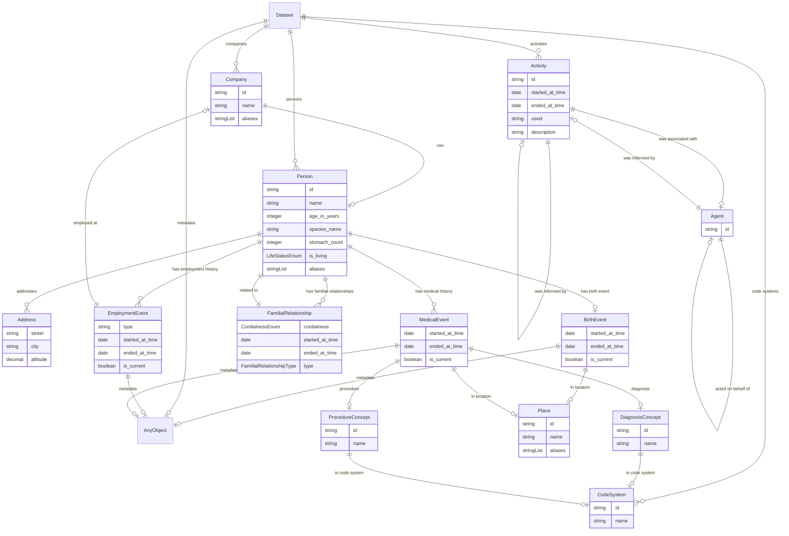


## Abstract Classes


### Friend


#### Attributes

| Name | Cardinality: | Type | Description |
| --- | --- | --- | --- |
| **name** | <sub>0..1</sub> | string |  |


## Classes


### Dataset


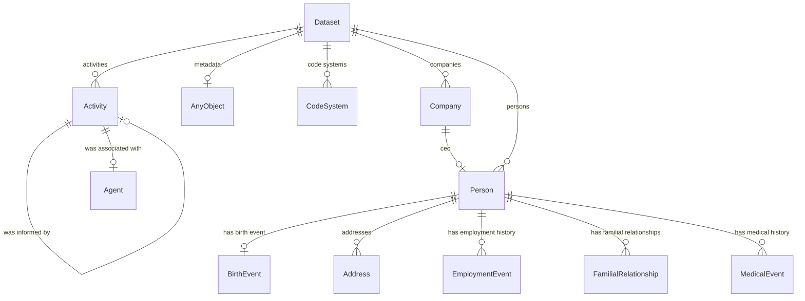


#### Attributes

| Name | Cardinality: | Type | Description |
| --- | --- | --- | --- |
| **activities** | <sub>0..\*</sub> | [Activity](#activity) |  |
| **code systems** | <sub>0..\*</sub> | [CodeSystem](#codesystem) |  |
| **companies** | <sub>0..\*</sub> | [Company](#company) |  |
| **dataset__activities** | <sub>0..\*</sub> | [Activity](#activity) |  |
| **dataset__code_systems** | <sub>0..\*</sub> | [CodeSystem](#codesystem) |  |
| **dataset__companies** | <sub>0..\*</sub> | [Company](#company) |  |
| **dataset__persons** | <sub>0..\*</sub> | [Person](#person) |  |
| **metadata** | <sub>0..1</sub> | [AnyObject](#anyobject) | Example of a slot that has an unconstrained range |
| **persons** | <sub>0..\*</sub> | [Person](#person) |  |


### Person

A person, living or dead

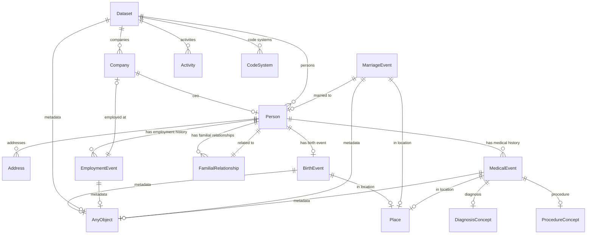


### Identifier prefixes

 * P

#### Attributes

| Name | Cardinality: | Type | Description |
| --- | --- | --- | --- |
| *aliases* | <sub>0..\*</sub> | None |  |
| *hasAliases__aliases* | <sub>0..\*</sub> | string |  |
| **id** | <sub>1..1</sub> | string |  |
| **Person_name** | <sub>0..1</sub> | string |  |
| **has medical history** | <sub>0..\*</sub> | [MedicalEvent](#medicalevent) |  |
| **has employment history** | <sub>0..\*</sub> | [EmploymentEvent](#employmentevent) |  |
| **Person_species name** | <sub>0..1</sub> | string |  |
| **Person_stomach count** | <sub>0..1</sub> | integer |  |
| **addresses** | <sub>0..\*</sub> | [Address](#address) |  |
| **age in years** | <sub>0..1</sub> | integer | number of years since birth |
| **has birth event** | <sub>0..1</sub> | [BirthEvent](#birthevent) |  |
| **has familial relationships** | <sub>0..\*</sub> | [FamilialRelationship](#familialrelationship) |  |
| **is_living** | <sub>0..1</sub> | [LifeStatusEnum](#lifestatusenum) |  |
| **person__is_living** | <sub>0..1</sub> | [LifeStatusEnum](#lifestatusenum) |  |

#### Uses

 *  mixin: [HasAliases](#hasaliases)

#### Referenced by:

 *  **[FamilialRelationship](#familialrelationship)** : *[FamilialRelationship_related to](#FamilialRelationship_related to)*  <sub>1..1</sub> 
 *  **[Company](#company)** : *[company__ceo](#company__ceo)*  <sub>0..1</sub> 
 *  **[Dataset](#dataset)** : *[dataset__persons](#dataset__persons)*  <sub>0..\*</sub> 
 *  **[MarriageEvent](#marriageevent)** : *[married to](#married to)*  <sub>0..1</sub> 


### Organization

An organization.

This description
includes newlines

## Markdown headers

 * and
 * a
 * list


#### Local class diagram

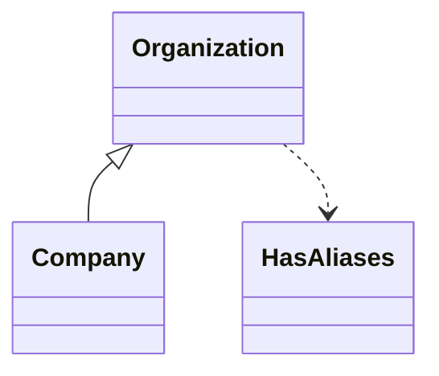

### Identifier prefixes

 * ROR

#### Attributes

| Name | Cardinality: | Type | Description |
| --- | --- | --- | --- |
| *aliases* | <sub>0..\*</sub> | None |  |
| *hasAliases__aliases* | <sub>0..\*</sub> | string |  |
| **id** | <sub>1..1</sub> | string |  |
| **name** | <sub>0..1</sub> | string |  |

#### Children

 * [Company](#company)

#### Uses

 *  mixin: [HasAliases](#hasaliases)


### FamilialRelationship


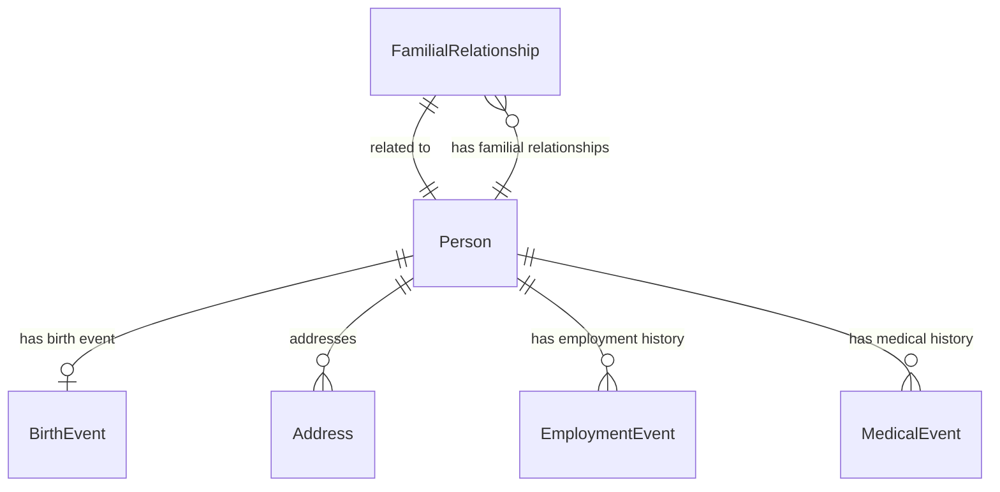


#### Attributes

| Name | Cardinality: | Type | Description |
| --- | --- | --- | --- |
| Relationship_cordialness | <sub>0..1</sub> | [CordialnessEnum](#cordialnessenum) |  |
| ended at time | <sub>0..1</sub> | date |  |
| related to | <sub>0..1</sub> | string |  |
| started at time | <sub>0..1</sub> | date |  |
| type | <sub>0..1</sub> | string |  |
| **FamilialRelationship_cordialness** | <sub>0..1</sub> | [CordialnessEnum](#cordialnessenum) |  |
| **FamilialRelationship_related to** | <sub>1..1</sub> | [Person](#person) |  |
| **FamilialRelationship_type** | <sub>1..1</sub> | [FamilialRelationshipType](#familialrelationshiptype) |  |
| **cordialness** | <sub>0..1</sub> | string |  |

#### Parents

 * [Relationship](#relationship)

#### Referenced by:

 *  **[Person](#person)** : *[has familial relationships](#has familial relationships)*  <sub>0..\*</sub> 


### EmploymentEvent


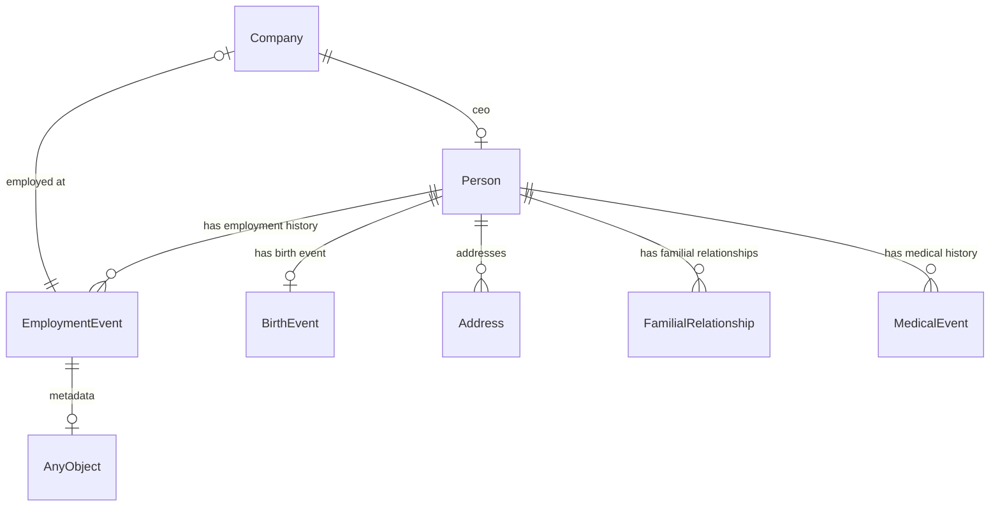


#### Attributes

| Name | Cardinality: | Type | Description |
| --- | --- | --- | --- |
| ended at time | <sub>0..1</sub> | date |  |
| is current | <sub>0..1</sub> | boolean |  |
| metadata | <sub>0..1</sub> | [AnyObject](#anyobject) | Example of a slot that has an unconstrained range |
| started at time | <sub>0..1</sub> | date |  |
| **EmploymentEvent_type** | <sub>0..1</sub> | string |  |
| **employed at** | <sub>0..1</sub> | [Company](#company) |  |

#### Parents

 * [Event](#event)

#### Referenced by:

 *  **[Person](#person)** : *[has employment history](#has employment history)*  <sub>0..\*</sub> 


### Address


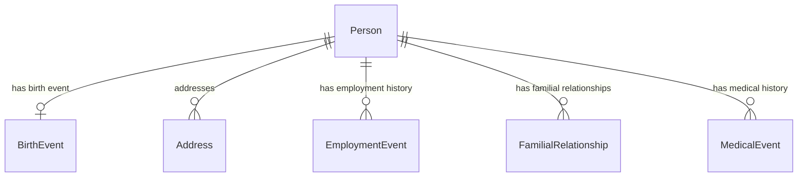


#### Attributes

| Name | Cardinality: | Type | Description |
| --- | --- | --- | --- |
| **altitude** | <sub>0..1</sub> | decimal |  |
| **city** | <sub>0..1</sub> | string |  |
| **street** | <sub>0..1</sub> | string |  |

#### Referenced by:

 *  **[Person](#person)** : *[addresses](#addresses)*  <sub>0..\*</sub> 


### AnyObject

Example of unconstrained class

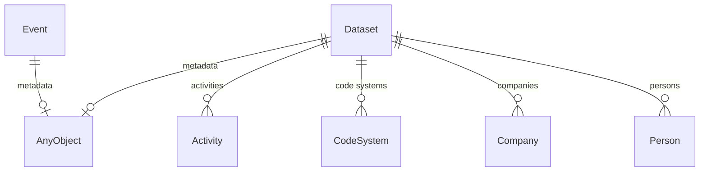


This class has no attributes


#### Referenced by:

 *  **[Dataset](#dataset)** : *[metadata](#metadata)*  <sub>0..1</sub> 
 *  **[Event](#event)** : *[metadata](#metadata)*  <sub>0..1</sub> 


### AnyOfClasses


#### Attributes

| Name | Cardinality: | Type | Description |
| --- | --- | --- | --- |
| **anyOfClasses__attribute2** | <sub>0..1</sub> | string |  |
| **attribute2** | <sub>0..1</sub> | None |  |


### AnyOfEnums


#### Attributes

| Name | Cardinality: | Type | Description |
| --- | --- | --- | --- |
| **anyOfEnums__attribute3** | <sub>0..1</sub> | string |  |
| **attribute3** | <sub>0..1</sub> | None |  |


### AnyOfMix


#### Attributes

| Name | Cardinality: | Type | Description |
| --- | --- | --- | --- |
| **anyOfMix__attribute4** | <sub>0..1</sub> | string |  |
| **attribute4** | <sub>0..1</sub> | None |  |


### AnyOfSimpleType


#### Attributes

| Name | Cardinality: | Type | Description |
| --- | --- | --- | --- |
| **anyOfSimpleType__attribute1** | <sub>0..1</sub> | string |  |
| **attribute1** | <sub>0..1</sub> | None |  |


### BirthEvent


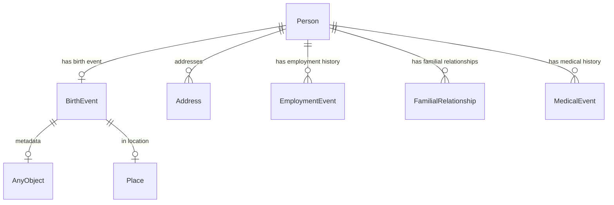


#### Attributes

| Name | Cardinality: | Type | Description |
| --- | --- | --- | --- |
| ended at time | <sub>0..1</sub> | date |  |
| is current | <sub>0..1</sub> | boolean |  |
| metadata | <sub>0..1</sub> | [AnyObject](#anyobject) | Example of a slot that has an unconstrained range |
| started at time | <sub>0..1</sub> | date |  |
| **in location** | <sub>0..1</sub> | [Place](#place) |  |

#### Parents

 * [Event](#event)

#### Referenced by:

 *  **[Person](#person)** : *[has birth event](#has birth event)*  <sub>0..1</sub> 


### CodeSystem


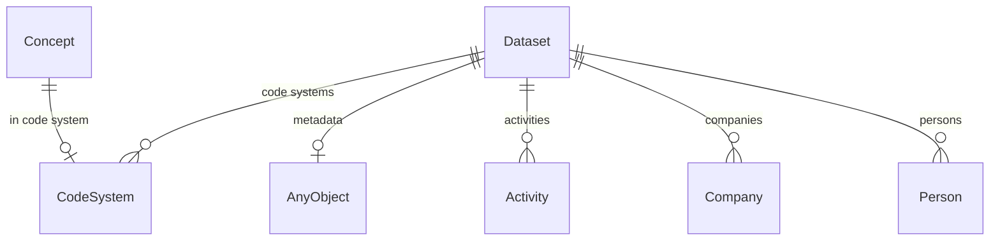


#### Attributes

| Name | Cardinality: | Type | Description |
| --- | --- | --- | --- |
| **id** | <sub>1..1</sub> | string |  |
| **name** | <sub>0..1</sub> | string |  |

#### Referenced by:

 *  **[Dataset](#dataset)** : *[dataset__code_systems](#dataset__code_systems)*  <sub>0..\*</sub> 
 *  **[Concept](#concept)** : *[in code system](#in code system)*  <sub>0..1</sub> 


### Company


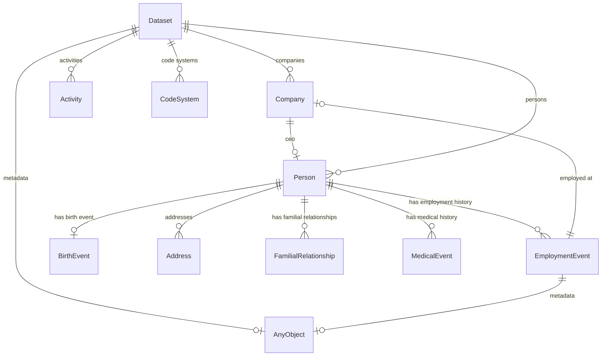


#### Attributes

| Name | Cardinality: | Type | Description |
| --- | --- | --- | --- |
| id | <sub>1..1</sub> | string |  |
| name | <sub>0..1</sub> | string |  |
| *aliases* | <sub>0..\*</sub> | None |  |
| *hasAliases__aliases* | <sub>0..\*</sub> | string |  |
| **ceo** | <sub>0..1</sub> | [Person](#person) |  |
| **company__ceo** | <sub>0..1</sub> | [Person](#person) |  |

#### Parents

 * [Organization](#organization) - An organization.

#### Referenced by:

 *  **[Dataset](#dataset)** : *[dataset__companies](#dataset__companies)*  <sub>0..\*</sub> 
 *  **[EmploymentEvent](#employmentevent)** : *[employed at](#employed at)*  <sub>0..1</sub> 


### Concept


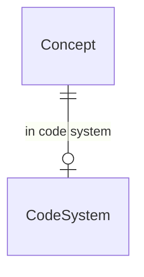


### Identifier prefixes

 * CODE

#### Attributes

| Name | Cardinality: | Type | Description |
| --- | --- | --- | --- |
| **id** | <sub>1..1</sub> | string |  |
| **name** | <sub>0..1</sub> | string |  |
| **in code system** | <sub>0..1</sub> | [CodeSystem](#codesystem) |  |

#### Children

 * [DiagnosisConcept](#diagnosisconcept)
 * [ProcedureConcept](#procedureconcept)


### DiagnosisConcept


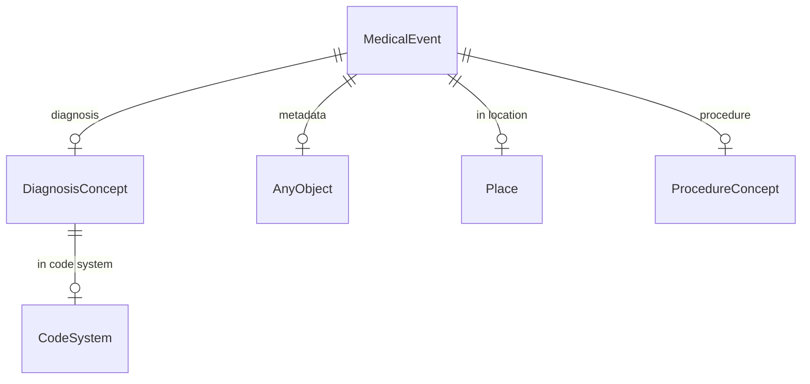


#### Attributes

| Name | Cardinality: | Type | Description |
| --- | --- | --- | --- |
| id | <sub>1..1</sub> | string |  |
| name | <sub>0..1</sub> | string |  |
| in code system | <sub>0..1</sub> | [CodeSystem](#codesystem) |  |

#### Parents

 * [Concept](#concept)

#### Referenced by:

 *  **[MedicalEvent](#medicalevent)** : *[diagnosis](#diagnosis)*  <sub>0..1</sub> 


### EqualsString


#### Attributes

| Name | Cardinality: | Type | Description |
| --- | --- | --- | --- |
| **attribute5** | <sub>0..1</sub> | None |  |
| **equalsString__attribute5** | <sub>0..1</sub> | string |  |


### EqualsStringIn


#### Attributes

| Name | Cardinality: | Type | Description |
| --- | --- | --- | --- |
| **attribute6** | <sub>0..1</sub> | None |  |
| **equalsStringIn__attribute6** | <sub>0..1</sub> | string |  |


### Event


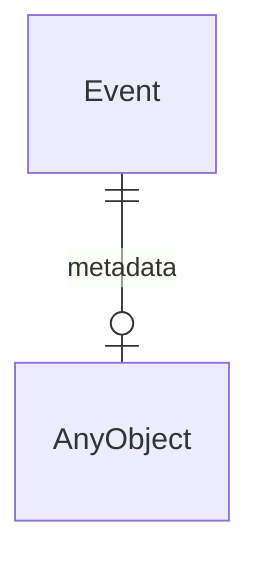


#### Attributes

| Name | Cardinality: | Type | Description |
| --- | --- | --- | --- |
| **ended at time** | <sub>0..1</sub> | date |  |
| **is current** | <sub>0..1</sub> | boolean |  |
| **metadata** | <sub>0..1</sub> | [AnyObject](#anyobject) | Example of a slot that has an unconstrained range |
| **started at time** | <sub>0..1</sub> | date |  |

#### Children

 * [BirthEvent](#birthevent)
 * [EmploymentEvent](#employmentevent)
 * [MarriageEvent](#marriageevent)
 * [MedicalEvent](#medicalevent)


### ~~FakeClass~~ _(deprecated)_


#### Attributes

| Name | Cardinality: | Type | Description |
| --- | --- | --- | --- |
| **fakeClass__test_attribute** | <sub>0..1</sub> | string |  |
| **test_attribute** | <sub>0..1</sub> | None |  |


### MarriageEvent


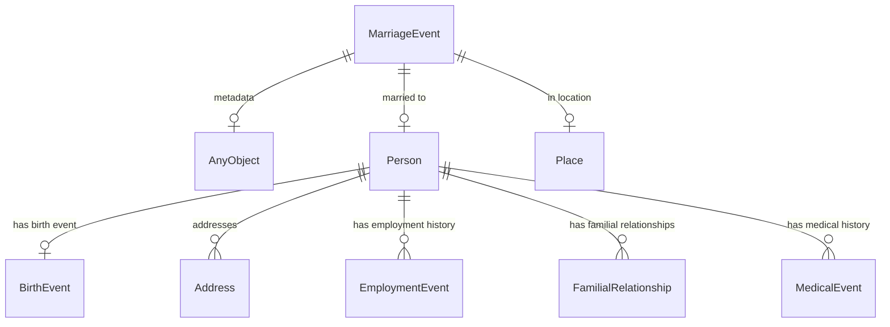


#### Attributes

| Name | Cardinality: | Type | Description |
| --- | --- | --- | --- |
| ended at time | <sub>0..1</sub> | date |  |
| is current | <sub>0..1</sub> | boolean |  |
| metadata | <sub>0..1</sub> | [AnyObject](#anyobject) | Example of a slot that has an unconstrained range |
| started at time | <sub>0..1</sub> | date |  |
| *in location* | <sub>0..1</sub> | [Place](#place) |  |
| **married to** | <sub>0..1</sub> | [Person](#person) |  |

#### Parents

 * [Event](#event)

#### Uses

 *  mixin: [WithLocation](#withlocation)

#### Referenced by:


### MedicalEvent


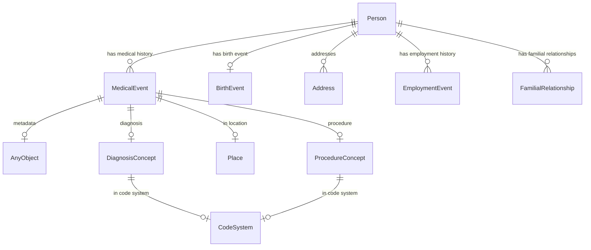


#### Attributes

| Name | Cardinality: | Type | Description |
| --- | --- | --- | --- |
| ended at time | <sub>0..1</sub> | date |  |
| is current | <sub>0..1</sub> | boolean |  |
| metadata | <sub>0..1</sub> | [AnyObject](#anyobject) | Example of a slot that has an unconstrained range |
| started at time | <sub>0..1</sub> | date |  |
| **diagnosis** | <sub>0..1</sub> | [DiagnosisConcept](#diagnosisconcept) |  |
| **in location** | <sub>0..1</sub> | [Place](#place) |  |
| **procedure** | <sub>0..1</sub> | [ProcedureConcept](#procedureconcept) |  |

#### Parents

 * [Event](#event)

#### Referenced by:

 *  **[Person](#person)** : *[has medical history](#has medical history)*  <sub>0..\*</sub> 


### Place


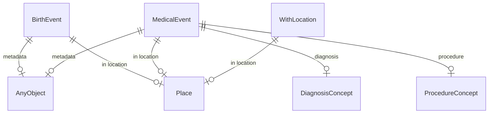


#### Attributes

| Name | Cardinality: | Type | Description |
| --- | --- | --- | --- |
| *aliases* | <sub>0..\*</sub> | None |  |
| *hasAliases__aliases* | <sub>0..\*</sub> | string |  |
| **id** | <sub>1..1</sub> | string |  |
| **name** | <sub>0..1</sub> | string |  |

#### Uses

 *  mixin: [HasAliases](#hasaliases)

#### Referenced by:

 *  **[BirthEvent](#birthevent)** : *[in location](#in location)*  <sub>0..1</sub> 
 *  **[MedicalEvent](#medicalevent)** : *[in location](#in location)*  <sub>0..1</sub> 
 *  **[WithLocation](#withlocation)** : *[in location](#in location)*  <sub>0..1</sub> 


### ProcedureConcept


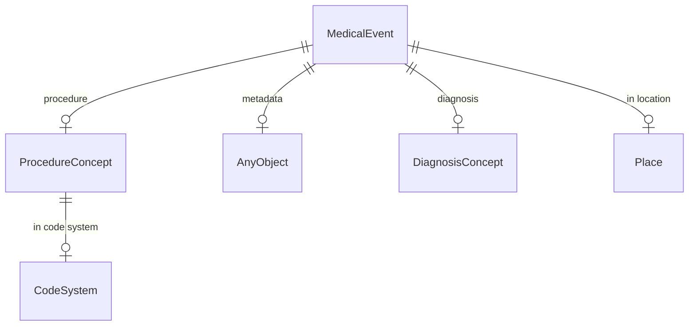


#### Attributes

| Name | Cardinality: | Type | Description |
| --- | --- | --- | --- |
| id | <sub>1..1</sub> | string |  |
| name | <sub>0..1</sub> | string |  |
| in code system | <sub>0..1</sub> | [CodeSystem](#codesystem) |  |

#### Parents

 * [Concept](#concept)

#### Referenced by:

 *  **[MedicalEvent](#medicalevent)** : *[procedure](#procedure)*  <sub>0..1</sub> 


### Relationship


#### Local class diagram

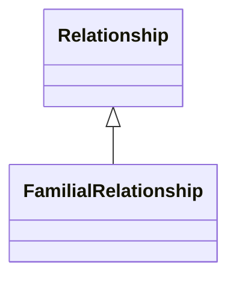

#### Attributes

| Name | Cardinality: | Type | Description |
| --- | --- | --- | --- |
| **Relationship_cordialness** | <sub>0..1</sub> | [CordialnessEnum](#cordialnessenum) |  |
| **ended at time** | <sub>0..1</sub> | date |  |
| **related to** | <sub>0..1</sub> | string |  |
| **started at time** | <sub>0..1</sub> | date |  |
| **type** | <sub>0..1</sub> | string |  |

#### Children

 * [FamilialRelationship](#familialrelationship)

#### Referenced by:


### Sub sub class 2


```mermaid
erDiagram
ClassWithSpaces {

}
SubSubClass2 {

}

SubSubClass2 ||--|o ClassWithSpaces : "slot with space 2"

```


#### Attributes

| Name | Cardinality: | Type | Description |
| --- | --- | --- | --- |
| classWithSpaces__slot_with_space_1 | <sub>0..1</sub> | string |  |
| slot with space 1 | <sub>0..1</sub> | None |  |
| slot with space 2 | <sub>0..1</sub> | [ClassWithSpaces](#classwithspaces) |  |
| subclassTest__slot_with_space_2 | <sub>0..1</sub> | [ClassWithSpaces](#classwithspaces) |  |

#### Parents

 * [SubclassTest](#subclasstest)


### activity

a provence-generating activity

```mermaid
erDiagram
Activity {

}
Agent {

}
Dataset {

}

Activity ||--|o Activity : "was informed by"
Activity ||--|o Agent : "was associated with"
Agent ||--|o Activity : "was informed by"
Agent ||--|o Agent : "acted on behalf of"
Dataset ||--|o AnyObject : "metadata"
Dataset ||--}o Activity : "activities"
Dataset ||--}o CodeSystem : "code systems"
Dataset ||--}o Company : "companies"
Dataset ||--}o Person : "persons"

```


#### Attributes

| Name | Cardinality: | Type | Description |
| --- | --- | --- | --- |
| **id** | <sub>1..1</sub> | string |  |
| **description** | <sub>0..1</sub> | string |  |
| **ended at time** | <sub>0..1</sub> | date |  |
| **started at time** | <sub>0..1</sub> | date |  |
| **used** | <sub>0..1</sub> | string |  |
| **was associated with** | <sub>0..1</sub> | [Agent](#agent) |  |
| **was informed by** | <sub>0..1</sub> | [Activity](#activity) |  |

#### Referenced by:

 *  **[Dataset](#dataset)** : *[dataset__activities](#dataset__activities)*  <sub>0..\*</sub> 
 *  **[Activity](#activity)** : *[was informed by](#was informed by)*  <sub>0..1</sub> 
 *  **[Agent](#agent)** : *[was informed by](#was informed by)*  <sub>0..1</sub> 


### agent

a provence-generating agent

```mermaid
erDiagram
Activity {

}
Agent {

}

Activity ||--|o Activity : "was informed by"
Activity ||--|o Agent : "was associated with"
Agent ||--|o Activity : "was informed by"
Agent ||--|o Agent : "acted on behalf of"

```


#### Attributes

| Name | Cardinality: | Type | Description |
| --- | --- | --- | --- |
| **id** | <sub>1..1</sub> | string |  |
| **acted on behalf of** | <sub>0..1</sub> | [Agent](#agent) |  |
| **was informed by** | <sub>0..1</sub> | [Activity](#activity) |  |

#### Referenced by:

 *  **[Agent](#agent)** : *[acted on behalf of](#acted on behalf of)*  <sub>0..1</sub> 
 *  **[Activity](#activity)** : *[was associated with](#was associated with)*  <sub>0..1</sub> 


### class with spaces


```mermaid
erDiagram
ClassWithSpaces {

}
SubclassTest {

}

SubclassTest ||--|o ClassWithSpaces : "slot with space 2"

```


#### Attributes

| Name | Cardinality: | Type | Description |
| --- | --- | --- | --- |
| **classWithSpaces__slot_with_space_1** | <sub>0..1</sub> | string |  |
| **slot with space 1** | <sub>0..1</sub> | None |  |

#### Children

 * [SubclassTest](#subclasstest)

#### Referenced by:

 *  **[SubclassTest](#subclasstest)** : *[subclassTest__slot_with_space_2](#subclassTest__slot_with_space_2)*  <sub>0..1</sub> 


### subclass test


```mermaid
erDiagram
ClassWithSpaces {

}
SubclassTest {

}

SubclassTest ||--|o ClassWithSpaces : "slot with space 2"

```


#### Attributes

| Name | Cardinality: | Type | Description |
| --- | --- | --- | --- |
| classWithSpaces__slot_with_space_1 | <sub>0..1</sub> | string |  |
| slot with space 1 | <sub>0..1</sub> | None |  |
| **slot with space 2** | <sub>0..1</sub> | [ClassWithSpaces](#classwithspaces) |  |
| **subclassTest__slot_with_space_2** | <sub>0..1</sub> | [ClassWithSpaces](#classwithspaces) |  |

#### Parents

 * [ClassWithSpaces](#classwithspaces)

#### Children

 * [SubSubClass2](#subsubclass2)
 * [TubSubClass1](#tubsubclass1) - Same depth as Sub sub class 1


### tub sub class 1

Same depth as Sub sub class 1

```mermaid
erDiagram
ClassWithSpaces {

}
TubSubClass1 {

}

TubSubClass1 ||--|o ClassWithSpaces : "slot with space 2"

```


#### Attributes

| Name | Cardinality: | Type | Description |
| --- | --- | --- | --- |
| classWithSpaces__slot_with_space_1 | <sub>0..1</sub> | string |  |
| slot with space 1 | <sub>0..1</sub> | None |  |
| slot with space 2 | <sub>0..1</sub> | [ClassWithSpaces](#classwithspaces) |  |
| subclassTest__slot_with_space_2 | <sub>0..1</sub> | [ClassWithSpaces](#classwithspaces) |  |

#### Parents

 * [SubclassTest](#subclasstest)


## Mixins


### HasAliases


#### Attributes

| Name | Cardinality: | Type | Description |
| --- | --- | --- | --- |
| **aliases** | <sub>0..\*</sub> | None |  |
| **hasAliases__aliases** | <sub>0..\*</sub> | string |  |

#### Used as mixin by

 * [Organization](#organization) - An organization.
 * [Person](#person) - A person, living or dead
 * [Place](#place)

### WithLocation


```mermaid
erDiagram
Place {

}
WithLocation {

}

WithLocation ||--|o Place : "in location"

```


#### Attributes

| Name | Cardinality: | Type | Description |
| --- | --- | --- | --- |
| **in location** | <sub>0..1</sub> | [Place](#place) |  |

#### Used as mixin by

 * [MarriageEvent](#marriageevent)

## Enums


### CordialnessEnum


| Text | Meaning: | Description |
| --- | --- | --- |
| hateful | None | spiteful |
| heartfelt | None | warm and hearty friendliness |
| indifferent | None | not overly friendly nor obnoxiously spiteful |

#### Used by

 *  **[FamilialRelationship](#familialrelationship)** *[FamilialRelationship_cordialness](#FamilialRelationship_cordialness)*  <sub>0..1</sub> 
 *  **[Relationship](#relationship)** *[Relationship_cordialness](#Relationship_cordialness)*  <sub>0..1</sub> 

### DiagnosisType


| Text | Meaning: | Description |
| --- | --- | --- |
| TODO | None |  |

### EmploymentEventType

codes for different kinds of employment/HR related events

| Text | Meaning: | Description |
| --- | --- | --- |
| FIRE | bizcodes:002 |  |
| HIRE | bizcodes:001 | event for a new employee |
| PROMOTION | bizcodes:003 | promotion event |
| TRANSFER | bizcodes:004 | transfer internally |

### FamilialRelationshipType


| Text | Meaning: | Description |
| --- | --- | --- |
| CHILD_OF | None |  |
| PARENT_OF | None |  |
| SIBLING_OF | None |  |

#### Used by

 *  **[FamilialRelationship](#familialrelationship)** *[FamilialRelationship_type](#FamilialRelationship_type)*  <sub>1..1</sub> 

### KitchenStatus


| Text | Meaning: | Description |
| --- | --- | --- |
| CLEAN | None |  |
| DIRTY | None |  |

### LifeStatusEnum


| Text | Meaning: | Description |
| --- | --- | --- |
| DEAD | None |  |
| LIVING | None |  |
| UNKNOWN | None |  |

#### Used by

 *  **[Person](#person)** *[person__is_living](#person__is_living)*  <sub>0..1</sub> 

### other codes


| Text | Meaning: | Description |
| --- | --- | --- |
| a b | None |  |
