# PERSONINFO


**metamodel version:** 1.7.0

**version:** None


Information about people, based on [schema.org](http://schema.org)


## Class Diagram

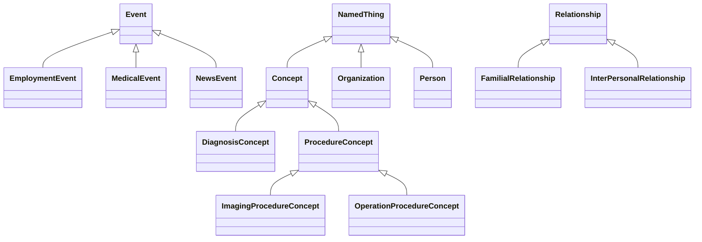

## ERD Diagram

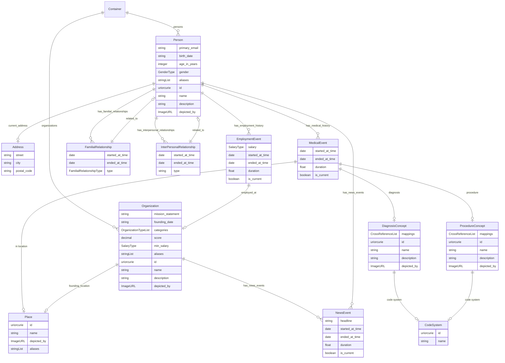


## Classes


### Address


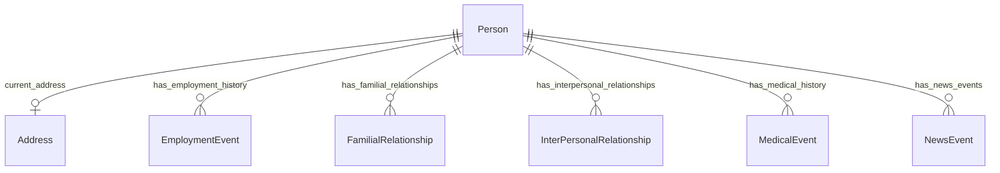


#### Attributes

| Name | Cardinality: | Type | Description |
| --- | --- | --- | --- |
| **city** | <sub>0..1</sub> | string |  |
| **postal_code** | <sub>0..1</sub> | string |  |
| **street** | <sub>0..1</sub> | string |  |

#### Referenced by:

 *  **[Person](#person)** : *[current_address](#current_address)*  <sub>0..1</sub> 


### Concept


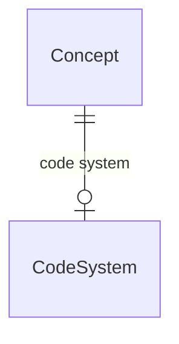


#### Attributes

| Name | Cardinality: | Type | Description |
| --- | --- | --- | --- |
| id | <sub>1..1</sub> | uriorcurie |  |
| name | <sub>0..1</sub> | string |  |
| description | <sub>0..1</sub> | string |  |
| depicted_by | <sub>0..1</sub> | ImageURL |  |
| **code system** | <sub>0..1</sub> | [CodeSystem](#codesystem) |  |
| **concept__code_system** | <sub>0..1</sub> | [CodeSystem](#codesystem) |  |
| **concept__mappings** | <sub>0..\*</sub> | CrossReference |  |
| **mappings** | <sub>0..\*</sub> | CrossReference |  |

#### Parents

 * [NamedThing](#namedthing) - A generic grouping for any identifiable entity

#### Children

 * [DiagnosisConcept](#diagnosisconcept)
 * [ProcedureConcept](#procedureconcept)


### Container


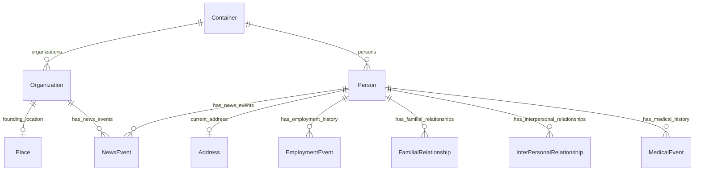


#### Attributes

| Name | Cardinality: | Type | Description |
| --- | --- | --- | --- |
| **organizations** | <sub>0..\*</sub> | [Organization](#organization) |  |
| **persons** | <sub>0..\*</sub> | [Person](#person) |  |


### DiagnosisConcept


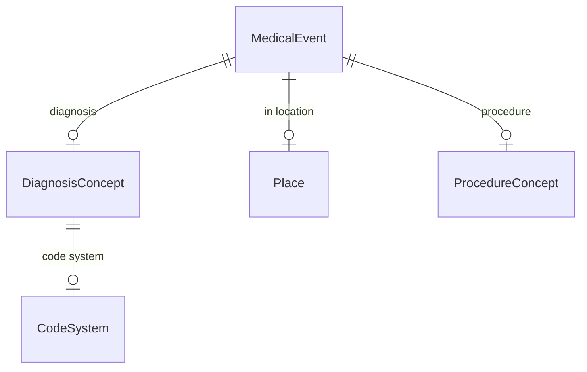


#### Attributes

| Name | Cardinality: | Type | Description |
| --- | --- | --- | --- |
| id | <sub>1..1</sub> | uriorcurie |  |
| name | <sub>0..1</sub> | string |  |
| description | <sub>0..1</sub> | string |  |
| code system | <sub>0..1</sub> | [CodeSystem](#codesystem) |  |
| concept__code_system | <sub>0..1</sub> | [CodeSystem](#codesystem) |  |
| concept__mappings | <sub>0..\*</sub> | CrossReference |  |
| depicted_by | <sub>0..1</sub> | ImageURL |  |
| mappings | <sub>0..\*</sub> | CrossReference |  |

#### Parents

 * [Concept](#concept)

#### Referenced by:

 *  **[MedicalEvent](#medicalevent)** : *[diagnosis](#diagnosis)*  <sub>0..1</sub> 


### EmploymentEvent


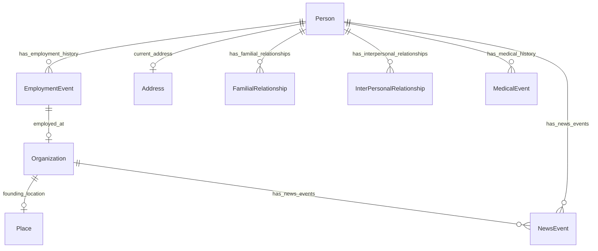


#### Attributes

| Name | Cardinality: | Type | Description |
| --- | --- | --- | --- |
| duration | <sub>0..1</sub> | float |  |
| ended_at_time | <sub>0..1</sub> | date |  |
| is_current | <sub>0..1</sub> | boolean |  |
| started_at_time | <sub>0..1</sub> | date |  |
| **employed_at** | <sub>0..1</sub> | [Organization](#organization) |  |
| **salary** | <sub>0..1</sub> | SalaryType |  |

#### Parents

 * [Event](#event)

#### Referenced by:

 *  **[Person](#person)** : *[has_employment_history](#has_employment_history)*  <sub>0..\*</sub> 


### Event


#### Local class diagram

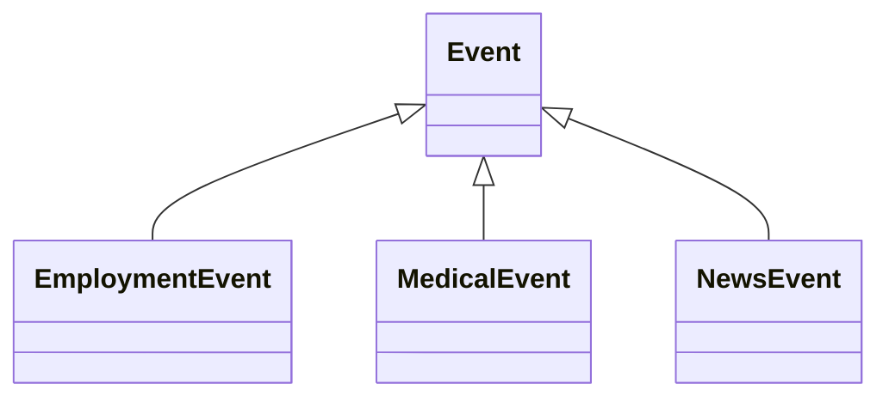

#### Attributes

| Name | Cardinality: | Type | Description |
| --- | --- | --- | --- |
| **duration** | <sub>0..1</sub> | float |  |
| **ended_at_time** | <sub>0..1</sub> | date |  |
| **is_current** | <sub>0..1</sub> | boolean |  |
| **started_at_time** | <sub>0..1</sub> | date |  |

#### Children

 * [EmploymentEvent](#employmentevent)
 * [MedicalEvent](#medicalevent)
 * [NewsEvent](#newsevent)


### FamilialRelationship


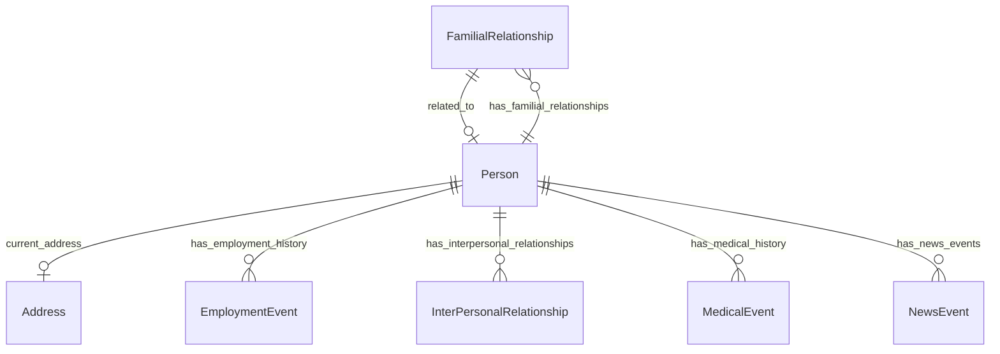


#### Attributes

| Name | Cardinality: | Type | Description |
| --- | --- | --- | --- |
| ended_at_time | <sub>0..1</sub> | date |  |
| related_to | <sub>0..1</sub> | [Person](#person) |  |
| started_at_time | <sub>0..1</sub> | date |  |
| type | <sub>0..1</sub> | string |  |
| **FamilialRelationship_related to** | <sub>1..1</sub> | [Person](#person) |  |
| **FamilialRelationship_type** | <sub>1..1</sub> | [FamilialRelationshipType](#familialrelationshiptype) |  |

#### Parents

 * [Relationship](#relationship)

#### Referenced by:

 *  **[Person](#person)** : *[has_familial_relationships](#has_familial_relationships)*  <sub>0..\*</sub> 


### ImagingProcedureConcept


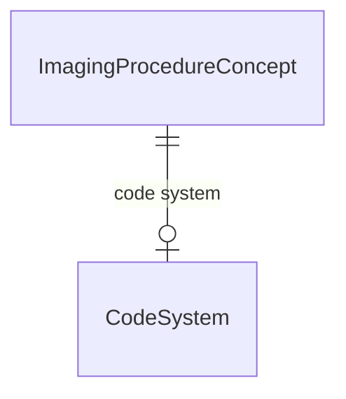


#### Attributes

| Name | Cardinality: | Type | Description |
| --- | --- | --- | --- |
| id | <sub>1..1</sub> | uriorcurie |  |
| name | <sub>0..1</sub> | string |  |
| description | <sub>0..1</sub> | string |  |
| code system | <sub>0..1</sub> | [CodeSystem](#codesystem) |  |
| concept__code_system | <sub>0..1</sub> | [CodeSystem](#codesystem) |  |
| concept__mappings | <sub>0..\*</sub> | CrossReference |  |
| depicted_by | <sub>0..1</sub> | ImageURL |  |
| mappings | <sub>0..\*</sub> | CrossReference |  |

#### Parents

 * [ProcedureConcept](#procedureconcept)


### InterPersonalRelationship


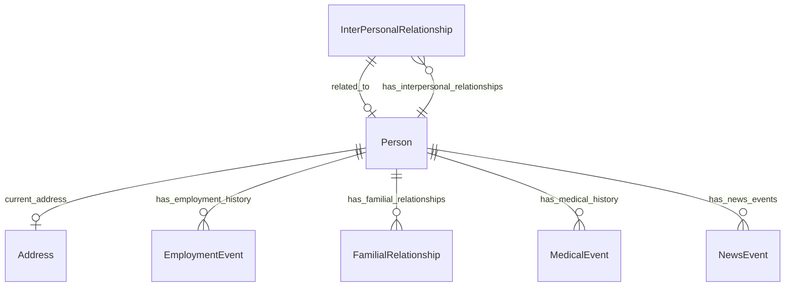


#### Attributes

| Name | Cardinality: | Type | Description |
| --- | --- | --- | --- |
| ended_at_time | <sub>0..1</sub> | date |  |
| related_to | <sub>0..1</sub> | [Person](#person) |  |
| started_at_time | <sub>0..1</sub> | date |  |
| type | <sub>0..1</sub> | string |  |
| **InterPersonalRelationship_related to** | <sub>1..1</sub> | [Person](#person) |  |
| **InterPersonalRelationship_type** | <sub>1..1</sub> | string |  |

#### Parents

 * [Relationship](#relationship)

#### Referenced by:

 *  **[Person](#person)** : *[has_interpersonal_relationships](#has_interpersonal_relationships)*  <sub>0..\*</sub> 


### MedicalEvent


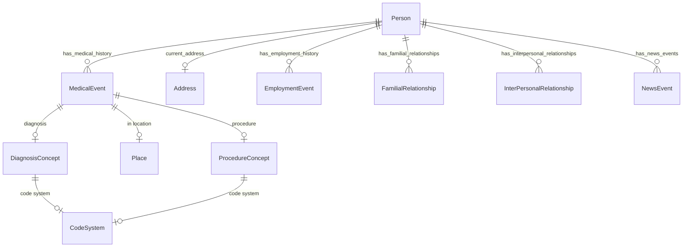


#### Attributes

| Name | Cardinality: | Type | Description |
| --- | --- | --- | --- |
| duration | <sub>0..1</sub> | float |  |
| ended_at_time | <sub>0..1</sub> | date |  |
| is_current | <sub>0..1</sub> | boolean |  |
| started_at_time | <sub>0..1</sub> | date |  |
| **diagnosis** | <sub>0..1</sub> | [DiagnosisConcept](#diagnosisconcept) |  |
| **in location** | <sub>0..1</sub> | [Place](#place) |  |
| **procedure** | <sub>0..1</sub> | [ProcedureConcept](#procedureconcept) |  |

#### Parents

 * [Event](#event)

#### Referenced by:

 *  **[Person](#person)** : *[has_medical_history](#has_medical_history)*  <sub>0..\*</sub> 


### NamedThing

A generic grouping for any identifiable entity


#### Local class diagram

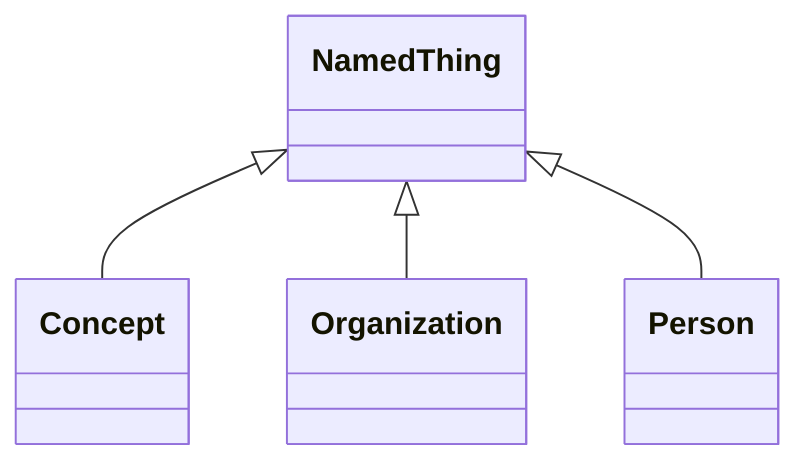

#### Attributes

| Name | Cardinality: | Type | Description |
| --- | --- | --- | --- |
| **id** | <sub>1..1</sub> | uriorcurie |  |
| **name** | <sub>0..1</sub> | string |  |
| **description** | <sub>0..1</sub> | string |  |
| **depicted_by** | <sub>0..1</sub> | ImageURL |  |

#### Children

 * [Concept](#concept)
 * [Organization](#organization) - An organization such as a company or university
 * [Person](#person) - A person (alive, dead, undead, or fictional).


### NewsEvent


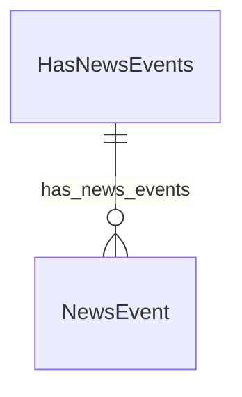


#### Attributes

| Name | Cardinality: | Type | Description |
| --- | --- | --- | --- |
| duration | <sub>0..1</sub> | float |  |
| ended_at_time | <sub>0..1</sub> | date |  |
| is_current | <sub>0..1</sub> | boolean |  |
| started_at_time | <sub>0..1</sub> | date |  |
| **headline** | <sub>0..1</sub> | None |  |
| **newsEvent__headline** | <sub>0..1</sub> | string |  |

#### Parents

 * [Event](#event)

#### Referenced by:

 *  **[HasNewsEvents](#hasnewsevents)** : *[hasNewsEvents__has_news_events](#hasNewsEvents__has_news_events)*  <sub>0..\*</sub> 


### OperationProcedureConcept


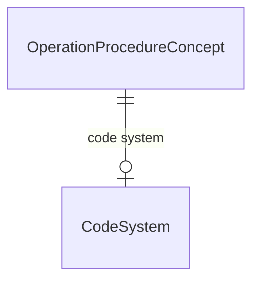


#### Attributes

| Name | Cardinality: | Type | Description |
| --- | --- | --- | --- |
| id | <sub>1..1</sub> | uriorcurie |  |
| name | <sub>0..1</sub> | string |  |
| description | <sub>0..1</sub> | string |  |
| code system | <sub>0..1</sub> | [CodeSystem](#codesystem) |  |
| concept__code_system | <sub>0..1</sub> | [CodeSystem](#codesystem) |  |
| concept__mappings | <sub>0..\*</sub> | CrossReference |  |
| depicted_by | <sub>0..1</sub> | ImageURL |  |
| mappings | <sub>0..\*</sub> | CrossReference |  |

#### Parents

 * [ProcedureConcept](#procedureconcept)


### Organization

An organization such as a company or university

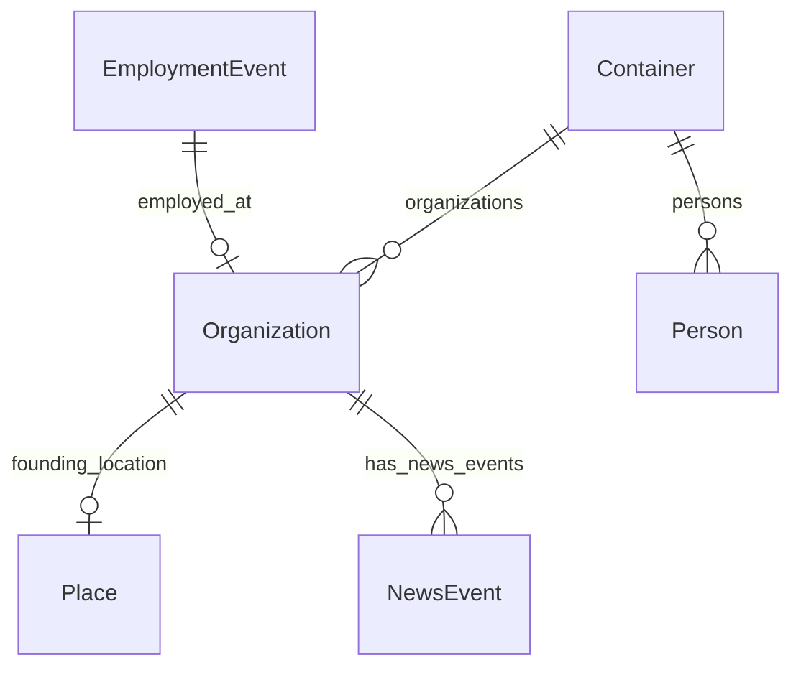


#### Attributes

| Name | Cardinality: | Type | Description |
| --- | --- | --- | --- |
| id | <sub>1..1</sub> | uriorcurie |  |
| name | <sub>0..1</sub> | string |  |
| description | <sub>0..1</sub> | string |  |
| depicted_by | <sub>0..1</sub> | ImageURL |  |
| *aliases* | <sub>0..\*</sub> | None |  |
| *hasAliases__aliases* | <sub>0..\*</sub> | string |  |
| *hasNewsEvents__has_news_events* | <sub>0..\*</sub> | [NewsEvent](#newsevent) |  |
| *has_news_events* | <sub>0..\*</sub> | [NewsEvent](#newsevent) |  |
| **Organization_categories** | <sub>0..\*</sub> | [OrganizationType](#organizationtype) |  |
| **founding_date** | <sub>0..1</sub> | string |  |
| **founding_location** | <sub>0..1</sub> | [Place](#place) |  |
| **min_salary** | <sub>0..1</sub> | SalaryType |  |
| **mission_statement** | <sub>0..1</sub> | string |  |
| **score** | <sub>0..1</sub> | decimal | A score between 0 and 5, represented as a decimal |

#### Parents

 * [NamedThing](#namedthing) - A generic grouping for any identifiable entity

#### Uses

 *  mixin: [HasAliases](#hasaliases) - A mixin applied to any class that can have aliases/alternateNames
 *  mixin: [HasNewsEvents](#hasnewsevents)

#### Referenced by:

 *  **[EmploymentEvent](#employmentevent)** : *[employed_at](#employed_at)*  <sub>0..1</sub> 
 *  **[Container](#container)** : *[organizations](#organizations)*  <sub>0..\*</sub> 


### Person

A person (alive, dead, undead, or fictional).

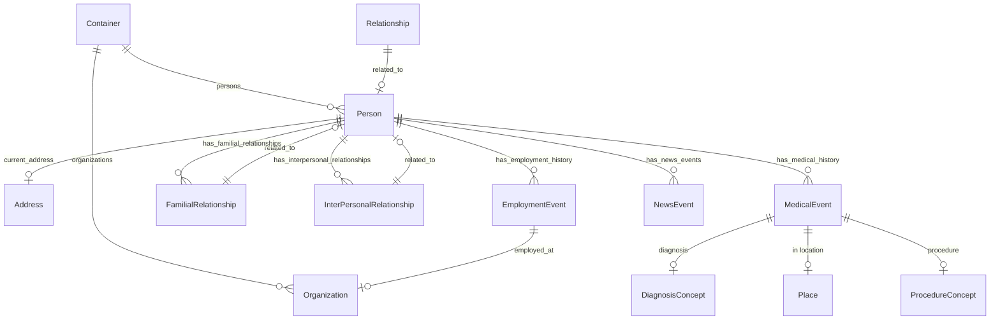


#### Attributes

| Name | Cardinality: | Type | Description |
| --- | --- | --- | --- |
| id | <sub>1..1</sub> | uriorcurie |  |
| name | <sub>0..1</sub> | string |  |
| description | <sub>0..1</sub> | string |  |
| depicted_by | <sub>0..1</sub> | ImageURL |  |
| *aliases* | <sub>0..\*</sub> | None |  |
| *hasAliases__aliases* | <sub>0..\*</sub> | string |  |
| *hasNewsEvents__has_news_events* | <sub>0..\*</sub> | [NewsEvent](#newsevent) |  |
| *has_news_events* | <sub>0..\*</sub> | [NewsEvent](#newsevent) |  |
| **Person_age_in_years** | <sub>0..1</sub> | integer |  |
| **Person_primary_email** | <sub>0..1</sub> | string |  |
| **birth_date** | <sub>0..1</sub> | string |  |
| **current_address** | <sub>0..1</sub> | [Address](#address) | The address at which a person currently lives |
| **gender** | <sub>0..1</sub> | [GenderType](#gendertype) |  |
| **has_employment_history** | <sub>0..\*</sub> | [EmploymentEvent](#employmentevent) |  |
| **has_familial_relationships** | <sub>0..\*</sub> | [FamilialRelationship](#familialrelationship) |  |
| **has_interpersonal_relationships** | <sub>0..\*</sub> | [InterPersonalRelationship](#interpersonalrelationship) |  |
| **has_medical_history** | <sub>0..\*</sub> | [MedicalEvent](#medicalevent) |  |

#### Parents

 * [NamedThing](#namedthing) - A generic grouping for any identifiable entity

#### Uses

 *  mixin: [HasAliases](#hasaliases) - A mixin applied to any class that can have aliases/alternateNames
 *  mixin: [HasNewsEvents](#hasnewsevents)

#### Referenced by:

 *  **[FamilialRelationship](#familialrelationship)** : *[FamilialRelationship_related to](#FamilialRelationship_related to)*  <sub>1..1</sub> 
 *  **[InterPersonalRelationship](#interpersonalrelationship)** : *[InterPersonalRelationship_related to](#InterPersonalRelationship_related to)*  <sub>1..1</sub> 
 *  **[Container](#container)** : *[persons](#persons)*  <sub>0..\*</sub> 
 *  **[Relationship](#relationship)** : *[related_to](#related_to)*  <sub>0..1</sub> 


### Place


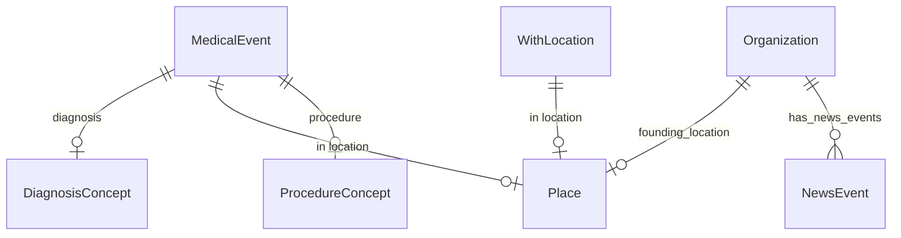


#### Attributes

| Name | Cardinality: | Type | Description |
| --- | --- | --- | --- |
| *aliases* | <sub>0..\*</sub> | None |  |
| *hasAliases__aliases* | <sub>0..\*</sub> | string |  |
| **id** | <sub>1..1</sub> | uriorcurie |  |
| **name** | <sub>0..1</sub> | string |  |
| **depicted_by** | <sub>0..1</sub> | ImageURL |  |

#### Uses

 *  mixin: [HasAliases](#hasaliases) - A mixin applied to any class that can have aliases/alternateNames

#### Referenced by:

 *  **[Organization](#organization)** : *[founding_location](#founding_location)*  <sub>0..1</sub> 
 *  **[MedicalEvent](#medicalevent)** : *[in location](#in location)*  <sub>0..1</sub> 
 *  **[WithLocation](#withlocation)** : *[in location](#in location)*  <sub>0..1</sub> 


### ProcedureConcept


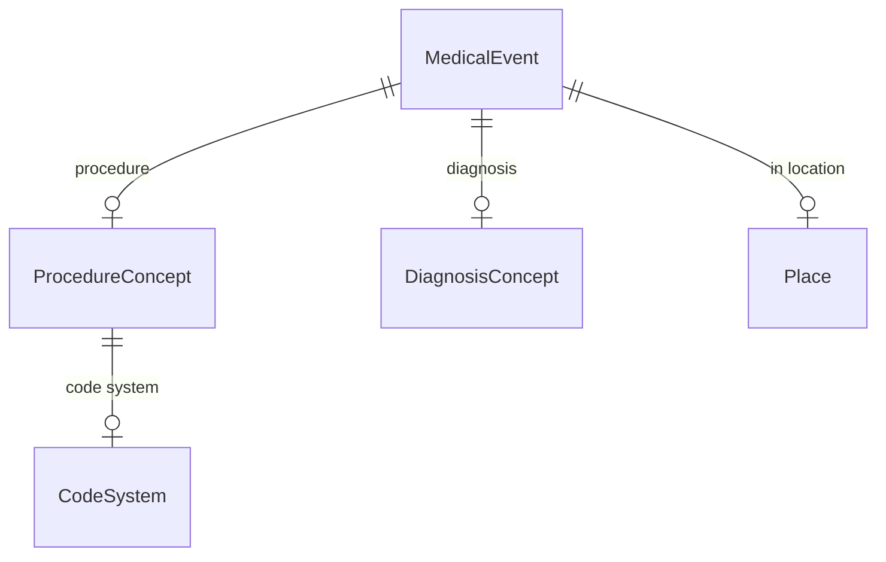


#### Attributes

| Name | Cardinality: | Type | Description |
| --- | --- | --- | --- |
| id | <sub>1..1</sub> | uriorcurie |  |
| name | <sub>0..1</sub> | string |  |
| description | <sub>0..1</sub> | string |  |
| code system | <sub>0..1</sub> | [CodeSystem](#codesystem) |  |
| concept__code_system | <sub>0..1</sub> | [CodeSystem](#codesystem) |  |
| concept__mappings | <sub>0..\*</sub> | CrossReference |  |
| depicted_by | <sub>0..1</sub> | ImageURL |  |
| mappings | <sub>0..\*</sub> | CrossReference |  |

#### Parents

 * [Concept](#concept)

#### Children

 * [ImagingProcedureConcept](#imagingprocedureconcept)
 * [OperationProcedureConcept](#operationprocedureconcept)

#### Referenced by:

 *  **[MedicalEvent](#medicalevent)** : *[procedure](#procedure)*  <sub>0..1</sub> 


### Relationship


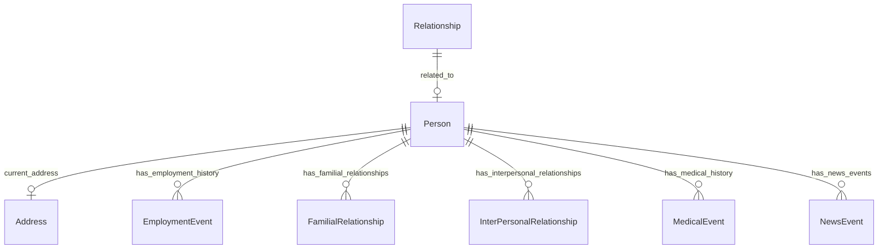


#### Attributes

| Name | Cardinality: | Type | Description |
| --- | --- | --- | --- |
| **ended_at_time** | <sub>0..1</sub> | date |  |
| **related_to** | <sub>0..1</sub> | [Person](#person) |  |
| **started_at_time** | <sub>0..1</sub> | date |  |
| **type** | <sub>0..1</sub> | string |  |

#### Children

 * [FamilialRelationship](#familialrelationship)
 * [InterPersonalRelationship](#interpersonalrelationship)


### code system


```mermaid
erDiagram
CodeSystem {

}
Concept {

}

Concept ||--|o CodeSystem : "code system"

```


#### Attributes

| Name | Cardinality: | Type | Description |
| --- | --- | --- | --- |
| **id** | <sub>1..1</sub> | uriorcurie |  |
| **name** | <sub>0..1</sub> | string |  |

#### Referenced by:

 *  **[Concept](#concept)** : *[concept__code_system](#concept__code_system)*  <sub>0..1</sub> 


## Mixins


### HasAliases

A mixin applied to any class that can have aliases/alternateNames


#### Attributes

| Name | Cardinality: | Type | Description |
| --- | --- | --- | --- |
| **aliases** | <sub>0..\*</sub> | None |  |
| **hasAliases__aliases** | <sub>0..\*</sub> | string |  |

#### Used as mixin by

 * [Organization](#organization) - An organization such as a company or university
 * [Person](#person) - A person (alive, dead, undead, or fictional).
 * [Place](#place)

### HasNewsEvents


```mermaid
erDiagram
HasNewsEvents {

}
NewsEvent {

}

HasNewsEvents ||--}o NewsEvent : "has_news_events"

```


#### Attributes

| Name | Cardinality: | Type | Description |
| --- | --- | --- | --- |
| **hasNewsEvents__has_news_events** | <sub>0..\*</sub> | [NewsEvent](#newsevent) |  |
| **has_news_events** | <sub>0..\*</sub> | [NewsEvent](#newsevent) |  |

#### Used as mixin by

 * [Organization](#organization) - An organization such as a company or university
 * [Person](#person) - A person (alive, dead, undead, or fictional).

### WithLocation


```mermaid
erDiagram
Place {

}
WithLocation {

}

WithLocation ||--|o Place : "in location"

```


#### Attributes

| Name | Cardinality: | Type | Description |
| --- | --- | --- | --- |
| **in location** | <sub>0..1</sub> | [Place](#place) |  |

## Enums


### DiagnosisType


| Text | Meaning: | Description |
| --- | --- | --- |
| todo | None |  |

### FamilialRelationshipType


| Text | Meaning: | Description |
| --- | --- | --- |
| CHILD_OF | famrel:03 |  |
| PARENT_OF | famrel:02 |  |
| SIBLING_OF | famrel:01 |  |

#### Used by

 *  **[FamilialRelationship](#familialrelationship)** *[FamilialRelationship_type](#FamilialRelationship_type)*  <sub>1..1</sub> 

### GenderType


| Text | Meaning: | Description |
| --- | --- | --- |
| cisgender man | GSSO:000371 |  |
| cisgender woman | GSSO:000385 |  |
| nonbinary man | GSSO:009254 |  |
| nonbinary woman | GSSO:009253 |  |
| transgender man | GSSO:000372 |  |
| transgender woman | GSSO:000384 |  |

#### Used by

 *  **[Person](#person)** *[gender](#gender)*  <sub>0..1</sub> 

### NonFamilialRelationshipType


| Text | Meaning: | Description |
| --- | --- | --- |
| BEST_FRIEND_OF | None |  |
| COWORKER_OF | famrel:70 |  |
| MORTAL_ENEMY_OF | None |  |
| ROOMMATE_OF | famrel:71 |  |

### OrganizationType


| Text | Meaning: | Description |
| --- | --- | --- |
| charity | bizcodes:001 |  |
| for profit | None |  |
| loose organization | None |  |
| non profit | None |  |
| offshore | None |  |
| shell company | None |  |

#### Used by

 *  **[Organization](#organization)** *[Organization_categories](#Organization_categories)*  <sub>0..\*</sub>
