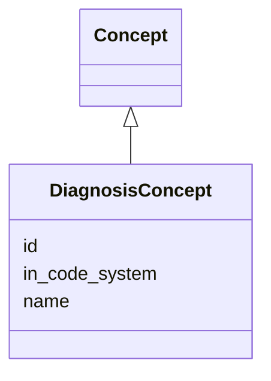

# Class: DiagnosisConcept


URI: [ks:DiagnosisConcept](https://w3id.org/linkml/tests/kitchen_sink/DiagnosisConcept)





## Inheritance
* [Concept](Concept.md)
    * **DiagnosisConcept**


## Slots

| Name | Range | Cardinality | Description  | Info |
| ---  | --- | --- | --- | --- |
| [id](id.md) | NONE | 0..1 | None  | . |
| [name](name.md) | NONE | 0..1 | None  | . |
| [in_code_system](in_code_system.md) | [CodeSystem](CodeSystem.md) | 0..1 | None  | . |


## Usages


| used by | used in | type | used |
| ---  | --- | --- | --- |
| [MedicalEvent](MedicalEvent.md) | [diagnosis](diagnosis.md) | range | DiagnosisConcept |


## Identifier and Mapping Information


### Schema Source


* from schema: https://w3id.org/linkml/tests/kitchen_sink


## Mappings

| Mapping Type | Mapped Value |
| ---  | ---  |
| self | ['ks:DiagnosisConcept'] |
| native | ['ks:DiagnosisConcept'] |
| close | ['biolink:Disease'] |


## LinkML Specification

<!-- TODO: investigate https://stackoverflow.com/questions/37606292/how-to-create-tabbed-code-blocks-in-mkdocs-or-sphinx -->

### Direct

<details>
```yaml
name: DiagnosisConcept
from_schema: https://w3id.org/linkml/tests/kitchen_sink
close_mappings:
- biolink:Disease
is_a: Concept

```
</details>

### Induced

<details>
```yaml
name: DiagnosisConcept
from_schema: https://w3id.org/linkml/tests/kitchen_sink
close_mappings:
- biolink:Disease
is_a: Concept
attributes:
  id:
    name: id
    from_schema: https://w3id.org/linkml/tests/core
    identifier: true
    alias: id
    owner: DiagnosisConcept
  name:
    name: name
    from_schema: https://w3id.org/linkml/tests/core
    alias: name
    owner: DiagnosisConcept
    required: false
  in code system:
    name: in code system
    from_schema: https://w3id.org/linkml/tests/kitchen_sink
    alias: in_code_system
    owner: DiagnosisConcept
    range: CodeSystem

```
</details>