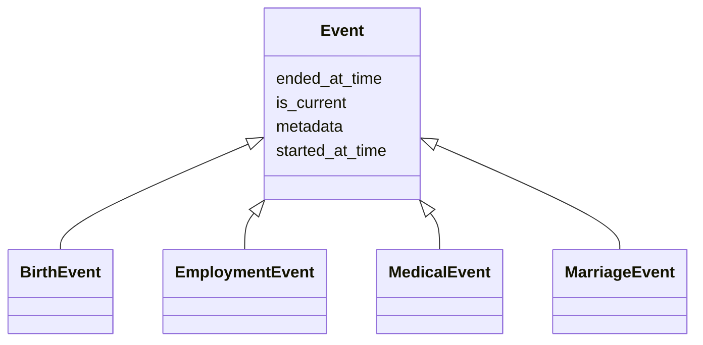

# Class: Event


URI: [ks:Event](https://w3id.org/linkml/tests/kitchen_sink/Event)





## Inheritance
* **Event**
    * [BirthEvent](BirthEvent.md)
    * [EmploymentEvent](EmploymentEvent.md)
    * [MedicalEvent](MedicalEvent.md)
    * [MarriageEvent](MarriageEvent.md) [ WithLocation]


## Slots

| Name | Range | Cardinality | Description  | Info |
| ---  | --- | --- | --- | --- |
| [started_at_time](started_at_time.md) | [xsd:date](http://www.w3.org/2001/XMLSchema#date) | 0..1 | None  | . |
| [ended_at_time](ended_at_time.md) | [xsd:date](http://www.w3.org/2001/XMLSchema#date) | 0..1 | None  | . |
| [is_current](is_current.md) | [xsd:boolean](http://www.w3.org/2001/XMLSchema#boolean) | 0..1 | None  | . |
| [metadata](metadata.md) | [AnyObject](AnyObject.md) | 0..1 | Example of a slot that has an unconstrained range  | . |


## Usages


## Identifier and Mapping Information


### Schema Source


* from schema: https://w3id.org/linkml/tests/kitchen_sink


## Mappings

| Mapping Type | Mapped Value |
| ---  | ---  |
| self | ['ks:Event'] |
| native | ['ks:Event'] |


## LinkML Specification

<!-- TODO: investigate https://stackoverflow.com/questions/37606292/how-to-create-tabbed-code-blocks-in-mkdocs-or-sphinx -->

### Direct

<details>
```yaml
name: Event
from_schema: https://w3id.org/linkml/tests/kitchen_sink
slots:
- started at time
- ended at time
- is current
- metadata

```
</details>

### Induced

<details>
```yaml
name: Event
from_schema: https://w3id.org/linkml/tests/kitchen_sink
attributes:
  started at time:
    name: started at time
    from_schema: https://w3id.org/linkml/tests/core
    slot_uri: prov:startedAtTime
    alias: started_at_time
    owner: Event
    range: date
  ended at time:
    name: ended at time
    from_schema: https://w3id.org/linkml/tests/core
    slot_uri: prov:endedAtTime
    alias: ended_at_time
    owner: Event
    range: date
  is current:
    name: is current
    from_schema: https://w3id.org/linkml/tests/kitchen_sink
    alias: is_current
    owner: Event
    range: boolean
  metadata:
    name: metadata
    description: Example of a slot that has an unconstrained range
    from_schema: https://w3id.org/linkml/tests/kitchen_sink
    alias: metadata
    owner: Event
    range: AnyObject

```
</details>