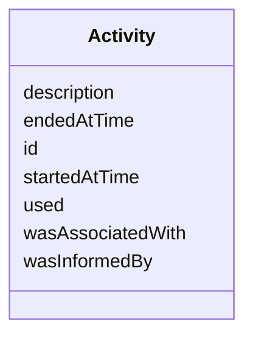

# Class: Activity
_a provence-generating activity_


URI: [core:Activity](https://w3id.org/linkml/tests/core/Activity)





<!-- no inheritance hierarchy -->


## Slots

| Name | Cardinality and Range | Description | Inheritance |
| ---  | --- | --- | --- |
| [id](id.md) | 1..1 <br/> NONE | None  | direct |
| [started at time](startedAtTime.md) | 0..1 <br/> [xsd:date](http://www.w3.org/2001/XMLSchema#date) | None  | direct |
| [ended at time](endedAtTime.md) | 0..1 <br/> [xsd:date](http://www.w3.org/2001/XMLSchema#date) | None  | direct |
| [was informed by](wasInformedBy.md) | 0..1 <br/> [Activity](Activity.md) | None  | direct |
| [was associated with](wasAssociatedWith.md) | 0..1 <br/> [Agent](Agent.md) | None  | direct |
| [used](used.md) | 0..1 <br/> NONE | None  | direct |
| [description](description.md) | 0..1 <br/> NONE | None  | direct |


## Usages

| used by | used in | type | used |
| ---  | --- | --- | --- |
| [Dataset](Dataset.md) | [activities](activities.md) | range | activity |
| [Activity](Activity.md) | [was informed by](wasInformedBy.md) | range | activity |
| [Activity](Activity.md) | [used](used.md) | domain | activity |
| [Agent](Agent.md) | [was informed by](wasInformedBy.md) | range | activity |


## Identifier and Mapping Information


### Schema Source


* from schema: https://w3id.org/linkml/tests/core


## Mappings

| Mapping Type | Mapped Value |
| ---  | ---  |
| self | ['core:Activity']|join(', ') |
| native | ['core:Activity']|join(', ') |
| undefined | ['prov:Activity']|join(', ') |


## LinkML Source

<!-- TODO: investigate https://stackoverflow.com/questions/37606292/how-to-create-tabbed-code-blocks-in-mkdocs-or-sphinx -->

### Direct

<details>
```yaml
name: activity
description: a provence-generating activity
from_schema: https://w3id.org/linkml/tests/core
mappings:
- prov:Activity
rank: 1000
slots:
- id
- started at time
- ended at time
- was informed by
- was associated with
- used
- description

```
</details>

### Induced

<details>
```yaml
name: activity
description: a provence-generating activity
from_schema: https://w3id.org/linkml/tests/core
mappings:
- prov:Activity
rank: 1000
attributes:
  id:
    name: id
    from_schema: https://w3id.org/linkml/tests/core
    rank: 1
    identifier: true
    alias: id
    owner: activity
    domain_of:
    - Person
    - Organization
    - Place
    - Concept
    - CodeSystem
    - activity
    - agent
  started at time:
    name: started at time
    from_schema: https://w3id.org/linkml/tests/core
    rank: 1000
    slot_uri: prov:startedAtTime
    alias: started_at_time
    owner: activity
    domain_of:
    - Event
    - Relationship
    - activity
    range: date
  ended at time:
    name: ended at time
    from_schema: https://w3id.org/linkml/tests/core
    rank: 1000
    slot_uri: prov:endedAtTime
    alias: ended_at_time
    owner: activity
    domain_of:
    - Event
    - Relationship
    - activity
    range: date
  was informed by:
    name: was informed by
    from_schema: https://w3id.org/linkml/tests/core
    rank: 1000
    slot_uri: prov:wasInformedBy
    alias: was_informed_by
    owner: activity
    domain_of:
    - activity
    - agent
    range: activity
  was associated with:
    name: was associated with
    from_schema: https://w3id.org/linkml/tests/core
    rank: 1000
    slot_uri: prov:wasAssociatedWith
    alias: was_associated_with
    owner: activity
    domain_of:
    - activity
    range: agent
    inlined: false
  used:
    name: used
    from_schema: https://w3id.org/linkml/tests/core
    rank: 1000
    domain: activity
    slot_uri: prov:used
    alias: used
    owner: activity
    domain_of:
    - activity
  description:
    name: description
    from_schema: https://w3id.org/linkml/tests/core
    rank: 1000
    alias: description
    owner: activity
    domain_of:
    - activity

```
</details>