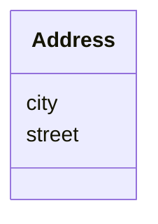

# Class: Address


URI: [ks:Address](https://w3id.org/linkml/tests/kitchen_sink/Address)





<!-- no inheritance hierarchy -->


## Slots

| Name | Cardinality and Range | Description | Inheritance |
| ---  | --- | --- | --- |
| [street](street.md) | 0..1 <br/> NONE | None  | direct |
| [city](city.md) | 0..1 <br/> NONE | None  | direct |


## Usages

| used by | used in | type | used |
| ---  | --- | --- | --- |
| [Person](Person.md) | [addresses](addresses.md) | range | Address |


## Identifier and Mapping Information


### Schema Source


* from schema: https://w3id.org/linkml/tests/kitchen_sink


## Mappings

| Mapping Type | Mapped Value |
| ---  | ---  |
| self | ['ks:Address']|join(', ') |
| native | ['ks:Address']|join(', ') |


## LinkML Source

<!-- TODO: investigate https://stackoverflow.com/questions/37606292/how-to-create-tabbed-code-blocks-in-mkdocs-or-sphinx -->

### Direct

<details>
```yaml
name: Address
from_schema: https://w3id.org/linkml/tests/kitchen_sink
rank: 1000
slots:
- street
- city

```
</details>

### Induced

<details>
```yaml
name: Address
from_schema: https://w3id.org/linkml/tests/kitchen_sink
rank: 1000
attributes:
  street:
    name: street
    from_schema: https://w3id.org/linkml/tests/kitchen_sink
    rank: 1000
    alias: street
    owner: Address
    domain_of:
    - Address
  city:
    name: city
    from_schema: https://w3id.org/linkml/tests/kitchen_sink
    rank: 1000
    alias: city
    owner: Address
    domain_of:
    - Address

```
</details>