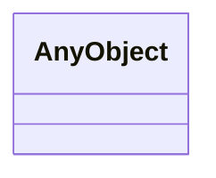

# Class: AnyObject
_Example of unconstrained class_


URI: [linkml:Any](https://w3id.org/linkml/Any)





<!-- no inheritance hierarchy -->


## Slots

| Name | Cardinality and Range | Description | Inheritance |
| ---  | --- | --- | --- |


## Usages

| used by | used in | type | used |
| ---  | --- | --- | --- |
| [Event](Event.md) | [metadata](metadata.md) | range | AnyObject |
| [BirthEvent](BirthEvent.md) | [metadata](metadata.md) | range | AnyObject |
| [EmploymentEvent](EmploymentEvent.md) | [metadata](metadata.md) | range | AnyObject |
| [MedicalEvent](MedicalEvent.md) | [metadata](metadata.md) | range | AnyObject |
| [MarriageEvent](MarriageEvent.md) | [metadata](metadata.md) | range | AnyObject |


## Identifier and Mapping Information


### Schema Source


* from schema: https://w3id.org/linkml/tests/kitchen_sink


## Mappings

| Mapping Type | Mapped Value |
| ---  | ---  |
| self | ['linkml:Any']|join(', ') |
| native | ['ks:AnyObject']|join(', ') |


## LinkML Source

<!-- TODO: investigate https://stackoverflow.com/questions/37606292/how-to-create-tabbed-code-blocks-in-mkdocs-or-sphinx -->

### Direct

<details>
```yaml
name: AnyObject
description: Example of unconstrained class
from_schema: https://w3id.org/linkml/tests/kitchen_sink
rank: 1000
class_uri: linkml:Any

```
</details>

### Induced

<details>
```yaml
name: AnyObject
description: Example of unconstrained class
from_schema: https://w3id.org/linkml/tests/kitchen_sink
rank: 1000
class_uri: linkml:Any

```
</details>