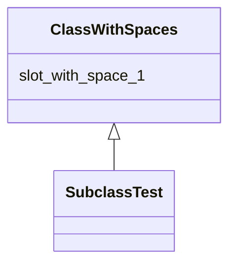

# Class: ClassWithSpaces


URI: [ks:ClassWithSpaces](https://w3id.org/linkml/tests/kitchen_sink/ClassWithSpaces)





## Inheritance
* **class with spaces**
    * [SubclassTest](SubclassTest.md)


## Slots

| Name | Cardinality and Range | Description | Inheritance |
| ---  | --- | --- | --- |
| [slot with space 1](slot_with_space_1.md) | 0..1 <br/> NONE | None  | direct |


## Usages

| used by | used in | type | used |
| ---  | --- | --- | --- |
| [SubclassTest](SubclassTest.md) | [slot with space 2](slot_with_space_2.md) | range | class with spaces |
| [SubSubClass2](SubSubClass2.md) | [slot with space 2](slot_with_space_2.md) | range | class with spaces |
| [TubSubClass1](TubSubClass1.md) | [slot with space 2](slot_with_space_2.md) | range | class with spaces |


## Identifier and Mapping Information


### Schema Source


* from schema: https://w3id.org/linkml/tests/kitchen_sink


## Mappings

| Mapping Type | Mapped Value |
| ---  | ---  |
| self | ['ks:ClassWithSpaces']|join(', ') |
| native | ['ks:ClassWithSpaces']|join(', ') |


## LinkML Source

<!-- TODO: investigate https://stackoverflow.com/questions/37606292/how-to-create-tabbed-code-blocks-in-mkdocs-or-sphinx -->

### Direct

<details>
```yaml
name: class with spaces
from_schema: https://w3id.org/linkml/tests/kitchen_sink
rank: 1000
attributes:
  slot with space 1:
    name: slot with space 1
    from_schema: https://w3id.org/linkml/tests/kitchen_sink
    rank: 1000

```
</details>

### Induced

<details>
```yaml
name: class with spaces
from_schema: https://w3id.org/linkml/tests/kitchen_sink
rank: 1000
attributes:
  slot with space 1:
    name: slot with space 1
    from_schema: https://w3id.org/linkml/tests/kitchen_sink
    rank: 1000
    alias: slot_with_space_1
    owner: class with spaces
    domain_of:
    - class with spaces

```
</details>