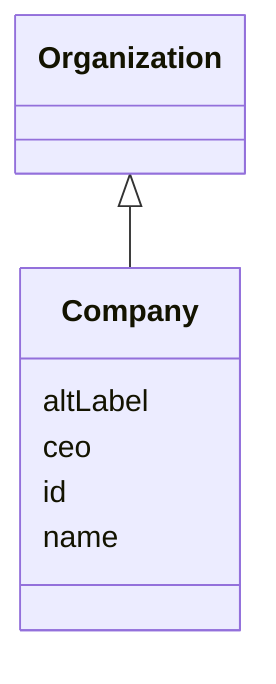

# Class: Company


URI: [ks:Company](https://w3id.org/linkml/tests/kitchen_sink/Company)





## Inheritance
* [Organization](Organization.md) [ [HasAliases](HasAliases.md)]
    * **Company**


## Slots

| Name | Cardinality and Range | Description | Inheritance |
| ---  | --- | --- | --- |
| [ceo](ceo.md) | 0..1 <br/> [Person](Person.md) | None  | direct |
| [id](id.md) | 1..1 <br/> NONE | None  | inherited |
| [name](name.md) | 0..1 <br/> NONE | None  | inherited |
| [aliases](altLabel.md) | 0..* <br/> NONE | None  | inherited |


## Usages

| used by | used in | type | used |
| ---  | --- | --- | --- |
| [EmploymentEvent](EmploymentEvent.md) | [employed at](employed_at.md) | range | Company |
| [Dataset](Dataset.md) | [companies](companies.md) | range | Company |


## Identifier and Mapping Information


### Schema Source


* from schema: https://w3id.org/linkml/tests/kitchen_sink


## Mappings

| Mapping Type | Mapped Value |
| ---  | ---  |
| self | ['ks:Company']|join(', ') |
| native | ['ks:Company']|join(', ') |


## LinkML Source

<!-- TODO: investigate https://stackoverflow.com/questions/37606292/how-to-create-tabbed-code-blocks-in-mkdocs-or-sphinx -->

### Direct

<details>
```yaml
name: Company
from_schema: https://w3id.org/linkml/tests/kitchen_sink
rank: 1000
is_a: Organization
attributes:
  ceo:
    name: ceo
    from_schema: https://w3id.org/linkml/tests/kitchen_sink
    rank: 1000
    slot_uri: schema:ceo
    range: Person

```
</details>

### Induced

<details>
```yaml
name: Company
from_schema: https://w3id.org/linkml/tests/kitchen_sink
rank: 1000
is_a: Organization
attributes:
  ceo:
    name: ceo
    from_schema: https://w3id.org/linkml/tests/kitchen_sink
    rank: 1000
    slot_uri: schema:ceo
    alias: ceo
    owner: Company
    domain_of:
    - Company
    range: Person
  id:
    name: id
    from_schema: https://w3id.org/linkml/tests/core
    rank: 1
    identifier: true
    alias: id
    owner: Company
    domain_of:
    - Person
    - Organization
    - Place
    - Concept
    - CodeSystem
    - activity
    - agent
  name:
    name: name
    from_schema: https://w3id.org/linkml/tests/core
    rank: 2
    alias: name
    owner: Company
    domain_of:
    - Friend
    - Person
    - Organization
    - Place
    - Concept
    - CodeSystem
    required: false
  aliases:
    name: aliases
    from_schema: https://w3id.org/linkml/tests/kitchen_sink
    rank: 1000
    slot_uri: skos:altLabel
    multivalued: true
    alias: aliases
    owner: Company
    domain_of:
    - HasAliases

```
</details>