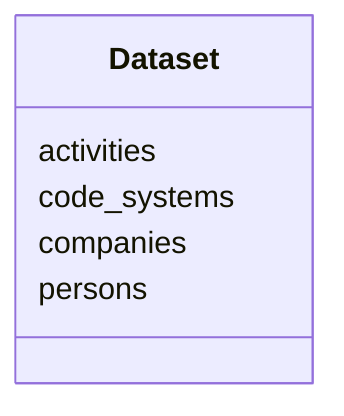

# Class: Dataset


URI: [ks:Dataset](https://w3id.org/linkml/tests/kitchen_sink/Dataset)





<!-- no inheritance hierarchy -->


## Slots

| Name | Cardinality and Range | Description | Inheritance |
| ---  | --- | --- | --- |
| [persons](persons.md) | 0..* <br/> [Person](Person.md) | None  | direct |
| [companies](companies.md) | 0..* <br/> [Company](Company.md) | None  | direct |
| [activities](activities.md) | 0..* <br/> [Activity](Activity.md) | None  | direct |
| [code systems](code_systems.md) | 0..* <br/> [CodeSystem](CodeSystem.md) | None  | direct |


## Identifier and Mapping Information


### Schema Source


* from schema: https://w3id.org/linkml/tests/kitchen_sink


## Mappings

| Mapping Type | Mapped Value |
| ---  | ---  |
| self | ['ks:Dataset']|join(', ') |
| native | ['ks:Dataset']|join(', ') |


## LinkML Source

<!-- TODO: investigate https://stackoverflow.com/questions/37606292/how-to-create-tabbed-code-blocks-in-mkdocs-or-sphinx -->

### Direct

<details>
```yaml
name: Dataset
from_schema: https://w3id.org/linkml/tests/kitchen_sink
rank: 1
attributes:
  persons:
    name: persons
    from_schema: https://w3id.org/linkml/tests/kitchen_sink
    rank: 1000
    multivalued: true
    range: Person
    inlined: true
    inlined_as_list: true
  companies:
    name: companies
    from_schema: https://w3id.org/linkml/tests/kitchen_sink
    rank: 1000
    multivalued: true
    range: Company
    inlined: true
    inlined_as_list: true
  activities:
    name: activities
    from_schema: https://w3id.org/linkml/tests/kitchen_sink
    rank: 1000
    multivalued: true
    range: activity
    inlined: true
    inlined_as_list: true
  code systems:
    name: code systems
    from_schema: https://w3id.org/linkml/tests/kitchen_sink
    rank: 1000
    multivalued: true
    range: CodeSystem
    inlined: true
tree_root: true

```
</details>

### Induced

<details>
```yaml
name: Dataset
from_schema: https://w3id.org/linkml/tests/kitchen_sink
rank: 1
attributes:
  persons:
    name: persons
    from_schema: https://w3id.org/linkml/tests/kitchen_sink
    rank: 1000
    multivalued: true
    alias: persons
    owner: Dataset
    domain_of:
    - Dataset
    range: Person
    inlined: true
    inlined_as_list: true
  companies:
    name: companies
    from_schema: https://w3id.org/linkml/tests/kitchen_sink
    rank: 1000
    multivalued: true
    alias: companies
    owner: Dataset
    domain_of:
    - Dataset
    range: Company
    inlined: true
    inlined_as_list: true
  activities:
    name: activities
    from_schema: https://w3id.org/linkml/tests/kitchen_sink
    rank: 1000
    multivalued: true
    alias: activities
    owner: Dataset
    domain_of:
    - Dataset
    range: activity
    inlined: true
    inlined_as_list: true
  code systems:
    name: code systems
    from_schema: https://w3id.org/linkml/tests/kitchen_sink
    rank: 1000
    multivalued: true
    alias: code_systems
    owner: Dataset
    domain_of:
    - Dataset
    range: CodeSystem
    inlined: true
tree_root: true

```
</details>