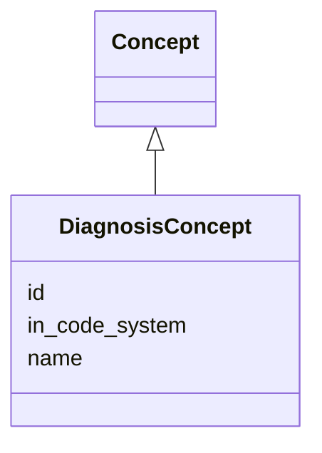

# Class: DiagnosisConcept


URI: [ks:DiagnosisConcept](https://w3id.org/linkml/tests/kitchen_sink/DiagnosisConcept)





## Inheritance
* [Concept](Concept.md)
    * **DiagnosisConcept**


## Slots

| Name | Cardinality and Range | Description | Inheritance |
| ---  | --- | --- | --- |
| [id](id.md) | 1..1 <br/> NONE | None  | inherited |
| [name](name.md) | 0..1 <br/> NONE | None  | inherited |
| [in code system](in_code_system.md) | 0..1 <br/> [CodeSystem](CodeSystem.md) | None  | inherited |


## Usages

| used by | used in | type | used |
| ---  | --- | --- | --- |
| [MedicalEvent](MedicalEvent.md) | [diagnosis](diagnosis.md) | range | DiagnosisConcept |


## Identifier and Mapping Information


### Schema Source


* from schema: https://w3id.org/linkml/tests/kitchen_sink


## Mappings

| Mapping Type | Mapped Value |
| ---  | ---  |
| self | ['ks:DiagnosisConcept']|join(', ') |
| native | ['ks:DiagnosisConcept']|join(', ') |
| close | ['biolink:Disease']|join(', ') |


## LinkML Source

<!-- TODO: investigate https://stackoverflow.com/questions/37606292/how-to-create-tabbed-code-blocks-in-mkdocs-or-sphinx -->

### Direct

<details>
```yaml
name: DiagnosisConcept
from_schema: https://w3id.org/linkml/tests/kitchen_sink
close_mappings:
- biolink:Disease
rank: 1000
is_a: Concept

```
</details>

### Induced

<details>
```yaml
name: DiagnosisConcept
from_schema: https://w3id.org/linkml/tests/kitchen_sink
close_mappings:
- biolink:Disease
rank: 1000
is_a: Concept
attributes:
  id:
    name: id
    from_schema: https://w3id.org/linkml/tests/core
    rank: 1
    identifier: true
    alias: id
    owner: DiagnosisConcept
    domain_of:
    - Person
    - Organization
    - Place
    - Concept
    - CodeSystem
    - activity
    - agent
  name:
    name: name
    from_schema: https://w3id.org/linkml/tests/core
    rank: 2
    alias: name
    owner: DiagnosisConcept
    domain_of:
    - Friend
    - Person
    - Organization
    - Place
    - Concept
    - CodeSystem
    required: false
  in code system:
    name: in code system
    from_schema: https://w3id.org/linkml/tests/kitchen_sink
    rank: 1000
    alias: in_code_system
    owner: DiagnosisConcept
    domain_of:
    - Concept
    range: CodeSystem

```
</details>