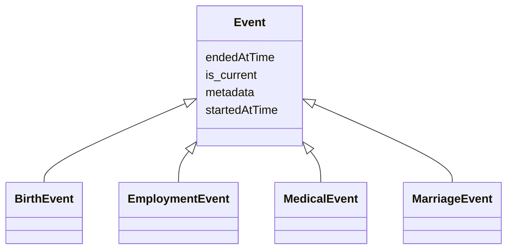

# Class: Event


URI: [ks:Event](https://w3id.org/linkml/tests/kitchen_sink/Event)





## Inheritance
* **Event**
    * [BirthEvent](BirthEvent.md)
    * [EmploymentEvent](EmploymentEvent.md)
    * [MedicalEvent](MedicalEvent.md)
    * [MarriageEvent](MarriageEvent.md) [ [WithLocation](WithLocation.md)]


## Slots

| Name | Cardinality and Range | Description | Inheritance |
| ---  | --- | --- | --- |
| [started at time](startedAtTime.md) | 0..1 <br/> [xsd:date](http://www.w3.org/2001/XMLSchema#date) | None  | direct |
| [ended at time](endedAtTime.md) | 0..1 <br/> [xsd:date](http://www.w3.org/2001/XMLSchema#date) | None  | direct |
| [is current](is_current.md) | 0..1 <br/> [xsd:boolean](http://www.w3.org/2001/XMLSchema#boolean) | None  | direct |
| [metadata](metadata.md) | 0..1 <br/> [AnyObject](AnyObject.md) | Example of a slot that has an unconstrained range  | direct |


## Identifier and Mapping Information


### Schema Source


* from schema: https://w3id.org/linkml/tests/kitchen_sink


## Mappings

| Mapping Type | Mapped Value |
| ---  | ---  |
| self | ['ks:Event']|join(', ') |
| native | ['ks:Event']|join(', ') |


## LinkML Source

<!-- TODO: investigate https://stackoverflow.com/questions/37606292/how-to-create-tabbed-code-blocks-in-mkdocs-or-sphinx -->

### Direct

<details>
```yaml
name: Event
from_schema: https://w3id.org/linkml/tests/kitchen_sink
rank: 1000
slots:
- started at time
- ended at time
- is current
- metadata

```
</details>

### Induced

<details>
```yaml
name: Event
from_schema: https://w3id.org/linkml/tests/kitchen_sink
rank: 1000
attributes:
  started at time:
    name: started at time
    from_schema: https://w3id.org/linkml/tests/core
    rank: 1000
    slot_uri: prov:startedAtTime
    alias: started_at_time
    owner: Event
    domain_of:
    - Event
    - Relationship
    - activity
    range: date
  ended at time:
    name: ended at time
    from_schema: https://w3id.org/linkml/tests/core
    rank: 1000
    slot_uri: prov:endedAtTime
    alias: ended_at_time
    owner: Event
    domain_of:
    - Event
    - Relationship
    - activity
    range: date
  is current:
    name: is current
    from_schema: https://w3id.org/linkml/tests/kitchen_sink
    rank: 1000
    alias: is_current
    owner: Event
    domain_of:
    - Event
    range: boolean
  metadata:
    name: metadata
    description: Example of a slot that has an unconstrained range
    from_schema: https://w3id.org/linkml/tests/kitchen_sink
    rank: 1000
    alias: metadata
    owner: Event
    domain_of:
    - Event
    range: AnyObject

```
</details>