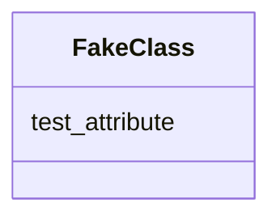

# Class: FakeClass


URI: [ks:FakeClass](https://w3id.org/linkml/tests/kitchen_sink/FakeClass)





<!-- no inheritance hierarchy -->


## Slots

| Name | Cardinality and Range | Description | Inheritance |
| ---  | --- | --- | --- |
| [test_attribute](test_attribute.md) | 0..1 <br/> NONE | None  | direct |


## Identifier and Mapping Information


### Schema Source


* from schema: https://w3id.org/linkml/tests/kitchen_sink


## Mappings

| Mapping Type | Mapped Value |
| ---  | ---  |
| self | ['ks:FakeClass']|join(', ') |
| native | ['ks:FakeClass']|join(', ') |


## LinkML Source

<!-- TODO: investigate https://stackoverflow.com/questions/37606292/how-to-create-tabbed-code-blocks-in-mkdocs-or-sphinx -->

### Direct

<details>
```yaml
name: FakeClass
deprecated: this is not a real class, we are using it to test deprecation
from_schema: https://w3id.org/linkml/tests/kitchen_sink
rank: 1000
attributes:
  test_attribute:
    name: test_attribute
    from_schema: https://w3id.org/linkml/tests/kitchen_sink
    rank: 1000

```
</details>

### Induced

<details>
```yaml
name: FakeClass
deprecated: this is not a real class, we are using it to test deprecation
from_schema: https://w3id.org/linkml/tests/kitchen_sink
rank: 1000
attributes:
  test_attribute:
    name: test_attribute
    from_schema: https://w3id.org/linkml/tests/kitchen_sink
    rank: 1000
    alias: test_attribute
    owner: FakeClass
    domain_of:
    - FakeClass

```
</details>