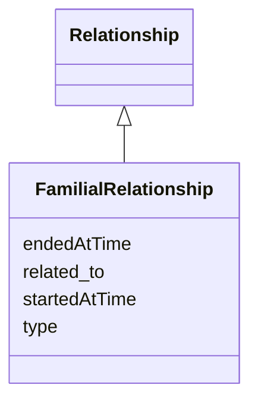

# Class: FamilialRelationship


URI: [ks:FamilialRelationship](https://w3id.org/linkml/tests/kitchen_sink/FamilialRelationship)





## Inheritance
* [Relationship](Relationship.md)
    * **FamilialRelationship**


## Slots

| Name | Cardinality and Range | Description | Inheritance |
| ---  | --- | --- | --- |
| [started at time](startedAtTime.md) | 0..1 <br/> [xsd:date](http://www.w3.org/2001/XMLSchema#date) | None  | inherited |
| [ended at time](endedAtTime.md) | 0..1 <br/> [xsd:date](http://www.w3.org/2001/XMLSchema#date) | None  | inherited |
| [related to](related_to.md) | 1..1 <br/> [Person](Person.md) | None  | inherited |
| [type](type.md) | 1..1 <br/> [FamilialRelationshipType](FamilialRelationshipType.md) | None  | inherited |


## Usages

| used by | used in | type | used |
| ---  | --- | --- | --- |
| [Person](Person.md) | [has familial relationships](has_familial_relationships.md) | range | FamilialRelationship |


## Identifier and Mapping Information


### Schema Source


* from schema: https://w3id.org/linkml/tests/kitchen_sink


## Mappings

| Mapping Type | Mapped Value |
| ---  | ---  |
| self | ['ks:FamilialRelationship']|join(', ') |
| native | ['ks:FamilialRelationship']|join(', ') |


## LinkML Source

<!-- TODO: investigate https://stackoverflow.com/questions/37606292/how-to-create-tabbed-code-blocks-in-mkdocs-or-sphinx -->

### Direct

<details>
```yaml
name: FamilialRelationship
from_schema: https://w3id.org/linkml/tests/kitchen_sink
rank: 5
is_a: Relationship
slot_usage:
  type:
    name: type
    domain_of:
    - Relationship
    - EmploymentEvent
    - Relationship
    - EmploymentEvent
    range: FamilialRelationshipType
    required: true
  related to:
    name: related to
    domain_of:
    - Relationship
    - Relationship
    range: Person
    required: true

```
</details>

### Induced

<details>
```yaml
name: FamilialRelationship
from_schema: https://w3id.org/linkml/tests/kitchen_sink
rank: 5
is_a: Relationship
slot_usage:
  type:
    name: type
    domain_of:
    - Relationship
    - EmploymentEvent
    - Relationship
    - EmploymentEvent
    range: FamilialRelationshipType
    required: true
  related to:
    name: related to
    domain_of:
    - Relationship
    - Relationship
    range: Person
    required: true
attributes:
  started at time:
    name: started at time
    from_schema: https://w3id.org/linkml/tests/core
    rank: 1000
    slot_uri: prov:startedAtTime
    alias: started_at_time
    owner: FamilialRelationship
    domain_of:
    - Event
    - Relationship
    - activity
    range: date
  ended at time:
    name: ended at time
    from_schema: https://w3id.org/linkml/tests/core
    rank: 1000
    slot_uri: prov:endedAtTime
    alias: ended_at_time
    owner: FamilialRelationship
    domain_of:
    - Event
    - Relationship
    - activity
    range: date
  related to:
    name: related to
    from_schema: https://w3id.org/linkml/tests/kitchen_sink
    rank: 1000
    alias: related_to
    owner: FamilialRelationship
    domain_of:
    - Relationship
    - Relationship
    range: Person
    required: true
  type:
    name: type
    from_schema: https://w3id.org/linkml/tests/kitchen_sink
    rank: 1000
    alias: type
    owner: FamilialRelationship
    domain_of:
    - Relationship
    - EmploymentEvent
    - Relationship
    - EmploymentEvent
    range: FamilialRelationshipType
    required: true

```
</details>