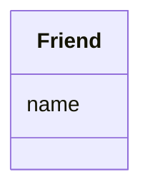

# Class: Friend


* __NOTE__: this is an abstract class and should not be instantiated directly


URI: [ks:Friend](https://w3id.org/linkml/tests/kitchen_sink/Friend)





<!-- no inheritance hierarchy -->


## Slots

| Name | Cardinality and Range | Description | Inheritance |
| ---  | --- | --- | --- |
| [name](name.md) | 0..1 <br/> NONE | None  | direct |


## Identifier and Mapping Information


### Schema Source


* from schema: https://w3id.org/linkml/tests/kitchen_sink


## Mappings

| Mapping Type | Mapped Value |
| ---  | ---  |
| self | ['ks:Friend']|join(', ') |
| native | ['ks:Friend']|join(', ') |


## LinkML Source

<!-- TODO: investigate https://stackoverflow.com/questions/37606292/how-to-create-tabbed-code-blocks-in-mkdocs-or-sphinx -->

### Direct

<details>
```yaml
name: Friend
from_schema: https://w3id.org/linkml/tests/kitchen_sink
rank: 1000
abstract: true
slots:
- name

```
</details>

### Induced

<details>
```yaml
name: Friend
from_schema: https://w3id.org/linkml/tests/kitchen_sink
rank: 1000
abstract: true
attributes:
  name:
    name: name
    from_schema: https://w3id.org/linkml/tests/core
    rank: 2
    alias: name
    owner: Friend
    domain_of:
    - Friend
    - Person
    - Organization
    - Place
    - Concept
    - CodeSystem
    required: false

```
</details>