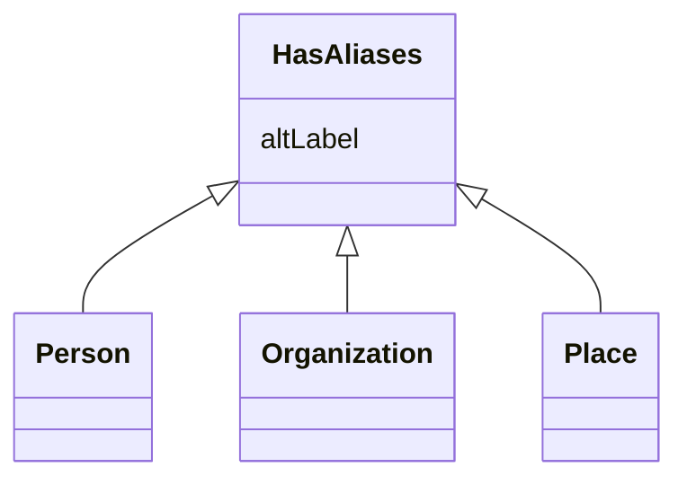

# Class: HasAliases


* __NOTE__: this is a mixin class intended to be used in combination with other classes, and not used directly


URI: [ks:HasAliases](https://w3id.org/linkml/tests/kitchen_sink/HasAliases)





<!-- no inheritance hierarchy -->


## Slots

| Name | Cardinality and Range | Description | Inheritance |
| ---  | --- | --- | --- |
| [aliases](altLabel.md) | 0..* <br/> NONE | None  | direct |


## Identifier and Mapping Information


### Schema Source


* from schema: https://w3id.org/linkml/tests/kitchen_sink


## Mappings

| Mapping Type | Mapped Value |
| ---  | ---  |
| self | ['ks:HasAliases']|join(', ') |
| native | ['ks:HasAliases']|join(', ') |


## LinkML Source

<!-- TODO: investigate https://stackoverflow.com/questions/37606292/how-to-create-tabbed-code-blocks-in-mkdocs-or-sphinx -->

### Direct

<details>
```yaml
name: HasAliases
from_schema: https://w3id.org/linkml/tests/kitchen_sink
rank: 1000
mixin: true
attributes:
  aliases:
    name: aliases
    from_schema: https://w3id.org/linkml/tests/kitchen_sink
    rank: 1000
    slot_uri: skos:altLabel
    multivalued: true

```
</details>

### Induced

<details>
```yaml
name: HasAliases
from_schema: https://w3id.org/linkml/tests/kitchen_sink
rank: 1000
mixin: true
attributes:
  aliases:
    name: aliases
    from_schema: https://w3id.org/linkml/tests/kitchen_sink
    rank: 1000
    slot_uri: skos:altLabel
    multivalued: true
    alias: aliases
    owner: HasAliases
    domain_of:
    - HasAliases

```
</details>