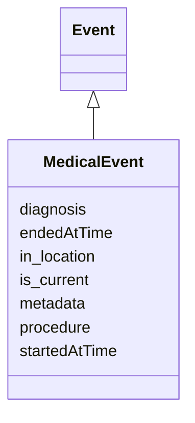

# Class: MedicalEvent


URI: [ks:MedicalEvent](https://w3id.org/linkml/tests/kitchen_sink/MedicalEvent)





## Inheritance
* [Event](Event.md)
    * **MedicalEvent**


## Slots

| Name | Cardinality and Range | Description | Inheritance |
| ---  | --- | --- | --- |
| [in location](in_location.md) | 0..1 <br/> [Place](Place.md) | None  | direct |
| [diagnosis](diagnosis.md) | 0..1 <br/> [DiagnosisConcept](DiagnosisConcept.md) | None  | direct |
| [procedure](procedure.md) | 0..1 <br/> [ProcedureConcept](ProcedureConcept.md) | None  | direct |
| [started at time](startedAtTime.md) | 0..1 <br/> [xsd:date](http://www.w3.org/2001/XMLSchema#date) | None  | inherited |
| [ended at time](endedAtTime.md) | 0..1 <br/> [xsd:date](http://www.w3.org/2001/XMLSchema#date) | None  | inherited |
| [is current](is_current.md) | 0..1 <br/> [xsd:boolean](http://www.w3.org/2001/XMLSchema#boolean) | None  | inherited |
| [metadata](metadata.md) | 0..1 <br/> [AnyObject](AnyObject.md) | Example of a slot that has an unconstrained range  | inherited |


## Usages

| used by | used in | type | used |
| ---  | --- | --- | --- |
| [Person](Person.md) | [has medical history](has_medical_history.md) | range | MedicalEvent |


## Identifier and Mapping Information


### Schema Source


* from schema: https://w3id.org/linkml/tests/kitchen_sink


## Mappings

| Mapping Type | Mapped Value |
| ---  | ---  |
| self | ['ks:MedicalEvent']|join(', ') |
| native | ['ks:MedicalEvent']|join(', ') |


## LinkML Source

<!-- TODO: investigate https://stackoverflow.com/questions/37606292/how-to-create-tabbed-code-blocks-in-mkdocs-or-sphinx -->

### Direct

<details>
```yaml
name: MedicalEvent
from_schema: https://w3id.org/linkml/tests/kitchen_sink
rank: 1000
is_a: Event
slots:
- in location
- diagnosis
- procedure

```
</details>

### Induced

<details>
```yaml
name: MedicalEvent
from_schema: https://w3id.org/linkml/tests/kitchen_sink
rank: 1000
is_a: Event
attributes:
  in location:
    name: in location
    annotations:
      biolink:opposite:
        tag: biolink:opposite
        value: location_of
    from_schema: https://w3id.org/linkml/tests/kitchen_sink
    rank: 1000
    alias: in_location
    owner: MedicalEvent
    domain_of:
    - BirthEvent
    - MedicalEvent
    - WithLocation
    range: Place
  diagnosis:
    name: diagnosis
    from_schema: https://w3id.org/linkml/tests/kitchen_sink
    rank: 1000
    alias: diagnosis
    owner: MedicalEvent
    domain_of:
    - MedicalEvent
    range: DiagnosisConcept
    inlined: true
  procedure:
    name: procedure
    from_schema: https://w3id.org/linkml/tests/kitchen_sink
    rank: 1000
    alias: procedure
    owner: MedicalEvent
    domain_of:
    - MedicalEvent
    range: ProcedureConcept
    inlined: true
  started at time:
    name: started at time
    from_schema: https://w3id.org/linkml/tests/core
    rank: 1000
    slot_uri: prov:startedAtTime
    alias: started_at_time
    owner: MedicalEvent
    domain_of:
    - Event
    - Relationship
    - activity
    range: date
  ended at time:
    name: ended at time
    from_schema: https://w3id.org/linkml/tests/core
    rank: 1000
    slot_uri: prov:endedAtTime
    alias: ended_at_time
    owner: MedicalEvent
    domain_of:
    - Event
    - Relationship
    - activity
    range: date
  is current:
    name: is current
    from_schema: https://w3id.org/linkml/tests/kitchen_sink
    rank: 1000
    alias: is_current
    owner: MedicalEvent
    domain_of:
    - Event
    range: boolean
  metadata:
    name: metadata
    description: Example of a slot that has an unconstrained range
    from_schema: https://w3id.org/linkml/tests/kitchen_sink
    rank: 1000
    alias: metadata
    owner: MedicalEvent
    domain_of:
    - Event
    range: AnyObject

```
</details>