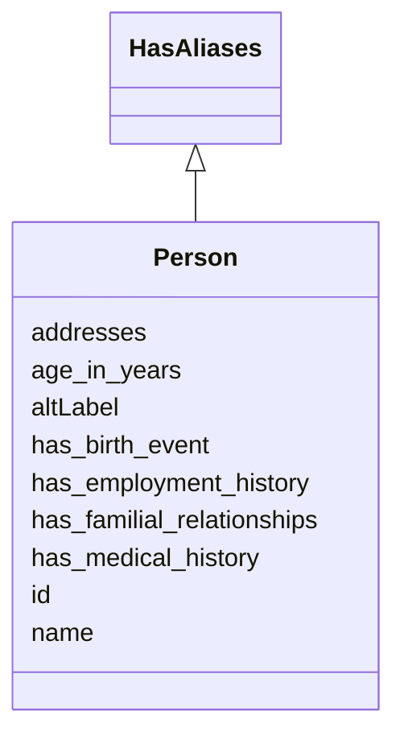

# Class: Person
_A person, living or dead_


URI: [ks:Person](https://w3id.org/linkml/tests/kitchen_sink/Person)





## Inheritance
* **Person** [ [HasAliases](HasAliases.md)]


## Slots

| Name | Cardinality and Range | Description | Inheritance |
| ---  | --- | --- | --- |
| [id](id.md) | 1..1 <br/> NONE | None  | direct |
| [name](name.md) | 0..1 <br/> NONE | None  | direct |
| [has employment history](has_employment_history.md) | 0..* <br/> [EmploymentEvent](EmploymentEvent.md) | None  | direct |
| [has familial relationships](has_familial_relationships.md) | 0..* <br/> [FamilialRelationship](FamilialRelationship.md) | None  | direct |
| [has medical history](has_medical_history.md) | 0..* <br/> [MedicalEvent](MedicalEvent.md) | None  | direct |
| [age in years](age_in_years.md) | 0..1 <br/> [xsd:integer](http://www.w3.org/2001/XMLSchema#integer) | number of years since birth  | direct |
| [addresses](addresses.md) | 0..* <br/> [Address](Address.md) | None  | direct |
| [has birth event](has_birth_event.md) | 0..1 <br/> [BirthEvent](BirthEvent.md) | None  | direct |
| [aliases](altLabel.md) | 0..* <br/> NONE | None  | inherited |


## Usages

| used by | used in | type | used |
| ---  | --- | --- | --- |
| [FamilialRelationship](FamilialRelationship.md) | [related to](related_to.md) | range | Person |
| [MarriageEvent](MarriageEvent.md) | [married to](married_to.md) | range | Person |
| [Company](Company.md) | [ceo](ceo.md) | range | Person |
| [Dataset](Dataset.md) | [persons](persons.md) | range | Person |


## Identifier and Mapping Information


### Valid ID Prefixes

Instances of this class *should* have identifiers with one of the following prefixes:

* P


### Schema Source


* from schema: https://w3id.org/linkml/tests/kitchen_sink


## Mappings

| Mapping Type | Mapped Value |
| ---  | ---  |
| self | ['ks:Person']|join(', ') |
| native | ['ks:Person']|join(', ') |
| exact | ['schema:Person']|join(', ') |


## LinkML Source

<!-- TODO: investigate https://stackoverflow.com/questions/37606292/how-to-create-tabbed-code-blocks-in-mkdocs-or-sphinx -->

### Direct

<details>
```yaml
name: Person
id_prefixes:
- P
description: A person, living or dead
in_subset:
- subset A
from_schema: https://w3id.org/linkml/tests/kitchen_sink
exact_mappings:
- schema:Person
rank: 2
mixins:
- HasAliases
slots:
- id
- name
- has employment history
- has familial relationships
- has medical history
- age in years
- addresses
- has birth event
slot_usage:
  name:
    name: name
    domain_of:
    - Friend
    - Person
    - Organization
    - Place
    - Concept
    - CodeSystem
    - Friend
    - Person
    - Organization
    - Place
    - Concept
    - CodeSystem
    pattern: ^\S+ \S+

```
</details>

### Induced

<details>
```yaml
name: Person
id_prefixes:
- P
description: A person, living or dead
in_subset:
- subset A
from_schema: https://w3id.org/linkml/tests/kitchen_sink
exact_mappings:
- schema:Person
rank: 2
mixins:
- HasAliases
slot_usage:
  name:
    name: name
    domain_of:
    - Friend
    - Person
    - Organization
    - Place
    - Concept
    - CodeSystem
    - Friend
    - Person
    - Organization
    - Place
    - Concept
    - CodeSystem
    pattern: ^\S+ \S+
attributes:
  id:
    name: id
    from_schema: https://w3id.org/linkml/tests/core
    rank: 1
    identifier: true
    alias: id
    owner: Person
    domain_of:
    - Person
    - Organization
    - Place
    - Concept
    - CodeSystem
    - activity
    - agent
  name:
    name: name
    from_schema: https://w3id.org/linkml/tests/core
    rank: 2
    alias: name
    owner: Person
    domain_of:
    - Friend
    - Person
    - Organization
    - Place
    - Concept
    - CodeSystem
    - Friend
    - Person
    - Organization
    - Place
    - Concept
    - CodeSystem
    required: false
    pattern: ^\S+ \S+
  has employment history:
    name: has employment history
    in_subset:
    - subset B
    from_schema: https://w3id.org/linkml/tests/kitchen_sink
    rank: 7
    multivalued: true
    alias: has_employment_history
    owner: Person
    domain_of:
    - Person
    range: EmploymentEvent
    inlined: true
    inlined_as_list: true
  has familial relationships:
    name: has familial relationships
    in_subset:
    - subset B
    from_schema: https://w3id.org/linkml/tests/kitchen_sink
    rank: 1000
    multivalued: true
    alias: has_familial_relationships
    owner: Person
    domain_of:
    - Person
    range: FamilialRelationship
    inlined: true
    inlined_as_list: true
  has medical history:
    name: has medical history
    in_subset:
    - subset B
    from_schema: https://w3id.org/linkml/tests/kitchen_sink
    rank: 5
    multivalued: true
    alias: has_medical_history
    owner: Person
    domain_of:
    - Person
    range: MedicalEvent
    inlined: true
    inlined_as_list: true
  age in years:
    name: age in years
    description: number of years since birth
    in_subset:
    - subset A
    - subset B
    from_schema: https://w3id.org/linkml/tests/kitchen_sink
    rank: 1000
    alias: age_in_years
    owner: Person
    domain_of:
    - Person
    range: integer
    minimum_value: 0
    maximum_value: 999
  addresses:
    name: addresses
    from_schema: https://w3id.org/linkml/tests/kitchen_sink
    rank: 1000
    multivalued: true
    alias: addresses
    owner: Person
    domain_of:
    - Person
    range: Address
  has birth event:
    name: has birth event
    from_schema: https://w3id.org/linkml/tests/kitchen_sink
    rank: 1000
    alias: has_birth_event
    owner: Person
    domain_of:
    - Person
    range: BirthEvent
  aliases:
    name: aliases
    from_schema: https://w3id.org/linkml/tests/kitchen_sink
    rank: 1000
    slot_uri: skos:altLabel
    multivalued: true
    alias: aliases
    owner: Person
    domain_of:
    - HasAliases

```
</details>